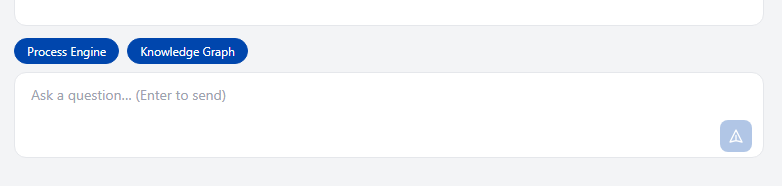

# Operaton MCP AI Assistant

The AI Assistant is a streaming chat interface embedded in the Gereedschap tab of the caseworker dashboard. It connects Claude (claude-sonnet-4) to the live Operaton BPMN/DMN engine via the [Model Context Protocol](https://modelcontextprotocol.io/) (MCP), allowing caseworkers to query process definitions, running instances, tasks, decisions, deployments, and incidents in natural language.

<figure markdown style="width:100%; margin:0;">
  
  <figcaption>The assistant bubble updates token-by-token. Between tool rounds, the active tool name appears above the typing indicator.</figcaption>
</figure>

---

## Access pattern

This feature uses [**Pattern 2 — `operaton-mcp` via `engine-rest`**](operaton-access-patterns.md#pattern-2-operaton-mcp-via-engine-rest-oidc) from the Operaton Access Patterns reference. The `operaton-mcp` subprocess talks **directly to Operaton's `engine-rest` API**, bypassing the RONL Business API entirely. It receives the full, unfiltered Operaton surface — all process instances, all deployments, all tenants — with no organisation filter applied.

In `mcpClient.service.ts`, the `StdioClientTransport` spawns the `operaton-mcp` child process and passes it the following env vars directly from the backend configuration:
```typescript
OPERATON_BASE_URL: config.operaton.baseUrl,   // → OPERATON_BASE_URL (must end with /engine-rest)
OPERATON_USERNAME: config.operaton.username,
OPERATON_PASSWORD: config.operaton.password,
```

Authentication is **basic auth** — unlike the standalone external `operaton-mcp` configuration described in the access patterns page, which uses OIDC client credentials. Because the AI assistant runs as an embedded backend subprocess, it inherits the backend's own Operaton service account credentials rather than an independent Keycloak client.

!!! warning "OPERATON_BASE_URL must point at engine-rest"
    Setting `OPERATON_BASE_URL` to the RONL Business API base URL (e.g. `https://acc.api.open-regels.nl`) will break every MCP tool call. The AI assistant requires the native `engine-rest` path structure — routes like `/process-instance`, `/history/process-instance`, and `/deployment` must resolve directly on the Operaton host. See [Why the patterns are incompatible](operaton-access-patterns.md#why-the-patterns-are-incompatible).

---

## Data sources

The AI assistant connects to one or more **MCP providers** registered in `McpRegistry`. Each provider exposes a curated set of read-only tools and contributes a section to the system prompt. The frontend fetches the list of providers from `GET /v1/mcp/sources` on mount and pre-selects all connected ones. The user can deselect sources before sending a message.

<figure markdown style="width:100%; margin:0;">
  
  <figcaption>MCP chat source selector.</figcaption>
</figure>

Two providers are registered in ACC:

| Source ID | Display name | Tools | Description |
|---|---|---|---|
| `operaton` | Process Engine | 16 | Live Operaton data: process instances, tasks, deployments, decisions, incidents |
| `triplydb` | Knowledge Graph | 11 | RONL knowledge graph via SPARQL: DMN metadata, public services, organisations, rules, concepts |

The `sources` array in the `POST /v1/mcp/chat` request body controls which providers are active for a given turn. An empty array activates all connected providers.

### Process Engine tools (`operaton`)

The `OperatonMcpProvider` allows the following 16 tools from `operaton-mcp`:

`processDefinition_list`, `processDefinition_count`, `processDefinition_getByKey`, `processInstance_list`, `processInstance_count`, `processInstance_get`, `task_list`, `task_count`, `task_getById`, `decision_list`, `decision_getByKey`, `deployment_list`, `deployment_count`, `deployment_getById`, `incident_list`, `incident_count`

All other `operaton-mcp` tools are blocked by the `ALLOWED_TOOLS` set in `OperatonMcpProvider.ts`.

### Knowledge Graph tools (`triplydb`)

The `TriplyDbMcpProvider` spawns the bundled `src/mcp-servers/triplydb/index.ts` (compiled to `dist/mcp-servers/triplydb/index.js` in production) and exposes the following 11 tools:

`dmn_list`, `dmn_get`, `dmn_chain_links`, `dmn_enhanced_chain_links`, `dmn_semantic_equivalences`, `organization_list`, `service_list`, `rule_list`, `concept_list`, `service_rules_metadata`, `sparql_query`

The TriplyDB server requires `TRIPLYDB_ENDPOINT` and `TRIPLYDB_TOKEN` env vars. If the connection fails at startup, the provider is silently unavailable and does not appear in the `GET /v1/mcp/sources` response as connected.

!!! note "Knowledge graph vs live engine"
    The TriplyDB knowledge graph contains **documented metadata** about decision models, including their intended Operaton endpoints. It is not live deployment data. To verify what is actually running in Operaton, the Process Engine source must also be selected. The model is prompted to note this distinction in its responses.

---

## Architecture
```
McpChatSection (React)
  │  native fetch + ReadableStream
  ▼
POST /v1/mcp/chat  (text/event-stream)
  │  SSE: { type: "status" | "delta" | "done" | "error" }
  ▼
runChatStream()  — mcpChat.service.ts
  │  client.messages.stream()  (Anthropic SDK)
  ▼
Claude claude-sonnet-4
  │  tool_use blocks → MCP tool calls
  ▼
McpClientService  — mcpClient.service.ts
  │  stdio child process
  ▼
operaton-mcp  (Node.js, bundled in packages/backend)
  │  REST calls
  ▼
Operaton engine-rest  (operaton.open-regels.nl)
```

The backend runs an **agentic loop**: Claude receives the conversation, decides which Operaton tools to call, executes them, feeds the results back to Claude, and repeats until Claude produces a final answer. The loop runs for up to 10 rounds and terminates on `stop_reason: end_turn`. Responses are streamed to the browser over **Server-Sent Events (SSE)** so the user sees tokens as they arrive and sees tool activity between rounds.

---

## SSE event types

All events are JSON-encoded on the `data:` field of a standard SSE frame.

| `type`   | Payload fields    | When emitted                                        |
|----------|-------------------|-----------------------------------------------------|
| `status` | `message: string` | Immediately before each MCP tool call executes      |
| `delta`  | `text: string`    | Each text token from Claude                         |
| `done`   | —                 | Loop completed cleanly                              |
| `error`  | `message: string` | Timeout, tool failure, or Anthropic API error       |

Pre-flight errors (MCP disabled, MCP not connected, missing message body) are returned as standard JSON with an appropriate HTTP status code before the SSE headers are flushed.

---

## Backend

### `mcpChat.service.ts`

`runChatStream(history, userMessage, emit, signal?)` replaces the former `runChatTurn`.

**`client.messages.stream()`** is used instead of `client.messages.create()`. Text deltas are emitted immediately via the `stream.on('text')` handler, so the user sees tokens in real time.

**Tool result truncation.** Each tool result is capped at 12,000 characters before being added to the messages array. Multi-round queries against Operaton list endpoints can return large JSON payloads; without truncation the accumulated messages array exceeds the 200,000-token API limit.

**AbortSignal threading.** The signal is passed to `client.messages.stream()` and checked before each tool execution. This ensures a timed-out or disconnected request does not leave an orphaned Anthropic API call running.
```typescript
// The event types emitted by runChatStream
export type ChatStreamEvent =
  | { type: 'status'; message: string }
  | { type: 'delta'; text: string }
  | { type: 'done' }
  | { type: 'error'; message: string };

export type ChatEventCallback = (event: ChatStreamEvent) => void;
```

### `mcp.routes.ts`

`POST /v1/mcp/chat` flushes SSE headers immediately after the pre-flight guards pass, then drives `runChatStream` and writes events to the response.
```typescript
res.setHeader('Content-Type', 'text/event-stream');
res.setHeader('Cache-Control', 'no-cache');
res.setHeader('Connection', 'keep-alive');
res.setHeader('X-Accel-Buffering', 'no'); // disables Caddy / nginx proxy buffering
res.flushHeaders();
```

A single `AbortController` covers both the 240-second hard timeout and client-disconnect cleanup (`req.on('close', ...)`). A `send()` helper guards `res.writableEnded` before each write so a disconnecting client cannot cause a write-after-end error.

**Audit log exclusion.** `POST /v1/mcp/chat` is excluded from `audit.middleware.ts` alongside `GET /v1/admin/audit`. Chat turns are high-frequency and do not require an audit trail.

### Allowed tools

The `ALLOWED_TOOLS` set in `mcpChat.service.ts` is a curation gate. Only these 15 read-only Operaton tools are forwarded to Claude; all others are stripped from the tool definitions before the first API call.

| Category            | Tools                                               |
|---------------------|-----------------------------------------------------|
| Process definitions | `processDefinition_list`, `_count`, `_getByKey`     |
| Process instances   | `processInstance_list`, `_count`, `_get`            |
| Tasks               | `task_list`, `_count`, `_getById`                   |
| Decisions           | `decision_list`, `_getByKey`                        |
| Deployments         | `deployment_list`, `_count`, `_getById`             |
| Incidents           | `incident_list`, `_count`                           |

To enable or disable a tool, add or remove its name from the set. No other code changes are required.

### System prompt conventions

The system prompt instructs Claude to use `maxResults=20` when listing resources for display, use dedicated count tools when counting, filter by `latestVersion=true` for process definitions and decisions unless the user asks for version history, and never narrate tool calls in the response text — only return the final answer.

---

## Frontend

### `businessApi.mcp.chatStream()` — `api.ts`

The axios POST has been replaced with a native `fetch` + `ReadableStream` async generator. The generator refreshes the Keycloak token before the request (mirroring the axios interceptor), consumes the SSE stream line by line, and yields typed `McpChatStreamEvent` objects.
```typescript
for await (const event of businessApi.mcp.chatStream(message, history, abortSignal)) {
  if (event.type === 'delta')  { /* append text to bubble */ }
  if (event.type === 'status') { /* show tool name above typing dots */ }
  if (event.type === 'done')   { /* commit bubble to message history */ }
  if (event.type === 'error')  { /* show error pill */ }
}
```

### `McpChatSection.tsx`

| State variable     | Purpose                                                            |
|--------------------|--------------------------------------------------------------------|
| `streamingContent` | Accumulated delta text for the in-progress bubble                 |
| `streamingRef`     | Mutable ref that accumulates deltas without stale-closure risk     |
| `statusMessage`    | Tool name shown above the typing dots between rounds              |
| `abortRef`         | `AbortController` for the active stream; cancelled on unmount      |

**In-progress bubble.** While `loading && streamingContent !== ''`, a separate assistant bubble renders below the confirmed message history. It displays `streamingContent` with a blinking cursor (`animate-pulse`). When `done` arrives, the accumulated text is committed to the `messages` array via `onMessagesChange` and the streaming state is cleared.

**Status line.** When `loading && streamingContent === '' && statusMessage !== null`, the tool name (e.g. `Calling deployment_list…`) is rendered in small grey text above the three typing dots. This is the only real-time feedback visible during multi-round tool execution.

**Clear chat.** The button now calls `abortRef.current?.abort()` before clearing messages, aborting any in-flight stream immediately. It is visible whenever `messages.length > 0 || loading`.

<figure markdown style="width:100%; margin:0;">
  
  <figcaption>Empty state shown before the first message is sent.</figcaption>
</figure>

<figure markdown style="width:100%; margin:0;">
  
  <figcaption>Status line visible between tool rounds, before the first delta token arrives.</figcaption>
</figure>

---

## Prerequisites

| Requirement         | Details                                                             |
|---------------------|---------------------------------------------------------------------|
| `MCP_ENABLED=true`  | Backend env var; defaults to `false`                                |
| `ANTHROPIC_API_KEY` | Valid Anthropic API key with access to `claude-sonnet-4-20250514`   |
| `OPERATON_USERNAME` | Operaton credentials passed to the MCP child process                |
| `OPERATON_PASSWORD` | —                                                                   |
| Node.js 22 LTS      | Required by `operaton-mcp`; Azure App Service must use `NODE|22-lts`|
| `caseworker` role   | JWT claim required to access `POST /v1/mcp/chat`                    |

`operaton-mcp` is a regular `package.json` dependency of `packages/backend`. On Linux (Azure App Service) it is resolved from `node_modules` at startup via `require.resolve`. On Windows/macOS it falls back to `npx -y operaton-mcp`. No global install is needed.

---

## Local development
```bash
# packages/backend/.env
MCP_ENABLED=true
ANTHROPIC_API_KEY=sk-ant-...
OPERATON_BASE_URL=https://operaton.open-regels.nl/engine-rest
OPERATON_USERNAME=demo
OPERATON_PASSWORD=<password>
```

Start the backend as normal. The MCP child process is spawned automatically at startup. Check the logs for:
```
INFO  mcp-client  MCP client connected  { operatonBaseUrl: "https://..." }
```

If the child process fails to connect within 30 seconds, the backend continues without MCP and the `/v1/mcp/chat` route returns `503 MCP_NOT_CONNECTED`.

---

## Azure App Service — ACC deployment
```bash
az webapp config appsettings set \
  --name ronl-business-api-acc \
  --resource-group rg-ronl-acc \
  --settings \
    MCP_ENABLED=true \
    ANTHROPIC_API_KEY="sk-ant-..." \
    OPERATON_USERNAME="<user>" \
    OPERATON_PASSWORD="<pass>"

# Ensure Node 22 LTS runtime
az webapp config set \
  --name ronl-business-api-acc \
  --resource-group rg-ronl-acc \
  --linux-fx-version "NODE|22-lts"
```

After deployment, verify the MCP connection in the application logs:
```bash
az webapp log tail --name ronl-business-api-acc --resource-group rg-ronl-acc
# Look for: mcp-client MCP client connected
```

---

## Troubleshooting

**`503 MCP_NOT_CONNECTED`** — The MCP child process did not connect within 30 seconds. Check that `MCP_ENABLED=true` is set, that `OPERATON_BASE_URL`, `OPERATON_USERNAME`, and `OPERATON_PASSWORD` are correct, that the App Service runtime is `NODE|22-lts` (the child process will silently fail on Node 20), and that `operaton-mcp` is present in `node_modules`.

**`400 prompt is too long`** — A multi-round query accumulated too many tokens. This is handled automatically — each tool result is truncated to 12,000 characters. If it still occurs, the query is driving an unusual number of rounds with very large results; try a more specific question.

**Stream hangs / timeout** — The hard timeout is 240 seconds. Complex queries involving many sequential tool rounds require the full budget. If you consistently hit the timeout, the Operaton instance may be slow or the query requires more rounds than `MAX_TOOL_ROUNDS = 10` allows.

**EPIPE errors in logs** — These are suppressed. They are expected when the MCP stdio pipe closes on disconnect and do not indicate a problem.