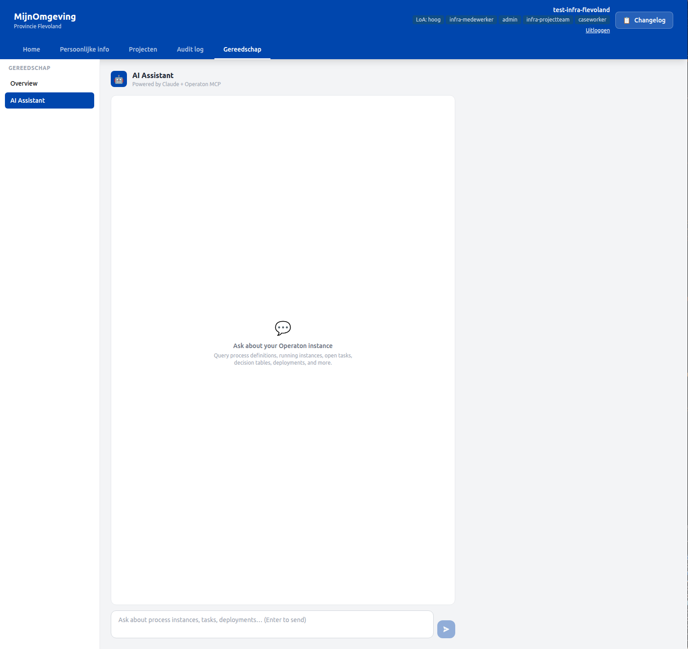
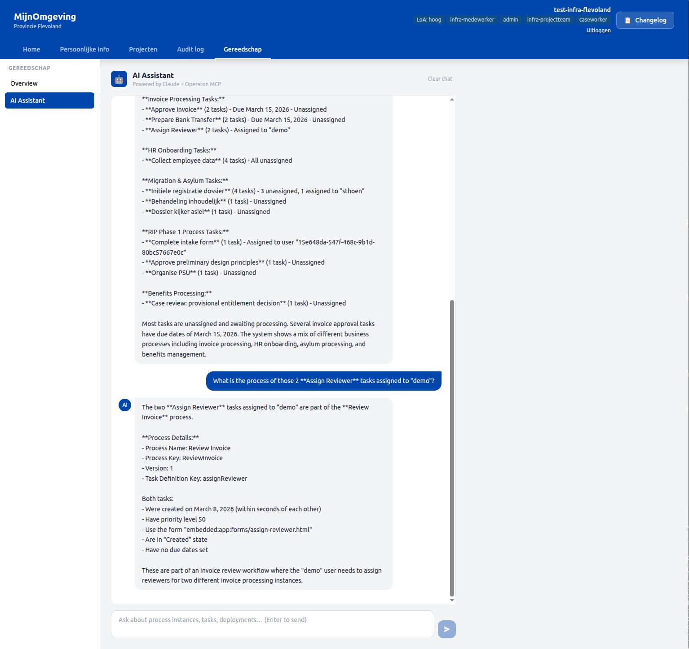

# Operaton MCP AI Assistant

The RONL Business API integrates with [operaton-mcp](https://github.com/operaton/operaton-mcp) — an MCP (Model Context Protocol) server that exposes the full Operaton REST API as AI-callable tools. This enables the AI Assistant feature in the caseworker dashboard: a Claude-powered chat interface that can query process definitions, instances, tasks, decisions, deployments, and incidents directly from the Operaton engine.

## Architecture
```
Caseworker (browser)
    ↓ POST /v1/mcp/chat  (JWT-authenticated)
RONL Business API (backend)
    ↓ Anthropic Messages API  (claude-sonnet-4)
Claude  ←→  Tool calls  ←→  McpClientService
                                    ↓ JSON-RPC over stdio
                             operaton-mcp (child process)
                                    ↓ HTTP REST
                             Operaton engine
```

The `McpClientService` spawns `operaton-mcp` as a child process at server startup and keeps it alive for the lifetime of the backend process. Communication between the backend and `operaton-mcp` uses the MCP stdio transport — JSON-RPC messages over stdin/stdout. The `McpChatService` runs an agentic loop: it sends the user message and conversation history to Claude along with available tool definitions, executes any tool calls Claude requests via `McpClientService`, and returns the final text response.

<figure markdown style="width:100%; margin:0;">
  
  <figcaption>AI Assistant in the Gereedschap tab — empty state before first message.</figcaption>
</figure>

<figure markdown style="width:100%; margin:0;">
  
  <figcaption>AI Assistant conversation.</figcaption>
</figure>

## Prerequisites

- Node.js ≥ 22 (required by `operaton-mcp`)
- `ANTHROPIC_API_KEY` environment variable set
- `MCP_ENABLED=true` environment variable set
- `OPERATON_BASE_URL`, `OPERATON_USERNAME`, `OPERATON_PASSWORD` already configured for the existing Operaton integration

## Environment variables

| Variable | Required | Description |
|---|---|---|
| `MCP_ENABLED` | Yes | Set to `true` to activate the MCP client at startup. When `false`, the service stays dormant and `/v1/mcp/chat` returns 503. |
| `MCP_SKIP_HEALTH_CHECK` | No | Set to `true` to skip the `operaton-mcp` startup connectivity check. Useful in CI or restricted network environments. |
| `ANTHROPIC_API_KEY` | Yes | Anthropic API key for Claude. Required when `MCP_ENABLED=true`. |

The MCP client reuses `OPERATON_BASE_URL`, `OPERATON_USERNAME`, and `OPERATON_PASSWORD` from the existing Operaton configuration — no separate credentials are needed.

## Local development

No additional setup is needed beyond adding the three variables to `packages/backend/.env.development`:
```dotenv
MCP_ENABLED=true
MCP_SKIP_HEALTH_CHECK=false
ANTHROPIC_API_KEY=sk-ant-...
```

On startup you should see:
```
[info] MCP client connected { operatonBaseUrl: 'https://operaton.open-regels.nl/engine-rest' }
[info] MCP client ready
```

If the MCP client fails to connect, the backend continues to start normally and `/v1/mcp/chat` returns 503 until the client is available.

## Azure App Service deployment

The Azure App Service runtime must be Node 22. Set this with the Azure CLI if not already configured:
```bash
az webapp config set \
  --name ronl-business-api-acc \
  --resource-group rg-ronl-acc \
  --linux-fx-version "NODE|22-lts"
```

Add the required application settings:
```bash
az webapp config appsettings set \
  --name ronl-business-api-acc \
  --resource-group rg-ronl-acc \
  --settings \
    MCP_ENABLED=true \
    ANTHROPIC_API_KEY=sk-ant-... \
    OPERATON_USERNAME=<username> \
    OPERATON_PASSWORD=<password>
```

`operaton-mcp` is bundled as a regular dependency in `packages/backend/package.json` and is included in the deployment zip. The backend resolves it via `require.resolve('operaton-mcp/dist/index.js')` on Linux, so no global npm install is required on the App Service container.

## Available tools

The `McpChatService` exposes a curated subset of the 100+ tools provided by `operaton-mcp`. Only read-only tools are enabled, scoped to what is relevant for a caseworker context:

| Group | Tools |
|---|---|
| Process definitions | `processDefinition_list`, `processDefinition_count`, `processDefinition_getByKey` |
| Process instances | `processInstance_list`, `processInstance_count`, `processInstance_get` |
| Tasks | `task_list`, `task_count`, `task_getById` |
| Decisions | `decision_list`, `decision_getByKey`, `decision_evaluate` |
| Deployments | `deployment_list`, `deployment_count`, `deployment_getById` |
| Incidents | `incident_list`, `incident_count` |

Write operations (start, delete, suspend, migrate, etc.) are intentionally excluded. To add a tool, add its name to the `ALLOWED_TOOLS` set in `packages/backend/src/services/mcpChat.service.ts`.

## System prompt conventions

The system prompt in `McpChatService` encodes several conventions that improve answer accuracy:

- When counting or listing deployed decisions or processes, filter by `latestVersion=true` unless the user explicitly asks about all versions. This matches what the Operaton Cockpit shows.
- When listing resources for display, use `maxResults=20`. When counting, use the dedicated count tools.
- Never describe or narrate tool calls in the response text.

## API endpoint
```
POST /v1/mcp/chat
Authorization: Bearer <caseworker or admin JWT>
Content-Type: application/json

{
  "message": "How many process definitions are deployed?",
  "history": [
    { "role": "user", "content": "..." },
    { "role": "assistant", "content": "..." }
  ]
}
```

Response:
```json
{
  "success": true,
  "data": {
    "response": "There are currently 12 process definitions deployed..."
  }
}
```

The `history` array is optional. Pass the full conversation history on each request to maintain context across turns. The frontend lifts this state to `CaseworkerDashboard` so it survives navigation between dashboard sections.

Error responses:

| HTTP | Code | Cause |
|---|---|---|
| 503 | `MCP_DISABLED` | `MCP_ENABLED` is not `true` |
| 503 | `MCP_NOT_CONNECTED` | Client failed to connect at startup |
| 504 | `MCP_CHAT_TIMEOUT` | Agentic loop exceeded 120 seconds |
| 500 | `MCP_CHAT_FAILED` | Unexpected error during the loop |

## Troubleshooting

**`MCP client failed to connect — continuing without MCP`** at startup

Check the error message in the log. Common causes:

- `No configuration found` — `OPERATON_USERNAME` or `OPERATON_PASSWORD` is missing from the app settings. Verify with `az webapp config appsettings list`.
- `Connection closed` — `operaton-mcp` crashed immediately. On Azure, verify Node 22 is active (`az webapp config show --query linuxFxVersion`).
- `MCP connect timed out after 30s` — the child process started but the JSON-RPC handshake never completed. Set `MCP_SKIP_HEALTH_CHECK=true` to rule out connectivity as a cause.

**Answers are wrong or counts don't match the Operaton Cockpit**

The Cockpit shows latest versions only. If counts differ, verify the system prompt's `latestVersion=true` convention is present. You can ask the assistant directly: "What is your system prompt?" to confirm the active conventions.

**`prompt is too long` error from Anthropic**

The tool schemas exceed Claude's context window. This happens if `ALLOWED_TOOLS` grows too large or if conversation history accumulates over many turns. Use the Clear chat button in the UI to reset history, or reduce `ALLOWED_TOOLS` further.

## Planned: streaming responses

The current implementation is synchronous — the full agentic loop completes before the response is returned to the browser. For complex queries involving multiple tool rounds, this can take 15–30 seconds with no visible progress.

The planned streaming implementation will replace the synchronous request/response with Server-Sent Events (SSE):

**Backend changes** (`packages/backend/src/routes/mcp.routes.ts`, `packages/backend/src/services/mcpChat.service.ts`):

- Replace `Promise.race` with an SSE endpoint: set `Content-Type: text/event-stream`, flush headers immediately, write events as they arrive.
- Rewrite `mcpChat.service.ts` to accept an event emitter callback. The agentic loop emits three event types: `status` (tool call starting, e.g. "Querying process definitions…"), `delta` (text token from Anthropic's streaming API), and `done` (loop complete).
- Switch the Anthropic SDK call from `client.messages.create()` to `client.messages.stream()` to yield tokens incrementally. Tool call rounds remain sequential but each emits a `status` event before executing, so the user sees activity rather than silence.

**Frontend changes** (`packages/frontend/src/components/CaseworkerDashboard/McpChatSection.tsx`):

- Replace the `businessApi.mcp.chat()` axios call with a native `fetch` + `ReadableStream` reader that consumes the SSE.
- Add an in-progress assistant message bubble that updates token-by-token as `delta` events arrive.
- Show tool activity as a small status line above the typing indicator when `status` events arrive.

This page will be replaced with a full documentation package after streaming is implemented and validated on ACC.