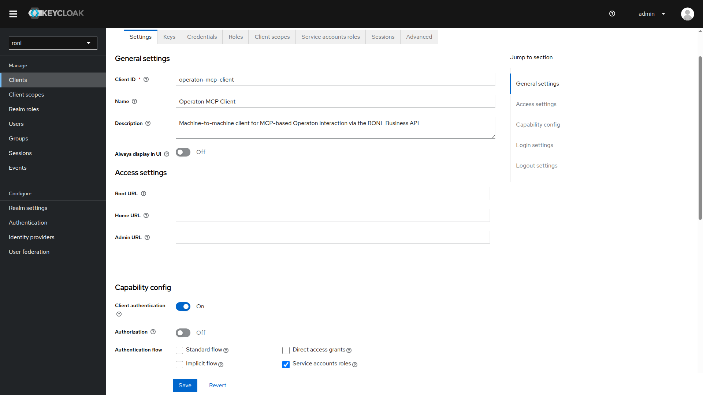
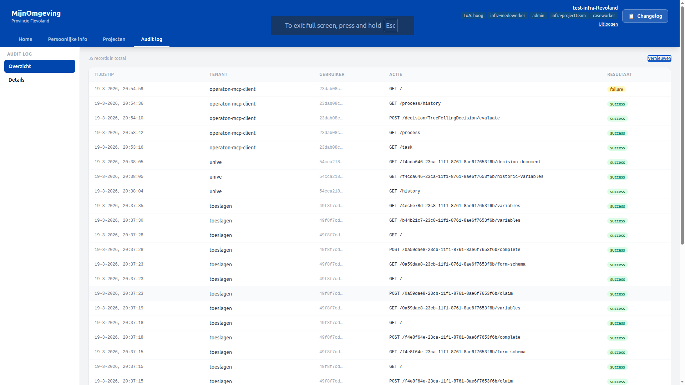

# Operaton MCP Client

This page documents the `operaton-mcp-client` Keycloak client and the `/v1/m2m/*` route group that exposes the full Operaton surface to machine-to-machine (M2M) callers without tenant scoping.

---

## Architecture

Regular RONL Business API routes (`/v1/process`, `/v1/task`, `/v1/decision`) enforce tenant isolation via `tenantMiddleware` — every request must carry a `municipality` JWT claim and data is filtered to that organisation. This is correct for human caseworkers but wrong for system actors such as an MCP agent that needs a cross-organisation view of Operaton.

The M2M API solves this with a dedicated route group that applies only `jwtMiddleware`:

```
MCP Client / Automation tool
    │
    │  1. POST /token  (client_credentials)
    ▼
Keycloak (acc.keycloak.open-regels.nl)
    │
    │  2. access_token (JWT, aud: ronl-business-api)
    │     no municipality claim
    ▼
RONL Business API (acc.api.open-regels.nl)
    │  jwtMiddleware validates token
    │  no tenantMiddleware — no organisation filter
    ▼
Operaton (operaton-doc.open-regels.nl)
```

---

## Keycloak client

A dedicated Keycloak client `operaton-mcp-client` is registered in the `ronl` realm. It uses the **Client Credentials** grant — no browser redirect or user login is involved. No `municipality` or `organisation_type` claims are present in the token by design.

| Setting | Value |
|---|---|
| **Client ID** | `operaton-mcp-client` |
| **Grant type** | `client_credentials` |
| **Token endpoint** | `https://acc.keycloak.open-regels.nl/realms/ronl/protocol/openid-connect/token` |
| **Audience** | `ronl-business-api` (set via audience mapper) |
| **Municipality claim** | absent — M2M client has no tenant scope |

The token endpoint for production will be `https://keycloak.open-regels.nl/realms/ronl/protocol/openid-connect/token`.

<figure markdown>
  
  <figcaption>Keycloak — operaton-mcp-client client settings</figcaption>
</figure>

---

## M2M — Operaton

`packages/backend/src/routes/m2m.routes.ts` registers all endpoints under `/v1/m2m`. All are protected by `jwtMiddleware` only — no `tenantMiddleware`.

### Process

| Method | Endpoint | Description |
|---|---|---|
| `GET` | `/v1/m2m/process` | List active process instances across all organisations. Query params forwarded to Operaton. |
| `POST` | `/v1/m2m/process/:key/start` | Start a process instance by definition key |
| `GET` | `/v1/m2m/process/history` | Query process history. Request body forwarded to Operaton. |
| `GET` | `/v1/m2m/process/:id/status` | Get process instance status |
| `GET` | `/v1/m2m/process/:id/variables` | Get current process variables (plain values) |
| `GET` | `/v1/m2m/process/:id/historic-variables` | Get final variable state of a completed instance |
| `GET` | `/v1/m2m/process/:id/decision-document` | Fetch the DocumentTemplate linked via `ronl:documentRef`. Returns 404 `DOCUMENT_NOT_FOUND` if no `ronl:documentRef` is present. |
| `GET` | `/v1/m2m/process/:key/start-form` | Fetch the deployed Camunda Form schema for a process start event. Returns 404 `FORM_NOT_FOUND` if no form is linked. |
| `GET` | `/v1/m2m/process/:key/variable-hints` | Fetch deduplicated variable names and types from history |
| `DELETE` | `/v1/m2m/process/:id` | Cancel a process instance |

### Task

| Method | Endpoint | Description |
|---|---|---|
| `GET` | `/v1/m2m/task` | List all open tasks across all organisations |
| `GET` | `/v1/m2m/task/:id` | Get a single task by ID |
| `GET` | `/v1/m2m/task/:id/variables` | Get all process variables for a task |
| `GET` | `/v1/m2m/task/:id/form-schema` | Fetch the deployed Camunda Form schema for a task. Returns 404 `FORM_NOT_FOUND` if no form is linked. |
| `POST` | `/v1/m2m/task/:id/claim` | Claim a task. Body: `{ "userId": "..." }` (optional — falls back to token subject) |
| `POST` | `/v1/m2m/task/:id/complete` | Complete a task with submitted variables |

### Decision

| Method | Endpoint | Description |
|---|---|---|
| `POST` | `/v1/m2m/decision/:key/evaluate` | Evaluate a DMN decision table by key |
| `GET` | `/v1/m2m/decision/:key` | Fetch decision definition metadata |

**`POST /v1/m2m/decision/:key/evaluate` request body:**
```json
{
  "variables": {
    "treeDiameter": 45,
    "protectedArea": false
  }
}
```

### Test script

`scripts/test-m2m-routes.sh` validates all M2M routes against a running instance. It obtains a token via Client Credentials, checks JWT claims, exercises every active operation, and verifies tenant isolation remains intact on the standard caseworker routes.

**Prerequisites:** `curl` and `jq` must be available on `$PATH`. The `operaton-mcp-client` Keycloak client must be configured with `CAMUNDA_BPM_AUTHORIZATION_ENABLED=false` on the target Operaton instance (or equivalent authorization grants in place) — without this, process, history, and deployment endpoints return 404.

**Usage:**
```bash
CLIENT_SECRET=<secret> bash scripts/test-m2m-routes.sh
```

**Overridable environment variables:**

| Variable | Default | Description |
|---|---|---|
| `BASE_URL` | `https://acc.api.open-regels.nl` | RONL Business API base URL |
| `KEYCLOAK_URL` | `https://acc.keycloak.open-regels.nl` | Keycloak base URL |
| `CLIENT_ID` | `operaton-mcp-client` | Keycloak client ID |
| `CLIENT_SECRET` | _(required)_ | Keycloak client secret |
| `DECISION_KEY` | `TreeFellingDecision` | DMN key used for the decision evaluate test |

**What it checks:**

- Token obtained and JWT claims valid (`azp`, `aud`, `municipality` absent)
- All active operations return HTTP 200 (404 accepted for `form-schema`, `start-form`, `decision-document` — resource may not exist in the deployment)
- All disabled operations return `403 OPERATION_NOT_PERMITTED`
- `GET /v1/task` with an M2M token returns `403 MISSING_TENANT` — confirming tenant-scoped routes remain isolated

---

## Curation gate

The `M2M_ALLOWED_OPERATIONS` constant at the top of `m2m.routes.ts` controls which operations are active. Comment out any entry to disable that operation — no other code changes are required:

```typescript
const M2M_ALLOWED_OPERATIONS = [
  'process.list',
  'process.start',
  // 'process.delete',   // ← uncomment to disable
  'task.list',
  'task.complete',
  // ...
] as const;
```

A disabled operation returns `403 OPERATION_NOT_PERMITTED`.

---

## Dedicated Operaton instance

The M2M routes can be pointed at a separate Operaton instance by setting `OPERATON_M2M_BASE_URL`. When unset, they share the default instance with all other routes.

| Variable | Required | Description |
|---|---|---|
| `OPERATON_M2M_BASE_URL` | No | Base URL for the M2M Operaton instance. Falls back to `OPERATON_BASE_URL` when absent. |
| `OPERATON_M2M_USERNAME` | No | Basic auth username for the M2M instance |
| `OPERATON_M2M_PASSWORD` | No | Basic auth password for the M2M instance |

On ACC, the M2M routes are pointed at `https://operaton-doc.open-regels.nl/engine-rest`.

---

## Audit logging

All M2M requests are written to the `audit_logs` table. Because the `operaton-mcp-client` token carries no `municipality` claim, the `tenant_id` column is populated with the Keycloak `azp` claim — i.e. `operaton-mcp-client` — making M2M activity queryable and distinguishable from human caseworker activity.

<figure markdown>
  
  <figcaption>Audit log — M2M entries identified by tenant_id = operaton-mcp-client. The failure entry reflects an intentional blocking of tenant-scoped route.</figcaption>
</figure>

---

## Testing with curl

### 1. Obtain a token

```bash
TOKEN=$(curl -s -X POST \
  https://acc.keycloak.open-regels.nl/realms/ronl/protocol/openid-connect/token \
  -H "Content-Type: application/x-www-form-urlencoded" \
  -d "grant_type=client_credentials" \
  -d "client_id=operaton-mcp-client" \
  -d "client_secret=<secret-from-keycloak>" \
  | jq -r .access_token)
```

### 2. Verify the token claims

```bash
echo $TOKEN | cut -d. -f2 | base64 -d 2>/dev/null | jq '{aud, azp, sub}'
```

Expected: `aud` contains `ronl-business-api`, `azp` is `operaton-mcp-client`, no `municipality` claim.

### 3. List all tasks (unfiltered across all organisations)

```bash
curl -s https://acc.api.open-regels.nl/v1/m2m/task \
  -H "Authorization: Bearer $TOKEN" | jq .
```

### 4. List all active process instances

```bash
curl -s https://acc.api.open-regels.nl/v1/m2m/process \
  -H "Authorization: Bearer $TOKEN" | jq .
```

### 5. Evaluate a decision

```bash
curl -s -X POST \
  https://acc.api.open-regels.nl/v1/m2m/decision/TreeFellingDecision/evaluate \
  -H "Authorization: Bearer $TOKEN" \
  -H "Content-Type: application/json" \
  -d '{"variables": {"treeDiameter": 45, "protectedArea": false}}' \
  | jq .
```

### 6. Get process history (body forwarded to Operaton)

```bash
curl -s -X GET \
  https://acc.api.open-regels.nl/v1/m2m/process/history \
  -H "Authorization: Bearer $TOKEN" \
  -H "Content-Type: application/json" \
  -d '{"sorting": [{"sortBy": "startTime", "sortOrder": "desc"}]}' \
  | jq .
```

### 7. Confirm tenant-scoped routes are still blocked

```bash
curl -s https://acc.api.open-regels.nl/v1/task \
  -H "Authorization: Bearer $TOKEN" | jq .error
```

Expected: `MISSING_TENANT` — the token carries no `municipality` claim so `tenantMiddleware` rejects it, confirming the original caseworker routes remain fully isolated.
