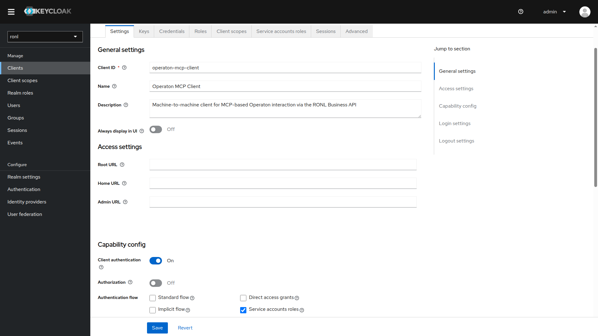
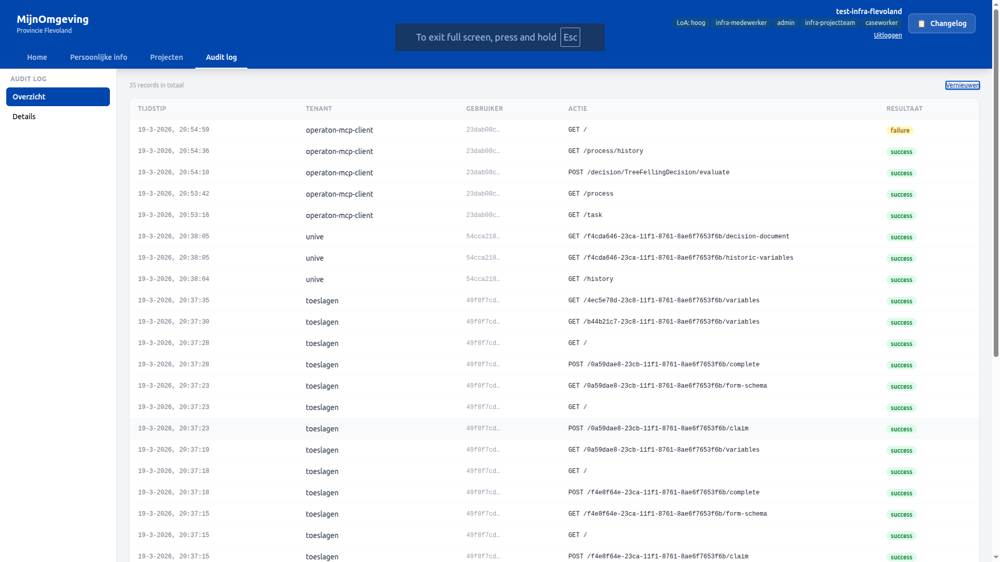

# Operaton MCP Client

This page documents the `operaton-mcp-client` Keycloak client and the `/v1/m2m/*` route group that exposes a curated set of Operaton operations to machine-to-machine (M2M) callers without tenant scoping.

---

## Access pattern

This feature uses [**Pattern 3 — RONL Business API M2M routes**](operaton-access-patterns.md#pattern-3-ronl-business-api-m2m-routes-v1m2m) from the Operaton Access Patterns reference. Callers interact with Operaton **through the RONL Business API**, not directly with `engine-rest`. This gives the platform audit logging, a curation gate, and RONL-shaped response envelopes — at the cost of a narrower operation surface compared to Pattern 2.

There are two distinct authentication hops in this pattern:

1. **Caller → RONL Business API** — the `operaton-mcp-client` Keycloak client obtains a JWT via OAuth 2.0 Client Credentials and presents it as `Authorization: Bearer <token>`. In `m2m.routes.ts`, `jwtMiddleware` validates the token and `requireM2mClient` then admits it only when its `azp` is on `M2M_ALLOWED_CLIENTS` (default `operaton-mcp-client`). Every person in the realm also holds a token for the `ronl-business-api` audience, so a valid token alone is not enough: any other token, a caseworker's or citizen's included, gets `403 M2M_CLIENT_NOT_ALLOWED` before any engine call. `tenantMiddleware` is intentionally absent, so no `municipality` claim is required or expected.

2. **RONL Business API → Operaton** — the backend calls Operaton using **basic auth** via a dedicated `OperatonService` instance, configured from `OPERATON_M2M_BASE_URL`, `OPERATON_M2M_USERNAME`, and `OPERATON_M2M_PASSWORD`. `OPERATON_M2M_BASE_URL` defaults to `https://operaton-doc.open-regels.nl/engine-rest` in `config.ts`, so the `: operatonService` fallback in the code below is not reached while that default stands:
```typescript
const m2mOperatonService = config.operaton.m2mBaseUrl
  ? new OperatonService(
      config.operaton.m2mBaseUrl,
      config.operaton.m2mUsername,
      config.operaton.m2mPassword
    )
  : operatonService;
```

The `M2M_ALLOWED_OPERATIONS` constant in `m2m.routes.ts` acts as a curation gate — any operation not listed returns `403 OPERATION_NOT_PERMITTED` regardless of what Operaton supports. This is the key structural difference from Pattern 2, which exposes the full `engine-rest` surface with no curation.

---

## Architecture

Regular RONL Business API routes (`/v1/process`, `/v1/task`, `/v1/decision`) enforce tenant isolation via `tenantMiddleware` — every request must carry a `municipality` JWT claim and data is filtered to that organisation. This is correct for human caseworkers but wrong for system actors such as an MCP agent that needs a cross-organisation view of Operaton.

The M2M API solves this with a dedicated route group that applies `jwtMiddleware` and the `requireM2mClient` allow-list, and no tenant middleware:

```
MCP Client / Automation tool
    │
    │  1. POST /token  (client_credentials)
    ▼
Keycloak (acc.keycloak.open-regels.nl)
    │
    │  2. access_token (JWT, aud: ronl-business-api)
    │     no municipality claim
    ▼
RONL Business API (acc.api.open-regels.nl)
    │  jwtMiddleware validates token
    │  requireM2mClient: azp on M2M_ALLOWED_CLIENTS, else 403
    │  no tenantMiddleware — no organisation filter
    ▼
Operaton (operaton-doc.open-regels.nl)
```

---

## Keycloak client

A dedicated Keycloak client `operaton-mcp-client` is registered in the `ronl` realm. It uses the **Client Credentials** grant — no browser redirect or user login is involved. No `municipality` or `organisation_type` claims are present in the token by design.

| Setting | Value |
|---|---|
| **Client ID** | `operaton-mcp-client` |
| **Grant type** | `client_credentials` |
| **Token endpoint** | `https://acc.keycloak.open-regels.nl/realms/ronl/protocol/openid-connect/token` |
| **Audience** | `ronl-business-api` (set via audience mapper) |
| **Municipality claim** | absent — M2M client has no tenant scope |

The token endpoint for production will be `https://keycloak.open-regels.nl/realms/ronl/protocol/openid-connect/token`.

<figure markdown>
  
  <figcaption>Keycloak — operaton-mcp-client client settings</figcaption>
</figure>

---

## M2M — Operaton

`packages/backend/src/routes/m2m.routes.ts` registers 18 operations under `/v1/m2m`: ten process, six task and two decision operations. Every one of them passes `jwtMiddleware` and `requireM2mClient`; none passes `tenantMiddleware`, so the surface is deliberately cross-tenant: it lists and acts on process instances and tasks of every organisation.

The operations, their parameters, request bodies, response shapes and error codes are described in the OpenAPI document, under the **Machine-to-machine** tag of the [API Specification](../reference/api-specification.md), with the `m2mOAuth` (client credentials) security scheme. Two details worth knowing before reading it: `POST /v1/m2m/process/:key/start` answers `200` where its `/v1` twin answers `201`, and it keeps a caller's `businessKey` verbatim rather than prefixing it with an organisation.

### Test script

`scripts/test-m2m-routes.sh` checks the M2M routes against a running backend. It obtains a token via Client Credentials, checks its claims, calls the read operations and the decision evaluation, drives a write lifecycle — start, claim, complete, delete — on instances it creates itself, and verifies that tenant isolation still holds on the standard caseworker routes.

The write lifecycle is self-cleaning by construction. It starts two instances of `LIFECYCLE_KEY` with a `businessKey` of `m2m-routes-test-<pid>-a` and `-b`, drives the first to completion through its user task, cancels the second, deletes both in a final cleanup, and checks that no instance with that prefix is left running. It never claims, completes or cancels an instance it did not start — the M2M surface applies no tenant filter, so a stray write would land on a real case.

**Prerequisites:** `curl` and `jq` on `$PATH`; on `TARGET=local` without an exported `CLIENT_SECRET`, also `python`, which reads the secret from the realm file.

**Usage:**
```bash
# Local stack (default) — the secret is read from config/keycloak/ronl-realm.json
bash scripts/test-m2m-routes.sh

# Acceptance — the secret must be supplied
TARGET=acc CLIENT_SECRET=<secret> bash scripts/test-m2m-routes.sh
```

**Overridable environment variables:**

| Variable | Default | Description |
|---|---|---|
| `TARGET` | `local` | `local` or `acc`; selects the preset URLs, decision and lifecycle key below |
| `BASE_URL` | `http://localhost:3002` (local), `https://acc.api.open-regels.nl` (acc) | RONL Business API base URL |
| `KEYCLOAK_URL` | `http://localhost:8080` (local), `https://acc.keycloak.open-regels.nl` (acc) | Keycloak base URL |
| `CLIENT_ID` | `operaton-mcp-client` | Keycloak client ID |
| `CLIENT_SECRET` | from the realm file (local only) | Keycloak client secret; required for `acc` |
| `DECISION_KEY` | `TreeFellingDecision` (local), `AwbCompletenessCheck` (acc) | DMN key for the decision tests |
| `DECISION_VARS` | matching preset | Request body for the evaluate test |
| `LIFECYCLE_KEY` | `ZorgtoeslagProvisionalSubProcessE2E` (local), `ZorgtoeslagProvisionalSubProcess` (acc) | Process the write lifecycle starts. It must raise a user task on its own instance; a task on a called sub-process makes the block skip claim and complete |

**What it checks:**

- Token obtained; `azp` is the client ID, `aud` contains `ronl-business-api`, `municipality` is absent
- The read operations return HTTP 200 (404 accepted for `form-schema`, `start-form`, `decision-document` and `historic-variables`, whose resource may not exist in the deployment); a 404 on `GET /v1/m2m/decision/:key` skips both decision checks
- Write lifecycle, skipped with a note when `LIFECYCLE_KEY` cannot be started:
    - start answers `200`, keeps the `businessKey` verbatim, labels the case's `municipality` with the instance's own `tenantId`, sets no `originTenantId`, and accepts wrapped `{ value, type }` variables as well as plain ones
    - a claim without a body assigns the token subject; re-claiming for the same user answers `200`; claiming a held task for another user answers `500` and leaves the assignee unchanged; a `userId` in the body overrides the token subject
    - complete answers `200` with `completed: true`; completing the same task again answers `500`
    - delete answers `200` with the instance id; cancelling it again answers `500`
    - no test instance is left running
- On `local` only, known-fixture assertions: tenant-scoped processes (`AwbShellProcess`, `AwbZorgtoeslagProcess`) still yield their start forms through the untenanted surface, `RipR21Process` has no start form, and its variable hints resolve
- `GET /v1/task` with an M2M token returns `403 MISSING_TENANT` — tenant-scoped routes remain isolated

The script exits non-zero when any check fails, and lists the failures.

---

## Curation gate

The `M2M_ALLOWED_OPERATIONS` constant at the top of `m2m.routes.ts` controls which operations are active. Comment out any entry to disable that operation — no other code changes are required:

```typescript
export const M2M_ALLOWED_OPERATIONS: string[] = [
  // Process
  'process.list',
  'process.start',
  // 'process.delete',   // ← commented out: disabled
  // Task
  'task.list',
  'task.complete',
  // ...
];
```

All 18 operations are listed today. A disabled operation returns `403 OPERATION_NOT_PERMITTED`. The gate runs after the client allow-list, so a caller not on `M2M_ALLOWED_CLIENTS` gets `403 M2M_CLIENT_NOT_ALLOWED` whatever the operation; the specification carries both codes on one shared `M2mForbidden` response.

---

## Dedicated Operaton instance

The M2M routes talk to their own Operaton engine, separate from the `OPERATON_BASE_URL` engine the tenant-scoped routes use.

| Variable | Required | Description |
|---|---|---|
| `OPERATON_M2M_BASE_URL` | No | Base URL for the M2M Operaton instance. Defaults to `https://operaton-doc.open-regels.nl/engine-rest`; it does not fall back to `OPERATON_BASE_URL`. |
| `OPERATON_M2M_USERNAME` | No | Basic auth username for the M2M instance |
| `OPERATON_M2M_PASSWORD` | No | Basic auth password for the M2M instance |
| `M2M_ALLOWED_CLIENTS` | No | Comma-separated Keycloak client ids, matched against the token's `azp`, that may call `/v1/m2m`. Defaults to `operaton-mcp-client`. Adding a consumer means adding its client id here; nothing changes in Keycloak. |

On ACC, the M2M routes are pointed at `https://operaton-doc.open-regels.nl/engine-rest`.

---

## Audit logging

All M2M requests are written to the `audit_logs` table. Because the `operaton-mcp-client` token carries no `municipality` claim, the `tenant_id` column is populated with the Keycloak `azp` claim — i.e. `operaton-mcp-client` — making M2M activity queryable and distinguishable from human caseworker activity.

<figure markdown>
  
  <figcaption>Audit log — M2M entries identified by tenant_id = operaton-mcp-client. The failure entry reflects an intentional blocking of tenant-scoped route.</figcaption>
</figure>

---

## Testing with curl

### 1. Obtain a token

```bash
TOKEN=$(curl -s -X POST \
  https://acc.keycloak.open-regels.nl/realms/ronl/protocol/openid-connect/token \
  -H "Content-Type: application/x-www-form-urlencoded" \
  -d "grant_type=client_credentials" \
  -d "client_id=operaton-mcp-client" \
  -d "client_secret=<secret-from-keycloak>" \
  | jq -r .access_token)
```

### 2. Verify the token claims

```bash
echo $TOKEN | cut -d. -f2 | base64 -d 2>/dev/null | jq '{aud, azp, sub}'
```

Expected: `aud` contains `ronl-business-api`, `azp` is `operaton-mcp-client`, no `municipality` claim.

### 3. List all tasks (unfiltered across all organisations)

```bash
curl -s https://acc.api.open-regels.nl/v1/m2m/task \
  -H "Authorization: Bearer $TOKEN" | jq .
```

### 4. List all active process instances

```bash
curl -s https://acc.api.open-regels.nl/v1/m2m/process \
  -H "Authorization: Bearer $TOKEN" | jq .
```

### 5. Evaluate a decision

```bash
curl -s -X POST \
  https://acc.api.open-regels.nl/v1/m2m/decision/TreeFellingDecision/evaluate \
  -H "Authorization: Bearer $TOKEN" \
  -H "Content-Type: application/json" \
  -d '{"variables": {"treeDiameter": 45, "protectedArea": false}}' \
  | jq .
```

### 6. Get process history (body forwarded to Operaton)

```bash
curl -s -X GET \
  https://acc.api.open-regels.nl/v1/m2m/process/history \
  -H "Authorization: Bearer $TOKEN" \
  -H "Content-Type: application/json" \
  -d '{"sorting": [{"sortBy": "startTime", "sortOrder": "desc"}]}' \
  | jq .
```

### 7. Confirm tenant-scoped routes are still blocked

```bash
curl -s https://acc.api.open-regels.nl/v1/task \
  -H "Authorization: Bearer $TOKEN" | jq .error
```

Expected: `MISSING_TENANT` — the token carries no `municipality` claim so `tenantMiddleware` rejects it, confirming the original caseworker routes remain fully isolated.
