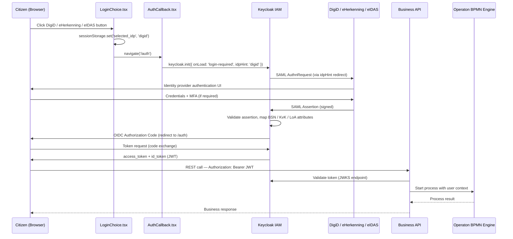
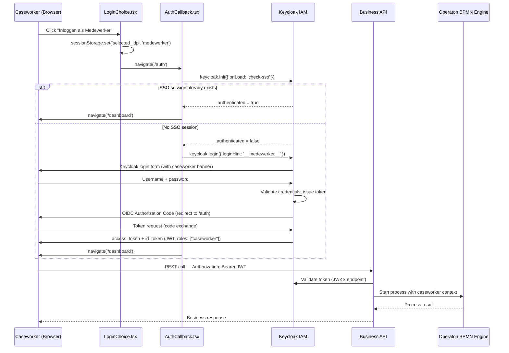

# Authentication & IAM

RONL Business API uses **Keycloak 23** as its Identity and Access Management layer, implementing the OIDC Authorization Code Flow. Keycloak acts as an identity broker, federating authentication requests to DigiD, eIDAS, and eHerkenning — the three Dutch government identity providers.

<figure markdown>
  
  <figcaption>Default Keycloak login page</figcaption>
</figure>

## Authentication flows

The platform supports two distinct authentication paths. Both converge at the Business API's JWT validation middleware, but differ entirely in how the user reaches Keycloak.

### Citizen flow (DigiD / eHerkenning / eIDAS)

Citizens select one of three identity providers on the landing page. `AuthCallback` calls `keycloak.init({ onLoad: 'login-required', idpHint })`, which redirects the browser directly to the selected external IdP — bypassing Keycloak's native login form entirely.



### Caseworker flow (Keycloak native)

Caseworkers are municipal employees whose accounts are managed directly in the Keycloak `ronl` realm. They do not authenticate through an external IdP. `AuthCallback` calls `keycloak.init({ onLoad: 'check-sso' })` first — a silent check that avoids forcing a login screen if the caseworker already has an active SSO session. Only if no session is found does Keycloak redirect to its native login form.



### Caseworker sentinel pattern

The `loginHint: '__medewerker__'` value passed to `keycloak.login()` is a sentinel — a known string that carries no real authentication meaning but acts as a signal to the Keycloak theme. Keycloak passes `login_hint` to the login page as the `login.username` variable, which the `login.ftl` FreeMarker template reads at render time:

```freemarker
<#assign isMedewerker = (login.username!'') == '__medewerker__'>

<#if isMedewerker>
<div id="kc-context-banner" class="kc-context-medewerker">
    <!-- briefcase icon -->
    Inloggen als gemeentemedewerker
</div>
</#if>

<input ... value="<#if !isMedewerker>${(login.username!'')}</#if>" ... />
```

When `isMedewerker` is true, the template renders the indigo context banner and suppresses the sentinel from the username field so the caseworker enters their own credentials into an empty field. No JavaScript is required — the suppression happens server-side in FreeMarker before the HTML is sent to the browser.

## Keycloak as identity broker

Keycloak sits between the municipality portal and the external identity providers. It handles:

- SAML AuthnRequest to DigiD / eHerkenning / eIDAS
- Validation of the signed SAML assertion returned by the IdP
- Attribute mapping: BSN, KvK number, Level of Assurance (LoA), eIDAS assurance level
- User auto-creation or linking on first login
- Issuance of OIDC tokens with custom claims (see below)

In the current development environment, DigiD is **simulated** — test users in the Keycloak realm substitute for a real DigiD connection. The architecture is identical; only the external IdP step is replaced by direct Keycloak credentials.

Caseworker accounts are an exception to the identity broker pattern. Because municipal employees are managed directly in the `ronl` realm, their authentication stays entirely within Keycloak — no SAML round-trip to an external IdP occurs. The `municipality` and `caseworker` role attributes are set directly on the user account in Keycloak Admin and included in the JWT via protocol mappers.

## JWT token structure

The Business API validates every request against the JWT access token. The token contains standard OIDC claims plus RONL-specific custom claims added by Keycloak protocol mappers:

```json
{
  "iss": "https://keycloak.open-regels.nl/realms/ronl",
  "aud": "ronl-business-api",
  "sub": "user-uuid-123",
  "typ": "Bearer",
  "preferred_username": "test-citizen-utrecht",
  "municipality": "utrecht",
  "roles": ["citizen"],
  "loa": "substantial"
}
```

**Caseworker token example:**

```json
{
  "sub": "xyz789abc012",
  "name": "Petra van Dam",
  "preferred_username": "test-caseworker-utrecht",
  "municipality": "utrecht",
  "loa": "hoog",
  "realm_access": {
    "roles": ["caseworker"]
  },
  "aud": "ronl-business-api",
  "iss": "https://acc.keycloak.open-regels.nl/realms/ronl"
}
```

Caseworker tokens do not contain a `bsn` claim. The `loa` value is set statically on the Keycloak user account rather than derived from a SAML assertion.

| Claim          | Type   | Description                                      | Example            |
| -------------- | ------ | ------------------------------------------------ | ------------------ |
| `municipality` | string | Tenant identifier used for isolation             | `"utrecht"`        |
| `roles`        | array  | User roles for authorization                     | `["citizen"]`      |
| `loa`          | string | Level of Assurance from DigiD                    | `"substantial"`    |
| `mandate`      | string | Representation authority (optional)              | `"legal-guardian"` |
| `bsn`          | string | Citizen Service Number (encrypted in production) | `"***-***-***"`    |

## OIDC discovery endpoints

**ACC:**

```
https://acc.keycloak.open-regels.nl/realms/ronl/.well-known/openid-configuration
```

**Production:**

```
https://keycloak.open-regels.nl/realms/ronl/.well-known/openid-configuration
```

Key endpoints exposed via the discovery document:

| Endpoint                 | Purpose                                                   |
| ------------------------ | --------------------------------------------------------- |
| `authorization_endpoint` | Redirects user to Keycloak login page                     |
| `token_endpoint`         | Exchanges authorization code for tokens                   |
| `jwks_uri`               | Public keys used by Business API to verify JWT signatures |
| `userinfo_endpoint`      | Returns user profile attributes                           |
| `end_session_endpoint`   | Logout                                                    |

## Token validation in the backend

The backend validates every incoming request through `auth/jwt.middleware.ts`:

1. Extracts `Authorization: Bearer <token>` header
2. Fetches the JWKS from Keycloak (cached in Redis, TTL 300s)
3. Verifies the JWT signature using the matching `kid`
4. Checks `exp`, `iss`, and `aud` claims
5. Attaches decoded claims to `req.user` for downstream middleware

If any validation step fails, the request is rejected with HTTP 401 before it reaches any route handler.

## Security settings in the Keycloak realm

The `ronl` realm is configured with:

- Access token lifespan: 15 minutes (`accessTokenLifespan: 900`)
- SSO session idle timeout: 30 minutes
- Brute force protection enabled (5 failed attempts → 15-minute lockout, exponential backoff)
- PKCE (Proof Key for Code Exchange): enabled on the `ronl-business-api` client
- Direct access grants: enabled for development test users only

The realm configuration is version-controlled in `config/keycloak/ronl-realm.json` and can be imported via the Keycloak Admin Console or the deployment scripts.

## Connecting a real DigiD / eHerkenning / eIDAS provider

The current development environment simulates DigiD with test users in the Keycloak realm. The following documents how to configure Keycloak to broker real government identity providers when going to production. This configuration is done in the Keycloak Admin Console.

### DigiD (SAML 2.0)

DigiD integrates via SAML 2.0. Keycloak acts as the SAML Service Provider.

**Create the Identity Provider:**

1. **Identity Providers → Add provider → SAML v2.0**
2. Set:
   - Alias: `digid`
   - Display name: `DigiD`
   - Service Provider Entity ID: `https://keycloak.open-regels.nl/realms/ronl`
   - Single Sign-On Service URL: provided by Logius
   - NameID Policy Format: `urn:oasis:names:tc:SAML:1.1:nameid-format:unspecified`
   - Force Authentication: enabled
   - Validate Signatures: enabled (upload Logius certificate)
   - Sign Assertions: as required by Logius contract

**Attribute mappers** (Identity Provider → DigiD → Mappers → Create):

| SAML Attribute OID                 | Maps to user attribute |
| ---------------------------------- | ---------------------- |
| `urn:oid:2.5.4.5`                  | `bsn`                  |
| `urn:oid:1.3.6.1.4.1.5923.1.1.1.9` | `loa`                  |

### eHerkenning (SAML 2.0)

eHerkenning is used for business users (KvK-based identity).

- Alias: `eherkenning`
- NameID is organisation-bound (KvK number)
- Additional attributes: KvK number, mandate, assurance level (eH2 / eH3 / eH4)

Map these to user attributes as above, then add protocol mappers to include them in the JWT.

### eIDAS (SAML 2.0)

eIDAS covers EU cross-border authentication.

- Alias: `eidas`
- Typical attributes: `PersonIdentifier`, `FamilyName`, `FirstName`, `DateOfBirth`, `LevelOfAssurance` (low / substantial / high)

### Authentication flow

After adding the IdPs, configure a custom browser flow:

1. **Authentication → Flows → Browser → Copy**
2. Name: `browser-digid`
3. Add an **Identity Provider Redirector** execution
4. Set `browser-digid` as the realm default browser flow

**First Broker Login flow** — what happens when a user logs in via DigiD for the first time:

- Auto-create user: enabled
- Skip profile update: enabled
- Block login if BSN attribute is missing: enforced via a script authenticator

### Assurance level (LoA) enforcement

**Option A — API-level check (recommended):** Validate the `loa` claim in the Business API. Return HTTP 403 if the level is insufficient for the requested operation.

**Option B — Keycloak flow-level check:** Add a conditional execution to the browser flow that evaluates the `loa` attribute and blocks access below a threshold.

### Protocol mappers for IdP attributes

After mapping IdP attributes to Keycloak user attributes, add Protocol Mappers on the `ronl-business-api-dedicated` client scope so they appear in the access token:

| Mapper type     | User attribute | Token claim    |
| --------------- | -------------- | -------------- |
| User Attribute  | `bsn`          | `bsn`          |
| User Attribute  | `loa`          | `loa`          |
| User Attribute  | `municipality` | `municipality` |
| User Realm Role | (realm roles)  | `roles`        |

Enable **Add to access token: ON** for each mapper.

### Token example (production)

```json
{
  "iss": "https://keycloak.open-regels.nl/realms/ronl",
  "aud": "ronl-business-api",
  "sub": "f:digid:8f23...",
  "bsn": "***-***-***",
  "loa": "substantial",
  "municipality": "utrecht",
  "roles": ["citizen"]
}
```

### Compliance notes

- Follow Logius integration contracts strictly (certificate requirements, NameID format, Force Authentication)
- Never persist BSN outside the allowed AVG scope
- Use short-lived access tokens (15 minutes)
- Enable audit logging in Keycloak Admin → Realm Settings → Events
- SAML Single Logout to DigiD is optional; configure at the IdP level if required by contract
