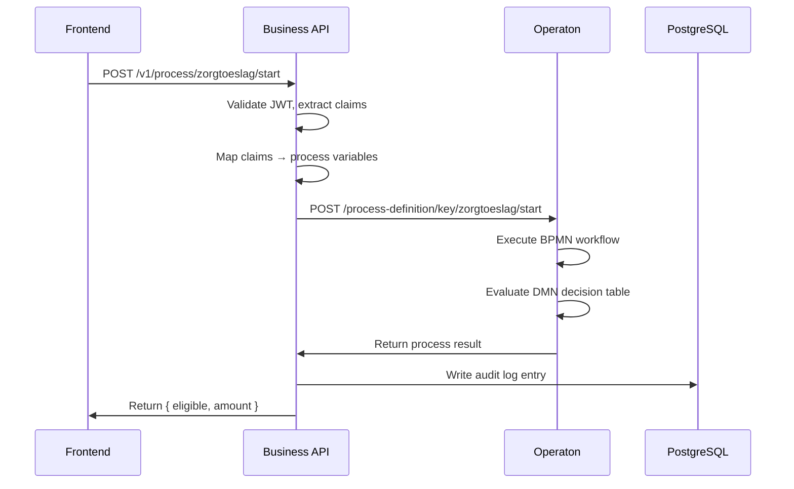

# Business Rules Execution

RONL Business API delegates all business rule execution to **Operaton**, an open-source BPMN/DMN engine (Apache 2.0 licence) hosted on the VM at `operaton.open-regels.nl`. The Business API acts as a secure, authenticated proxy: it validates the user's identity and then invokes Operaton on their behalf.

## What Operaton handles

- Executing BPMN 2.0 workflows that orchestrate multi-step government processes
- Evaluating DMN 1.3 decision tables (e.g. eligibility rules, benefit calculations)
- Managing process instances: start, status, variables, completion
- Business rule versioning — multiple versions of a process definition can coexist

The Business API hides the complexity of Operaton's REST API behind simple, purpose-built endpoints such as `POST /v1/decision/:key/evaluate` and `POST /v1/process/:key/start`.

## Supported processes

Currently configured processes include:

**Zorgtoeslag (healthcare allowance calculation)**  
Evaluates four eligibility criteria against a DMN decision table and returns whether the applicant qualifies and the calculated monthly amount.

Input variables mapped from the JWT and request body:

| Variable | Type | Source |
|---|---|---|
| `ingezeteneVanNederland` | boolean | Request body |
| `18JaarOfOuder` | boolean | Request body |
| `zorgverzekeringInNederland` | boolean | Request body |
| `inkomenEnVermogen` | number | Request body |
| `initiator` | string | JWT `sub` claim |
| `municipality` | string | JWT `municipality` claim |

Output: `{ "eligible": true, "amount": 1150 }`

## Process execution flow

## API endpoints for business rules

| Method | Endpoint | Description |
|---|---|---|
| `POST` | `/v1/decision/:key/evaluate` | Evaluate a DMN decision table by key |
| `POST` | `/v1/process/:key/start` | Start a BPMN process instance |
| `GET` | `/v1/process/:id/status` | Get process instance status |
| `GET` | `/v1/process/:id/variables` | Get process instance output variables |
| `DELETE` | `/v1/process/:id` | Cancel a process instance |

All endpoints require a valid JWT in the `Authorization: Bearer` header.

## Operaton environment

Operaton runs as a Docker container on the VM, exposed via Caddy reverse proxy at `https://operaton.open-regels.nl`. It is shared between ACC and PROD environments, using separate process definition version tags to isolate deployments.

The Operaton Cockpit (management UI) is available at the same URL for inspecting running processes, viewing audit history, and managing deployments.
