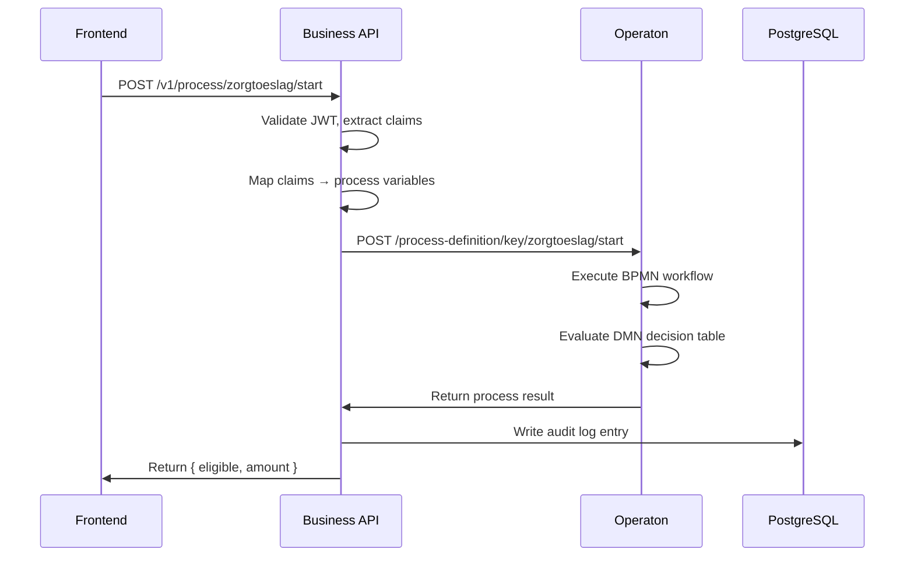
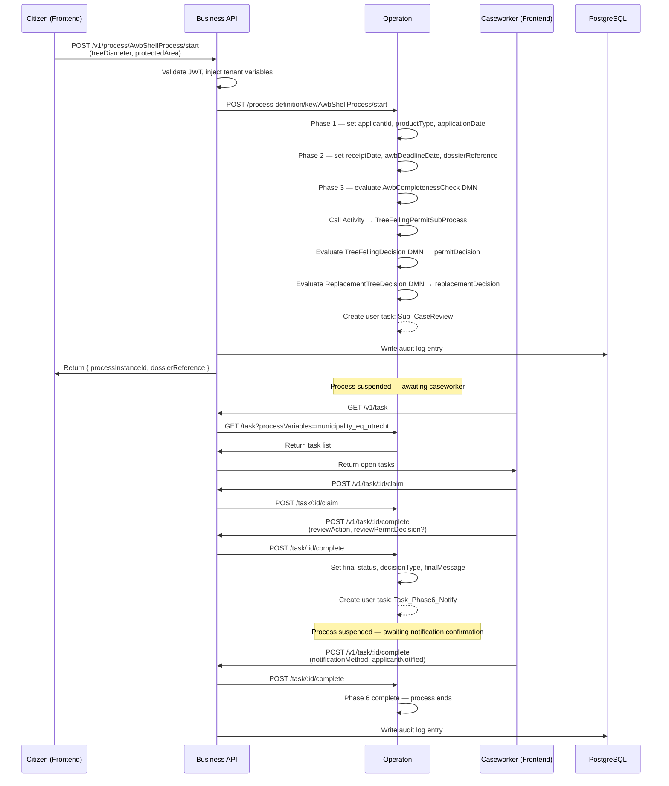

# Business Rules Execution

RONL Business API delegates all business rule execution to **Operaton**, an open-source BPMN/DMN engine (Apache 2.0 licence) hosted on the VM at `operaton.open-regels.nl`. The Business API acts as a secure, authenticated proxy: it validates the user's identity and then invokes Operaton on their behalf.

## What Operaton handles

- Executing BPMN 2.0 workflows that orchestrate multi-step government processes
- Evaluating DMN 1.3 decision tables (e.g. eligibility rules, benefit calculations)
- Managing process instances: start, status, variables, completion
- Business rule versioning — multiple versions of a process definition can coexist

The Business API hides the complexity of Operaton's REST API behind simple, purpose-built endpoints such as `POST /v1/decision/:key/evaluate` and `POST /v1/process/:key/start`.

---

## Supported processes

Currently configured processes include:

**Zorgtoeslag (healthcare allowance calculation)**  
Evaluates four eligibility criteria against a DMN decision table and returns whether the applicant qualifies and the calculated monthly amount.

Input variables mapped from the JWT and request body:

| Variable | Type | Source |
|---|---|---|
| `ingezeteneVanNederland` | boolean | Request body |
| `18JaarOfOuder` | boolean | Request body |
| `zorgverzekeringInNederland` | boolean | Request body |
| `inkomenEnVermogen` | number | Request body |
| `initiator` | string | JWT `sub` claim |
| `municipality` | string | JWT `municipality` claim |

Output: `{ "eligible": true, "amount": 1150 }`

---

## Process execution flow Zorgtoeslag

```mermaid
sequenceDiagram
    participant F as Frontend
    participant B as Business API
    participant O as Operaton
    participant D as PostgreSQL

    F->>B: POST /v1/process/zorgtoeslag/start
    B->>B: Validate JWT, extract claims
    B->>B: Map claims → process variables
    B->>O: POST /process-definition/key/zorgtoeslag/start
    O->>O: Execute BPMN workflow
    O->>O: Evaluate DMN decision table
    O->>B: Return process result
    B->>D: Write audit log entry
    B->>F: Return { eligible, amount }
```

**AWB Kapvergunning (tree felling permit)**  
A two-layer BPMN process implementing the Dutch Administrative Law Act (Awb) procedural requirements.

The outer shell (`AwbShellProcess`) manages the six AWB phases: receipt acknowledgement, completeness check, decision subprocess, and citizen notification. It sets `receiptDate`, `awbDeadlineDate` (8 weeks per Awb 4:13), and `dossierReference`.

The inner subprocess (`TreeFellingPermitSubProcess`) handles the substantive decision: it evaluates `TreeFellingDecision.dmn` and `ReplacementTreeDecision.dmn`, creates a `Sub_CaseReview` user task for caseworker review, and writes the final `permitDecision`, `status`, and `finalMessage` variables back to the parent process.

After the subprocess completes, the AWB shell creates a `Task_Phase6_Notify` user task requiring the caseworker to confirm citizen notification before the process ends.

---

## Process execution flow Tree Felling permit

```mermaid
sequenceDiagram
    participant C as Citizen (Frontend)
    participant B as Business API
    participant O as Operaton
    participant CW as Caseworker (Frontend)
    participant D as PostgreSQL

    C->>B: POST /v1/process/AwbShellProcess/start<br/>(treeDiameter, protectedArea)
    B->>B: Validate JWT, inject tenant variables
    B->>O: POST /process-definition/key/AwbShellProcess/start
    O->>O: Phase 1 — set applicantId, productType, applicationDate
    O->>O: Phase 2 — set receiptDate, awbDeadlineDate, dossierReference
    O->>O: Phase 3 — evaluate AwbCompletenessCheck DMN
    O->>O: Call Activity → TreeFellingPermitSubProcess
    O->>O: Evaluate TreeFellingDecision DMN → permitDecision
    O->>O: Evaluate ReplacementTreeDecision DMN → replacementDecision
    O-->>O: Create user task: Sub_CaseReview
    B->>D: Write audit log entry
    B->>C: Return { processInstanceId, dossierReference }

    Note over O: Process suspended — awaiting caseworker

    CW->>B: GET /v1/task
    B->>O: GET /task?processVariables=municipality_eq_utrecht
    O->>B: Return task list
    B->>CW: Return open tasks

    CW->>B: POST /v1/task/:id/claim
    B->>O: POST /task/:id/claim
    CW->>B: POST /v1/task/:id/complete<br/>(reviewAction, reviewPermitDecision?)
    B->>O: POST /task/:id/complete
    O->>O: Set final status, decisionType, finalMessage
    O-->>O: Create user task: Task_Phase6_Notify

    Note over O: Process suspended — awaiting notification confirmation

    CW->>B: POST /v1/task/:id/complete<br/>(notificationMethod, applicantNotified)
    B->>O: POST /task/:id/complete
    O->>O: Phase 6 complete — process ends
    B->>D: Write audit log entry
```

**The key structural differences from Zorgtoeslag worth noting**:

- Two suspension points — the process does not complete in a single request
- Two actors — citizen initiates, caseworker drives both decision and notification
- Subprocess — the material decision happens inside `TreeFellingPermitSubProcess`, which writes its variables back to the AWB shell
- No result in the start response — the citizen receives only a `dossierReference`; the actual decision is only available later via `/v1/process/history`

From v2.2.0, citizen and caseworker interaction with the AWB process is driven entirely by **Camunda Forms** — JSON schemas authored in the [LDE Form Editor](../../../linked-data-explorer/features/form-editor.md) and deployed alongside the BPMN in Operaton. The citizen start form is fetched and rendered dynamically; the caseworker review and notification forms are fetched per task. A **Decision Viewer** in the citizen dashboard fetches the final variable state of completed applications via the Operaton history API. See [Dynamic Forms](dynamic-forms.md) for the full implementation detail.

---

## API endpoints for business rules

| Method | Endpoint | Description |
|---|---|---|
| `POST` | `/v1/decision/:key/evaluate` | Evaluate a DMN decision table by key |
| `POST` | `/v1/process/:key/start` | Start a BPMN process instance |
| `GET` | `/v1/process/:id/status` | Get process instance status |
| `GET` | `/v1/process/:id/variables` | Get process instance output variables |
| `DELETE` | `/v1/process/:id` | Cancel a process instance |
| `GET` | `/v1/task` | List open tasks for the caseworker's municipality |
| `GET` | `/v1/task/:id/variables` | Get process variables for a task |
| `POST` | `/v1/task/:id/claim` | Claim a task |
| `POST` | `/v1/task/:id/complete` | Complete a task with caseworker-submitted variables |
| `GET` | `/v1/process/history` | List process history for the authenticated citizen |
| `GET` | `/v1/process/:key/start-form` | Fetch the deployed Camunda Form schema for a process start event |
| `GET` | `/v1/task/:id/form-schema` | Fetch the deployed Camunda Form schema for a task |
| `GET` | `/v1/process/:id/historic-variables` | Fetch final variable state of a completed process instance |

All endpoints require a valid JWT in the `Authorization: Bearer` header.

---

## Operaton environment

Operaton runs as a Docker container on the VM, exposed via Caddy reverse proxy at `https://operaton.open-regels.nl`. It is shared between ACC and PROD environments, using separate process definition version tags to isolate deployments.

The Operaton Cockpit (management UI) is available at the same URL for inspecting running processes, viewing audit history, and managing deployments.
