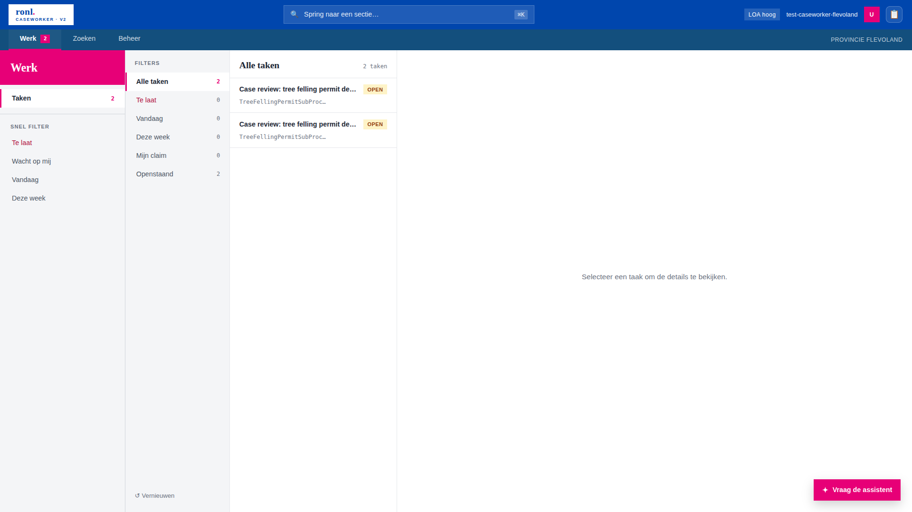
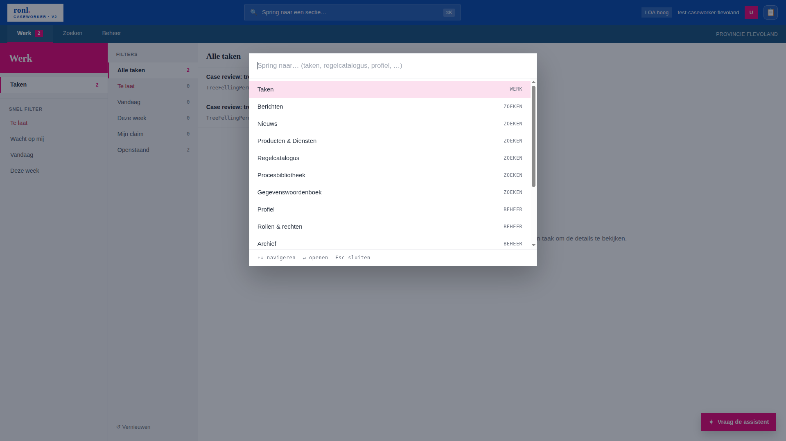

# Caseworker Dashboard (V2)

From v3.0.0 the caseworker portal at `/dashboard/caseworker` is served by the **V2 shell**. The earlier three-zone V1 shell has been retired; there is one caseworker dashboard and the `/dashboard/caseworker/v2` path now redirects to the canonical route for one release to catch stale bookmarks.

<figure markdown style="width:100%; margin:0;">
  
  <figcaption>The V2 caseworker shell: top bar with ⌘K search, a mode tab strip (Werk · Zoeken · Beheer), a mode-scoped rail, the main content area, and the toggleable assistant dock.</figcaption>
</figure>

---

## Shell layout

V2 replaces V1's flat 25-item left panel with a three-mode information architecture. The shell renders four regions:

```
┌────────────────────────────────────────────────────────────┐
│ Top bar (logo · ⌘K search · user)                          │
├────────────────────────────────────────────────────────────┤
│ Werk · Zoeken · Beheer                             [tenant]│
├──────────┬─────────────────────────────────┬───────────────┤
│ Rail     │ Main (section content)          │ Assistant ▶   │
│ (mode-   │                                 │ (toggleable)  │
│  scoped) │                                 │               │
└──────────┴─────────────────────────────────┴───────────────┘
```

The shell itself (`pages/CaseworkerDashboardV2.tsx`) owns only auth state, tenant theme application, navigation state, and layout. All section content is dispatched by `components/CaseworkerDashboardV2/SectionRouter.tsx`, which re-uses the existing section components verbatim.

!!! note "Inherited from V1"
    Keycloak auth and role guards, tenant theme application via `initializeTenantTheme(...)`, and every section component and its network calls are inherited unchanged. V2 is a shell redesign, not a rewrite of the sections.

---

## The three modes

Modes are defined in `pages/caseworker-v2/modes.config.ts`. The mapping is derived from V1's `tenants.<tenant>.leftPanelSections`:

| Mode | Default section | Maps from V1 | Contents |
|---|---|---|---|
| **Werk** | `taken` | V2-native | Taken, quick filters (Te laat / Wacht op mij / Vandaag / Deze week), DVTP (municipality tenants only) |
| **Zoeken** | `berichten` | V1 "Home" | Berichten, Nieuws, Producten & Diensten, Regelcatalogus, Procesbibliotheek, Gegevenswoordenboek |
| **Beheer** | `profiel` | V1 "Persoonlijke info" + "Projecten" + "IOU" + "Audit log" + "Gereedschap" | Account, Onboarding, Capaciteit, RIP, IOU, Hulpmiddelen, Audit log |

When switching modes, the shell jumps to that mode's `defaultSectionId` if the current section does not belong to the new mode, keeping the rail consistent with the selected tab.

---

## Command palette (⌘K)

`components/CaseworkerDashboardV2/CommandPalette.tsx` provides keyboard-driven navigation. ⌘K (or Ctrl+K) toggles it; any section is reachable in two keystrokes. The palette searches all non-filter sections via `allSearchableSections()` and applies the same visibility gate as the rail (see [Section gating](#section-gating)), so a section the user cannot see in the rail is also absent from palette results.

<figure markdown style="width:100%; margin:0;">
  
  <figcaption>The ⌘K command palette. Each result shows the section label and its owning mode.</figcaption>
</figure>

---

## Assistant dock

The AI assistant is hosted in a toggleable right-side dock (`components/CaseworkerDashboardV2/AssistantDock.tsx`), not as a rail item. The dock re-uses `McpChatSection` verbatim; conversation state is hoisted into the dock and persisted to `sessionStorage`, so toggling the dock or reloading the page keeps the thread. A floating "Vraag de assistent" button opens the dock when it is closed.

See [MCP AI Assistant](../developer/mcp-ai-assistant.md) for the assistant itself.

---

## Section gating

V2 enforces visibility through a single predicate, `isRailItemVisible(item, ctx)` in `modes.config.ts`, used by both the rail filter and the command palette so what is hidden is hidden everywhere. A `RailItem` may declare:

- `authRequired` — hidden for anonymous visitors
- `requiredRoles?: string[]` — OR-set of realm roles; hidden unless the user holds at least one
- `requiredOrgTypes?: OrgTypeGate[]` — hidden unless the user's `organisation_type` matches
- tenant gate — a tenant-scoped section only shows if its id appears in the active tenant's `leftPanelSections`; shell-global ids (`audit-*`, `gereedschap-overzicht`, `taken`, `dvtp-*`, `filter-*`) bypass the tenant gate

`SectionRouter` applies a defence-in-depth check via `findGateFor()`: any gated section deep-linked or reached by palette renders `<NoAccessPanel>` instead of the section if the gate fails. This means a permission regression cannot leak a section even if the rail filter is bypassed.

The current gate populations:

| Section | Gate |
|---|---|
| `hr-onboarding`, `onboarding-archief` | `requiredRoles: ['hr-medewerker']` |
| `capacity-claim` | `requiredRoles: ['manager']` |
| `capacity-claim-archief` | OR-set of all capacity-claim participant roles |
| `rip-fase1`, `rip-fase1-wip`, `rip-fase1-gereed` | `requiredRoles: ['infra-projectteam']` |
| `audit-overzicht`, `audit-details` | `requiredRoles: ['admin']` |
| `dvtp-start`, `dvtp-taken` | `requiredOrgTypes: ['municipality']` |

---

## Per-section crash isolation

`SectionErrorBoundary` wraps `<SectionRouter>`. A render error in one section shows an inline recovery panel ("Deze sectie kon niet geladen worden") with a retry action, without taking down the top bar, rail, or dock.

---

## Related documentation

- [Caseworker Dashboard (section reference)](caseworker-dashboard.md) — section ID table, tenant vs platform scoping
- [Multi-Tenant Municipality Portal](multi-tenant-portal.md) — tenant theming and isolation
- [MCP AI Assistant](../developer/mcp-ai-assistant.md) — the assistant hosted in the dock
- [Frontend Development](../developer/frontend-development.md) — V2 shell architecture