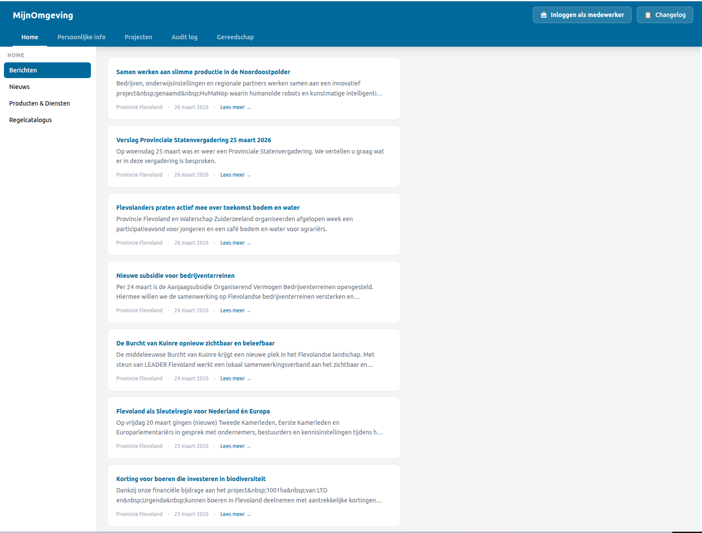
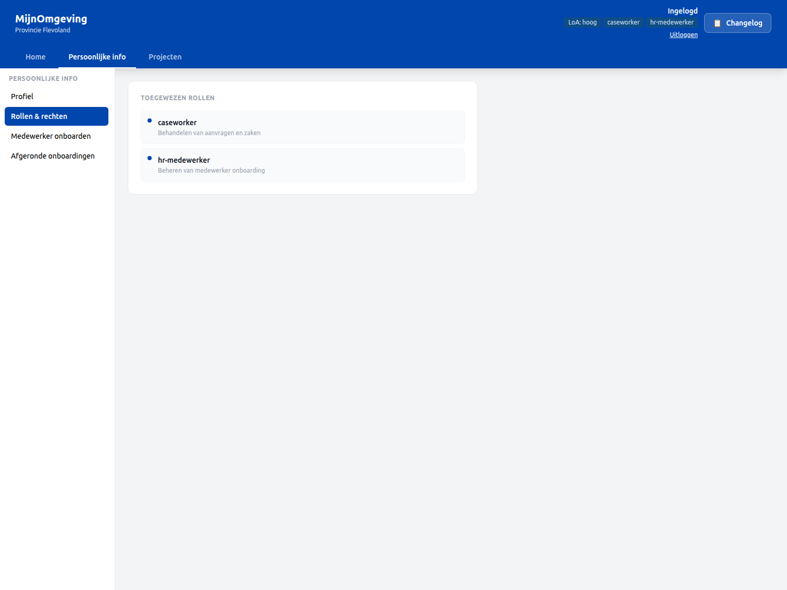
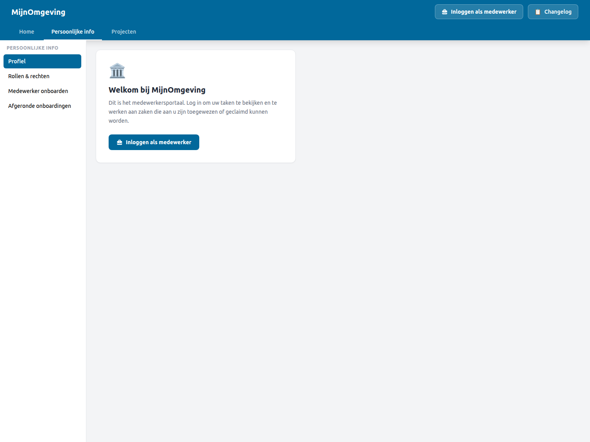
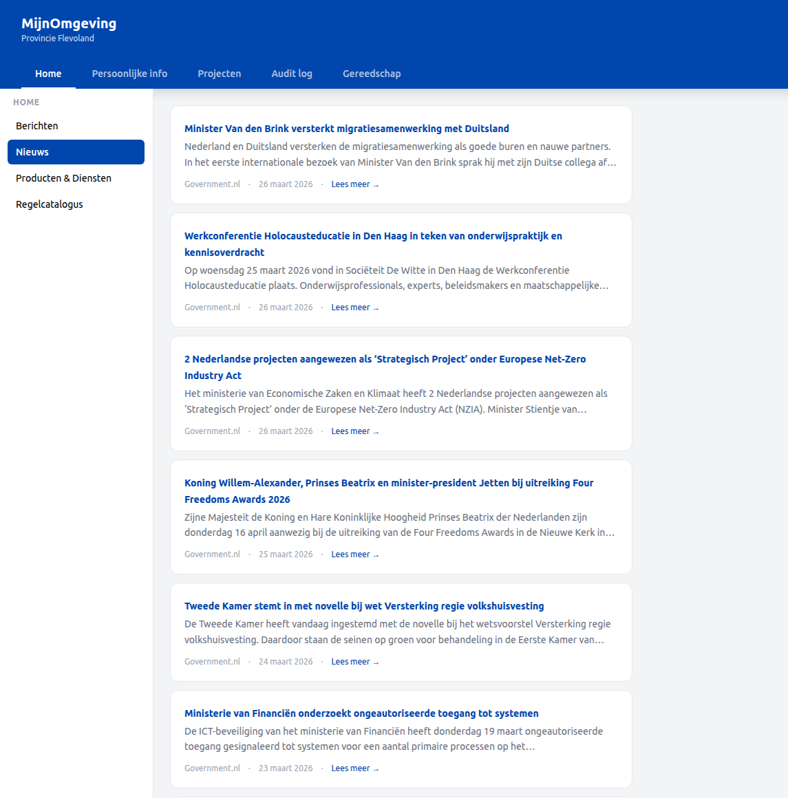
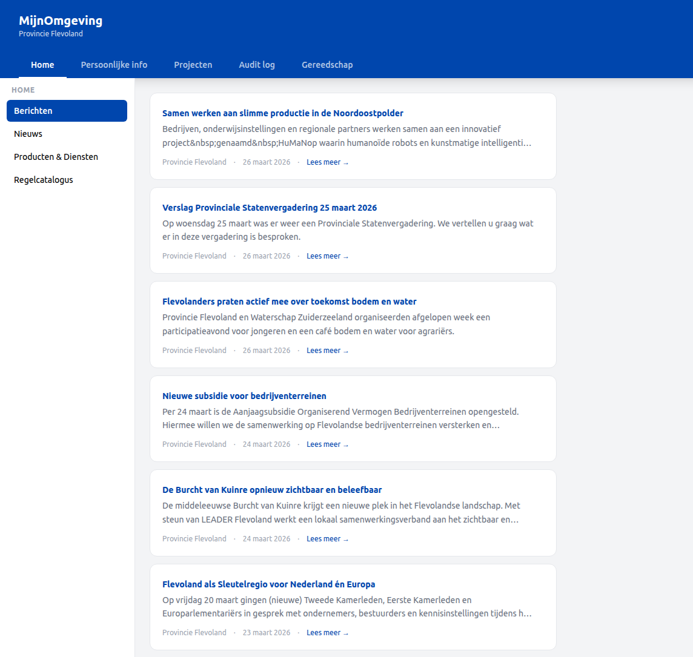
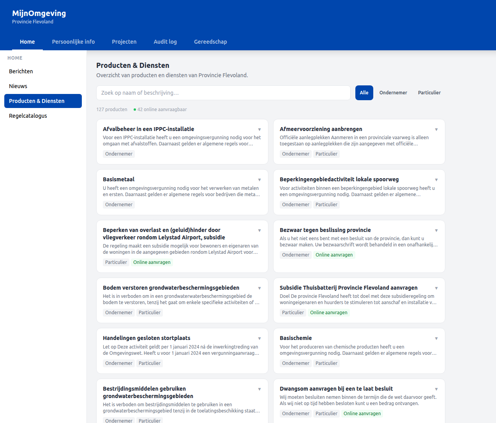
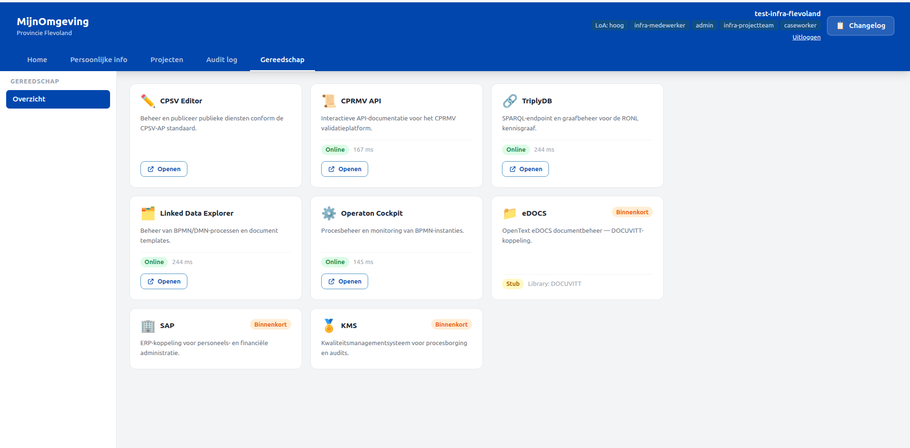

# Caseworker Dashboard

The MijnOmgeving caseworker dashboard is the primary interface for municipality staff. It is a shell-based single-page application that loads at `/dashboard/caseworker` and remains publicly accessible — authentication is handled inside the component rather than at the route level, allowing unauthenticated visitors to browse public content before logging in.

<figure markdown style="width:100%; margin:0;">
  
  <figcaption>The three-zone caseworker dashboard: top navigation bar, left panel, and main content area</figcaption>
</figure>

---

## Shell layout

The dashboard is divided into three permanent zones:

```
┌─────────────────────────────────────────────────────────────────────┐
│  Top navigation bar (header)                                        │
│  MijnOmgeving  [Home] [Persoonlijke info] [Projecten]               │
│                [Gereedschap] [Audit log]                      User  │
├──────────────┬──────────────────────────────────────────────────────┤
│ Left panel   │                                                      │
│ (w-56)       │  Main content area                                   │
│              │                                                      │
│ Section nav  │  Rendered by renderContent()                         │
│              │  based on activeSection                              │
└──────────────┴──────────────────────────────────────────────────────┘
```

!!! note "Tenant vs Platform"
    Tenant-configured pages (Home, Persoonlijke info, Projecten) are driven by `tenants.json`. Platform-scoped pages (Gereedschap, Audit log) are hardcoded in `CaseworkerDashboard.tsx` — they always appear for authenticated users regardless of tenant.

### Top navigation bar

The header contains three top-level navigation pages and a user block on the right:

| Page ID         | Label             | Default first section    | Scope                                        |
| --------------- | ----------------- | ------------------------ | -------------------------------------------- |
| `home`          | Home              | Nieuws                   | Tenant-configured (`tenants.json`)           |
| `personal-info` | Persoonlijke info | Profiel                  | Tenant-configured (`tenants.json`)           |
| `projects`      | Projecten         | Taken                    | Tenant-configured (`tenants.json`)           |
| `gereedschap`   | Gereedschap       | Gereedschap (overview)   | Platform-scoped — all authenticated users    |
| `audit-log`     | Audit log         | Overzicht                | Platform-scoped — `admin` role required      |

The three tenant-configured pages show or hide entirely based on whether the tenant's `leftPanelSections` contains at least one section for that page. Pages with no accessible sections for the current user are filtered out of the top nav automatically.

When tasks are pending, the page button for Projecten shows a count badge (`tasks.length`) so caseworkers can see open work at a glance without navigating there first.

The user block shows:

- `preferred_username` from the JWT (set via Keycloak `username` → `preferred_username` protocol mapper)
- LoA badge (`loa` claim, e.g. `hoog`)
- One badge per role in `realm_access.roles` (e.g. `caseworker`, `hr-medewerker`)
- **Uitloggen** button when authenticated, or an **Inloggen als medewerker** button when not

<figure markdown style="width:100%; margin:0;">
  
  <figcaption>Header showing username, LoA badge, and role badges for a user with both caseworker and hr-medewerker roles</figcaption>
</figure>

### Left panel

The left panel is driven entirely by `tenantConfig.leftPanelSections[activeTopNavPage]` — an array of section objects configured per tenant in `public/tenants.json`. Switching the top-nav page swaps the entire left-panel contents. Each section object has the shape:

```json
{ "id": "nieuws", "label": "Nieuws", "isPublic": true }
```

The `isPublic` flag controls whether the section is accessible without authentication (see [Public and private sections](#public-and-private-sections) below).

The active section is highlighted using the tenant's primary colour (`--color-primary`). Clicking a section stores the choice in `sectionMemory` so returning to the same top-nav page restores the last visited section rather than defaulting to the first.

### Main content area

The main area renders the component for `activeSection`. Each section ID maps to a dedicated render function:

| Section ID              | Component                              | Auth required                     |
| ----------------------- | -------------------------------------- | --------------------------------- |
| `nieuws`                | `<NieuwsSection />`                    | No                                |
| `berichten`             | `<BerichtenSection />`                 | No                                |
| `producten-diensten`    | `<ProductenDienstenCatalogus />`       | No                                |
| `regelcatalogus`        | `<RegelCatalogus />`                   | No                                |
| `taken`                 | `<TakenSection />`                     | Yes                               |
| `archief`               | `<ArchiefSection />`                   | Yes                               |
| `profiel`               | `<ProfielSection />`                   | Yes                               |
| `rollen`                | `<RollenSection />`                    | Yes                               |
| `hr-onboarding`         | `<HrOnboardingSection />`              | Yes + `hr-medewerker` role        |
| `onboarding-archief`    | `<OnboardingArchiefSection />`         | Yes + `hr-medewerker` role        |
| `rip-fase1`             | `<RipFase1Section />`                  | Yes + `infra-projectteam` role    |
| `rip-fase1-wip`         | `<RipFase1WipSection />`               | Yes + `infra-projectteam` role    |
| `rip-fase1-gereed`      | `<RipFase1GereedSection />`            | Yes + `infra-projectteam` role    |
| `gereedschap-overzicht` | `<GereedschapSection />`               | Yes (platform-scoped)             |
| `audit-overzicht`       | `<AuditSection activeTab="overzicht">` | Yes + `admin` role (platform-scoped) |
| `audit-details`         | `<AuditSection activeTab="details">`   | Yes + `admin` role (platform-scoped) |

All components live in `src/components/CaseworkerDashboard/` (from v2.9.2). The platform-scoped entries (`gereedschap-overzicht`, `audit-overzicht`, `audit-details`) are never present in any tenant's `leftPanelSections` — they use dedicated section constant arrays hardcoded in `CaseworkerDashboard.tsx`.

Sections not yet implemented render a placeholder card ("Deze sectie is in ontwikkeling.").

---

## Public and private sections

The dashboard is accessible without login. Whether a section renders its content or a login prompt depends on the `isPublic` field in `tenants.json`:

- **`isPublic: true`** — content renders for all visitors, authenticated or not.
- **`isPublic: false`** — an unauthenticated visitor clicking the section sees a login prompt instead of the content. No redirect occurs; the user remains on the page.

When an unauthenticated visitor lands on the dashboard and navigates to a top-nav page whose first section is private, the dashboard selects the first _public_ section for that page automatically, avoiding an empty content area.

<figure markdown style="width:100%; margin:0;">
  
  <figcaption>Clicking a private section while unauthenticated shows the login prompt inline without leaving the page</figcaption>
</figure>

Clicking **Inloggen als medewerker** in the prompt stores `medewerker` in `sessionStorage` and navigates to `/auth`, following the same caseworker login path described in [Logging In](../user-guide/login-flow.md#caseworker-path).

---

## Home tab

The Home tab contains three public sections, all visible without authentication.

### Nieuws

Fetches the latest government news from the Rijksoverheid RSS feed via `GET /v1/public/nieuws`. Items are shown as expandable cards with title, publication date, and stripped body text. The feed is cached for 10 minutes on the backend; on cache failure the stale result is returned to prevent a blank UI.

<figure markdown style="width:100%; margin:0;">
  
  <figcaption>Home → Nieuws — government news items from Rijksoverheid</figcaption>
</figure>

### Berichten

`BerichtenSection` is a self-contained component that fetches and renders announcements from `GET /v1/public/berichten`. It owns its own fetch lifecycle and requires no props beyond being mounted.

The data source changed in v2.9.3 from a hardcoded seed array to the live Provincie Flevoland RSS feed. From the frontend perspective the contract is unchanged — the component consumes the same `BerichtItem` shape it always did.

Each card in the list shows the subject, preview, priority badge, and publication date. When `item.action` is present, a **Lees meer →** anchor is rendered in the card footer, linking directly to the source article on flevoland.nl. This mirrors the pattern used by `NieuwsSection`.

The section is registered as `{ id: "berichten", label: "Berichten", isPublic: true }` in `leftPanelSections.home` for all tenants in `tenants.json`, and appears above `nieuws`.

<figure markdown style="width:100%; margin:0;">
  
  <figcaption>Berichten section — live RSS feed from Provincie Flevoland.</figcaption>
</figure>

### Producten & Diensten Catalogus

`ProductenDienstenCatalogus` is a self-contained component that fetches `GET /v1/public/producten-diensten` and renders the Provincie Flevoland SC4.0 product feed as an expandable card grid. The section is only configured in the Flevoland tenant's `leftPanelSections.home` in `tenants.json`. It is publicly accessible — no login required.

**Layout.** Products are displayed in a 2-column card grid, styled after `RegelCatalogus`. Each card shows the product title and audience badges (`Ondernemer`, `Particulier`). An **Online aanvragen** badge appears on products where `onlineAanvragen` is `true`. Expanding a card reveals the full description and a link to the product page on flevoland.nl.

**Filtering.** A free-text search field and an audience filter (Alle / Ondernemer / Particulier) are rendered above the grid. Both filters operate client-side on the full cached dataset.

**Stats row.** A summary row above the grid shows the total number of visible products and the count of items with online aanvraag enabled.

<figure markdown style="width:100%; margin:0;">
  
  <figcaption>Producten & Diensten Catalogus — Flevoland SC4.0 feed rendered as an expandable card grid.</figcaption>
</figure>

To add this section to another tenant, add the following entry to that tenant's `leftPanelSections.home` in `public/tenants.json`:
```json
{ "id": "producten-diensten", "label": "Producten & Diensten", "isPublic": true }
```

The backend service (`productenDiensten.service.ts`) currently hard-codes the Flevoland SC4.0 feed URL. Serving a different feed for a different tenant would require extending the service to accept a tenant parameter.

### Regelcatalogus

Displays the RONL knowledge graph via `GET /v1/public/regelcatalogus`. See [Regelcatalogus](regelcatalogus.md) for the full feature description.

---

## Persoonlijke info tab

The Persoonlijke info tab exposes four left-panel sections, all requiring authentication. See [HR Onboarding Workflow](../user-guide/hr-onboarding.md) for a full walkthrough of each section.

| Section                | Accessible to             |
| ---------------------- | ------------------------- |
| Profiel                | All caseworkers           |
| Rollen & rechten       | All caseworkers           |
| Medewerker onboarden   | `hr-medewerker` role only |
| Afgeronde onboardingen | `hr-medewerker` role only |

---

## Projecten tab

The Projecten tab contains the task queue and, for tenants with active BPMN processes, dedicated project management sections. The sections shown depend on the tenant configuration in `public/tenants.json`.

The Flevoland province tenant exposes the following sections:

| Section            | Accessible to       | Description                                               |
| ------------------ | ------------------- | --------------------------------------------------------- |
| Taken              | All caseworkers     | Full task queue with claim and complete                   |
| RIP Fase 1 starten | `infra-projectteam` | Start a new RipPhase1Process instance                     |
| RIP Fase 1 WIP     | `infra-projectteam` | Browse active RIP Phase 1 projects and their documents    |
| RIP Fase 1 gereed  | `infra-projectteam` | Browse completed RIP Phase 1 projects and their documents |
| Actieve zaken      | All caseworkers     | Placeholder                                               |
| Archief            | All caseworkers     | Placeholder                                               |

See [Caseworker Workflow](../user-guide/caseworker-workflow.md) for the task queue and [RIP Phase 1 Workflow](../user-guide/rip-phase1-workflow.md) for the full RIP process walkthrough.

---

## Tenant configuration

Each tenant defines its own left-panel section lists in `public/tenants.json`. This means different organisation types (municipality, province, national) can expose a different set of sections without any code change:

```json
"leftPanelSections": {
  "home": [
    { "id": "nieuws",             "label": "Nieuws",                "isPublic": true  },
    { "id": "berichten",          "label": "Berichten",             "isPublic": true  },
    { "id": "producten-diensten", "label": "Producten & Diensten",  "isPublic": true  },
    { "id": "regelcatalogus",     "label": "Regelcatalogus",        "isPublic": true  }
  ],
  "personal-info": [
    { "id": "profiel",             "label": "Profiel",                 "isPublic": false },
    { "id": "rollen",              "label": "Rollen & rechten",        "isPublic": false },
    { "id": "hr-onboarding",       "label": "Medewerker onboarden",    "isPublic": false },
    { "id": "onboarding-archief",  "label": "Afgeronde onboardingen",  "isPublic": false }
  ],
  "projects": [
    { "id": "taken",           "label": "Taken",              "isPublic": false },
    { "id": "rip-fase1",       "label": "RIP Fase 1 starten", "isPublic": false },
    { "id": "rip-fase1-wip",   "label": "RIP Fase 1 WIP",     "isPublic": false },
    { "id": "rip-fase1-gereed","label": "RIP Fase 1 gereed",  "isPublic": false },
    { "id": "actief",          "label": "Actieve zaken",      "isPublic": false },
    { "id": "archief",         "label": "Archief",            "isPublic": false }
  ]
}
```

To add a new section, add an entry here and implement the corresponding case in `renderContent()` in `CaseworkerDashboard.tsx`. The RIP sections are Flevoland-specific — other tenants omit them entirely from their `tenants.json`.

---

## Tenant-scoped vs platform-scoped features

Not all dashboard features are controlled by `tenants.json`. There are two distinct categories:

**Tenant-scoped features** are configured per organisation in `tenants.json` via `leftPanelSections`. They vary between tenants — a section present for Flevoland may be absent for Utrecht. Adding or removing a tenant-scoped feature requires only a `tenants.json` change; no code is touched.

**Platform-scoped features** are hardcoded in `CaseworkerDashboard.tsx` and apply across all tenants. They are not controlled by organisation — instead, visibility is gated by **role**. A platform-scoped feature is either present for all tenants (if the user holds the required role) or absent for all tenants (if they do not).

The **audit log** is the primary example of a platform-scoped feature. It is not listed in any tenant's `leftPanelSections`, it shows cross-tenant data, and its visibility is governed by the `admin` role — not by organisation.

The **Gereedschap** tab is a second example. It is also not in `tenants.json` — it is a fixed top-nav page available to all authenticated caseworkers regardless of organisation. It provides a central hub for platform tools (LDE, TriplyDB, CPSV Editor, CPRMV API, Operaton Cockpit, eDOCS, SAP, KMS), each as a tool card. Active tools open in a new tab; placeholder tools (eDOCS, SAP, KMS) show an orange **Binnenkort** badge instead. Live status widgets for Operaton, eDOCS, CPRMV API, TriplyDB, and LDE are fetched on mount — eDOCS and Operaton via existing endpoints, the three external tools via `GET /v1/health/external` (server-side HEAD requests to avoid CORS). Operaton Cockpit and SAP are only visible to users with the `admin` role. Adding a new tool requires a single entry in the `PLATFORM_TOOLS` constant in `GereedschapSection.tsx`.

Two further features follow the same pattern: the **Changelog button** in the top navigation bar and **top navigation filtering** (which hides top-nav pages that have no accessible sections for the current user). Both are rendered unconditionally in `CaseworkerDashboard.tsx` and are unaffected by tenant configuration.

The practical rule when adding new dashboard functionality: if the feature is organisation-specific, add it to `tenants.json` and implement the corresponding `case` in `renderContent()`. If the feature is cross-tenant and role-gated, add it directly to `CaseworkerDashboard.tsx` without touching `tenants.json`.

<figure markdown style="width:100%; margin:0;">
  
  <figcaption>Gereedschap tab — platform tools hub with live status badges. Operaton Cockpit shows Online with latency; eDOCS shows Stub mode.</figcaption>
</figure>

---

## Related documentation

- [Caseworker Workflow](../user-guide/caseworker-workflow.md) — Task queue, claim, complete, AWB Kapvergunning, Archief
- [HR Onboarding Workflow](../user-guide/hr-onboarding.md) — Persoonlijke info sections in detail
- [RIP Phase 1 Workflow](../user-guide/rip-phase1-workflow.md) — Projecten tab RIP sections in detail
- [Regelcatalogus](regelcatalogus.md) — Knowledge graph browser
- [Multi-Tenant Municipality Portal](multi-tenant-portal.md) — Tenant theming and isolation
- [Frontend Development](../developer/frontend-development.md) — CaseworkerDashboard.tsx architecture
