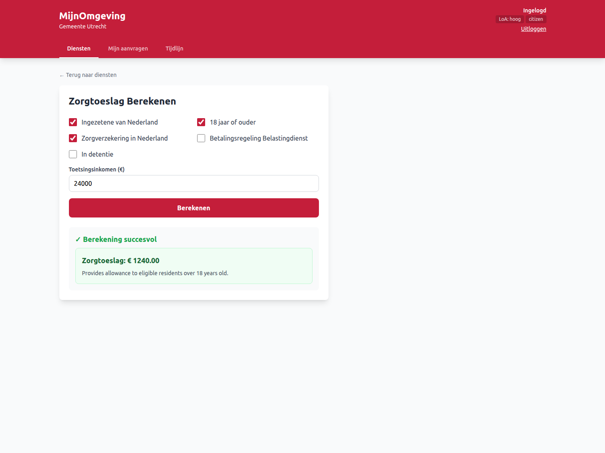

# Multi-Tenant Municipality Portal

RONL Business API is built for multi-tenancy from the ground up. Each Dutch municipality that integrates with the platform has its own branded portal, its own set of users and roles, its own isolated data, and its own audit logs — all running on shared infrastructure.

<figure markdown style="width:100%; margin:0;">
  
  <figcaption>Example dashboard MijnOmgeving showing Zorgtoeslag calculation</figcaption>
</figure>

## Supported municipalities

Four municipalities are currently configured:

| Municipality | Theme primary | Theme secondary | Portal URL |
|---|---|---|---|
| Utrecht | `#C41E3A` (red) | `#2C5F2D` (green) | https://mijn.open-regels.nl |
| Amsterdam | `#EC0000` (bright red) | `#003B5C` (dark blue) | — |
| Rotterdam | `#00811F` (green) | `#0C2340` (navy) | — |
| Den Haag | `#007BC7` (blue) | `#005A99` / `#E17000` (orange) | — |

Adding a new municipality requires a `tenants.json` entry and a Keycloak user group — see [Adding a Municipality](../user-guide/adding-municipality.md).

## Dynamic theming

The frontend reads the `municipality` claim from the JWT on login and applies the corresponding theme by setting CSS custom properties on `document.documentElement`:

```
--color-primary
--color-primary-dark
--color-primary-light
--color-secondary
--color-accent
```

This means a single deployed frontend binary serves all municipalities — the branding switches per user session based on their JWT claim, with no page reload required.

The tenant configuration is loaded from `public/tenants.json` at runtime. Each entry specifies the theme, the municipality code (for API filtering), enabled features, and contact details.

## Per-tenant feature flags

The `TenantFeatures` configuration allows enabling or disabling specific government services per municipality:

```
zorgtoeslag    — healthcare allowance calculation
kinderbijslag  — child benefit calculation
huurtoeslag    — rent allowance calculation
processes      — list of allowed BPMN process keys
```

A municipality that has not been cleared to offer `kinderbijslag` cannot invoke that process endpoint even if a user submits a valid JWT. The `processes` allowlist is enforced in the backend's tenant middleware.

## Tenant isolation in the backend

Every API request passes through the tenant middleware, which:

1. Extracts the `municipality` claim from the validated JWT
2. Loads the tenant configuration for that municipality
3. Attaches the tenant context to `req.user`
4. Ensures all downstream queries and audit log entries are scoped to that municipality

Process instances from one tenant are never returned to another. Audit log queries are always filtered by `municipality`.

## User roles

Each municipality has two standard roles configured in the Keycloak realm:

| Role | Scope | Capabilities |
|---|---|---|
| `citizen` | Own submissions | Start processes, view own application status, view own results |
| `caseworker` | Municipality queue | Process applications, view all submissions for their municipality, update status |
| `admin` | System | Manage users, view audit logs, configure settings |

Roles are set as realm roles in Keycloak, mapped into the JWT via a protocol mapper, and validated by the backend's authorization middleware.
