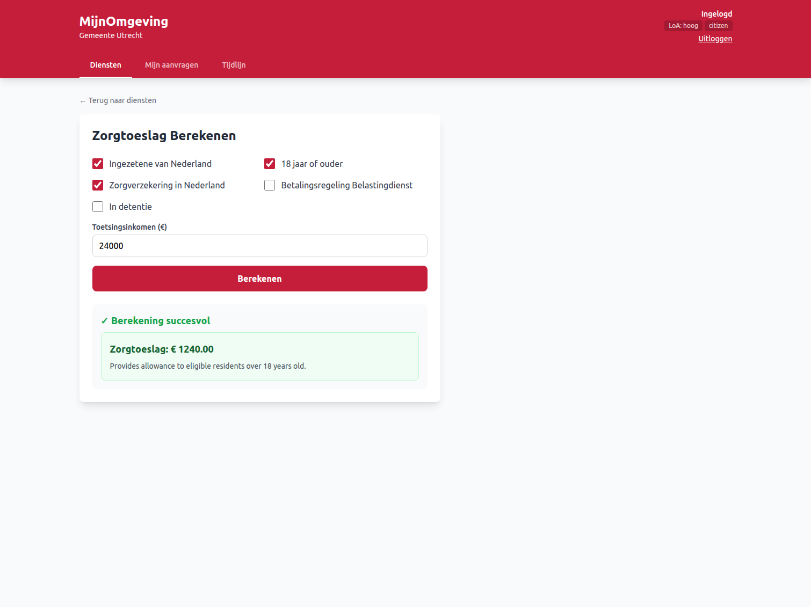

# Multi-Tenant Municipality Portal

RONL Business API is built for multi-tenancy from the ground up. Each Dutch municipality that integrates with the platform has its own branded portal, its own set of users and roles, its own isolated data, and its own audit logs — all running on shared infrastructure.

<figure markdown style="width:100%; margin:0;">
  
  <figcaption>Example dashboard MijnOmgeving showing Zorgtoeslag calculation</figcaption>
</figure>

---

## Supported municipalities

Six tenants are currently configured across three organisation types:

| Tenant | `organisationType` | Theme primary | Portal URL |
|---|---|---|---|
| Utrecht | `municipality` | `#C41E3A` (red) | https://mijn.open-regels.nl |
| Amsterdam | `municipality` | `#EC0000` (bright red) | — |
| Rotterdam | `municipality` | `#00811F` (green) | — |
| Den Haag | `municipality` | `#007BC7` (blue) | — |
| Provincie Flevoland | `province` | `#0046ad` (blue) | — |
| UWV | `national` | — | — |

Adding a new tenant requires a `tenants.json` entry and a Keycloak user — see [Adding a Municipality](../user-guide/adding-municipality.md).

---

## Dynamic theming

The frontend reads the `municipality` claim from the JWT on login and applies the corresponding theme by setting CSS custom properties on `document.documentElement`:

```
--color-primary
--color-primary-dark
--color-primary-light
--color-secondary
--color-accent
```

This means a single deployed frontend binary serves all municipalities — the branding switches per user session based on their JWT claim, with no page reload required.

The tenant configuration is loaded from `public/tenants.json` at runtime. Each entry specifies the theme, the municipality code (for API filtering), enabled features, and contact details.

---

## Per-tenant feature flags

The `TenantFeatures` configuration allows enabling or disabling specific government services per municipality:

```
zorgtoeslag    — healthcare allowance calculation
vergunningen   — permit applications (AWB Kapvergunning, etc.)
subsidies      — subsidy applications
meldingen      — municipal notifications
```

A municipality that has not been cleared to offer `kinderbijslag` cannot invoke that process endpoint even if a user submits a valid JWT. The `processes` allowlist is enforced in the backend's tenant middleware.

---

## Tenant isolation in the backend

Every API request passes through the tenant middleware, which:

1. Extracts the `municipality` claim from the validated JWT
2. Loads the tenant configuration for that municipality
3. Attaches the tenant context to `req.user`
4. Ensures all downstream queries and audit log entries are scoped to that municipality

Process instances from one tenant are never returned to another. Audit log queries are always filtered by `municipality`.

---

## Organisation types

From v2.4.1, the platform supports three organisation categories as first-class types in `TenantConfig`:

| `organisationType` | Used for | `organisationCode` example |
|---|---|---|
| `municipality` | Dutch municipalities (gemeenten) | CBS municipality code e.g. `GM0344` |
| `province` | Dutch provinces | CBS province code e.g. `PV24` |
| `national` | National government agencies (rijksoverheid) | OIN or agency identifier |

The `organisationType` is injected into every JWT via the `organisation_type` Keycloak protocol mapper and propagated as a BPMN process variable by the tenant middleware. It is available in Operaton as `organisationType` alongside `municipality`.

`municipalityCode` is now optional in `TenantConfig`. Provinces and national agencies use `organisationCode` instead.

---

## User roles

Each municipality has two standard roles configured in the Keycloak realm:

| Role | Scope | Capabilities |
|---|---|---|
| `citizen` | Own submissions | Start processes, view own application status, view own results |
| `caseworker` | Municipality queue | Process applications, view all submissions for their municipality, update status |
| `admin` | System | Manage users, view audit logs, configure settings |

Roles are set as realm roles in Keycloak, mapped into the JWT via a protocol mapper, and validated by the backend's authorization middleware.

---

## Caseworker dashboard shell

The caseworker portal at `/dashboard/caseworker` is the primary entry point for municipality staff. Unlike the citizen dashboard, it is a **public route** — the page loads for any visitor and renders public content (Nieuws, Berichten, Regelcatalogus) without authentication. Authentication state is checked inside the component; private sections replace their content with a login prompt when clicked by an unauthenticated visitor.

The dashboard layout consists of three zones: a top navigation bar, a left panel driven by `tenantConfig.leftPanelSections`, and a main content area. The left panel section list changes with each top-nav page, and the active section is remembered per page so navigating between Home, Persoonlijke info, and Projecten and back always restores the last visited section.

Tenant theming applies in full — the header background and active section indicator use `--color-primary` from the municipality's theme entry in `tenants.json`. For unauthenticated visitors the default tenant (`utrecht`) is loaded so the left panel always renders.

See [Caseworker Dashboard](caseworker-dashboard.md) for the complete feature description.