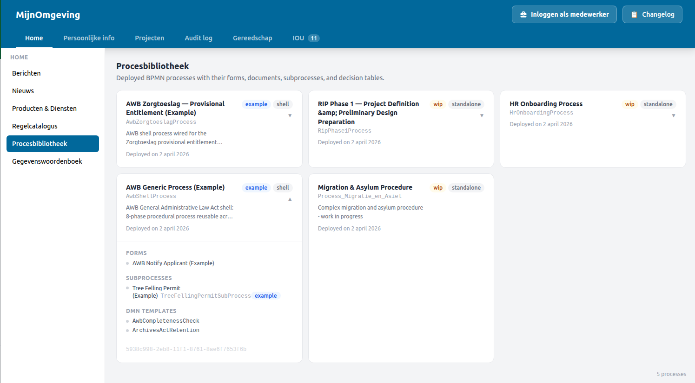

# Procesbibliotheek

From v2.9.7, the caseworker dashboard includes a **Procesbibliotheek** — a public section showing all deployed BPMN process bundles from the Linked Data Explorer (LDE). It gives caseworkers and unauthenticated visitors an at-a-glance view of the processes, forms, document templates, and decision models that are live in the platform.

<figure markdown style="width:100%; margin:0;">
  
  <figcaption>Procesbibliotheek — each card represents a deployed BPMN bundle. Expanding a card reveals linked forms, document templates, and DMN keys.</figcaption>
</figure>

---

## Placement and access

The Procesbibliotheek appears under the **Home** tab in the caseworker dashboard left panel for all tenants whose `tenants.json` entry includes `{ "id": "procesbibliotheek", "label": "Procesbibliotheek", "isPublic": true }` in `leftPanelSections.home`. It is rendered by the `ProcesBibliotheek` React component (`src/components/CaseworkerDashboard/ProcesBibliotheek.tsx`).

`isPublic: true` means it is accessible without login, alongside Nieuws, Berichten, and Regelcatalogus.

---

## What the cards show

Each card represents one deployed BPMN bundle from the LDE. The collapsed card shows:

- Process name (from the LDE bundle metadata)
- `bpmnProcessId` (the Operaton process definition key)
- Status badge: **WIP**, **Actief**, or **Concept**
- Role badge: **Standalone** or **Subprocess**
- Deployment date

Expanding a card reveals:

- Linked Camunda Form schemas (by `camunda:formRef`)
- Linked document templates (by `ronl:documentRef`)
- Linked DMN decision keys
- LDE deployment ID

---

## Data source

Data is fetched on mount from `VITE_LDE_API_URL/bundles/public`. This is the same public endpoint used by the LDE frontend and requires no authentication. A dedicated `ldeApi` Axios instance in `services/api.ts` is used to avoid attaching the Keycloak `Authorization` header to LDE requests.

---

## AI Assistant integration

The LDE MCP provider (`LdeMcpProvider`) exposes the same bundle data to the AI Assistant via six tools (`bundle_list`, `bundle_get`, `form_list`, `form_get`, `document_list`, `document_get`). A caseworker can ask the AI Assistant questions about deployed processes, forms, and document templates and receive answers drawn directly from the LDE database, complementing the visual browse experience in the Procesbibliotheek.

See [MCP AI Assistant — Process Library tools](../developer/mcp-ai-assistant.md#process-library-tools-lde) for the tool reference.

---

## Related documentation

- [Caseworker Dashboard](caseworker-dashboard.md) — Section ID table and left panel architecture
- [MCP AI Assistant](../developer/mcp-ai-assistant.md) — LDE Process Library provider
- [Regelcatalogus](regelcatalogus.md) — Knowledge graph browser, similar public section