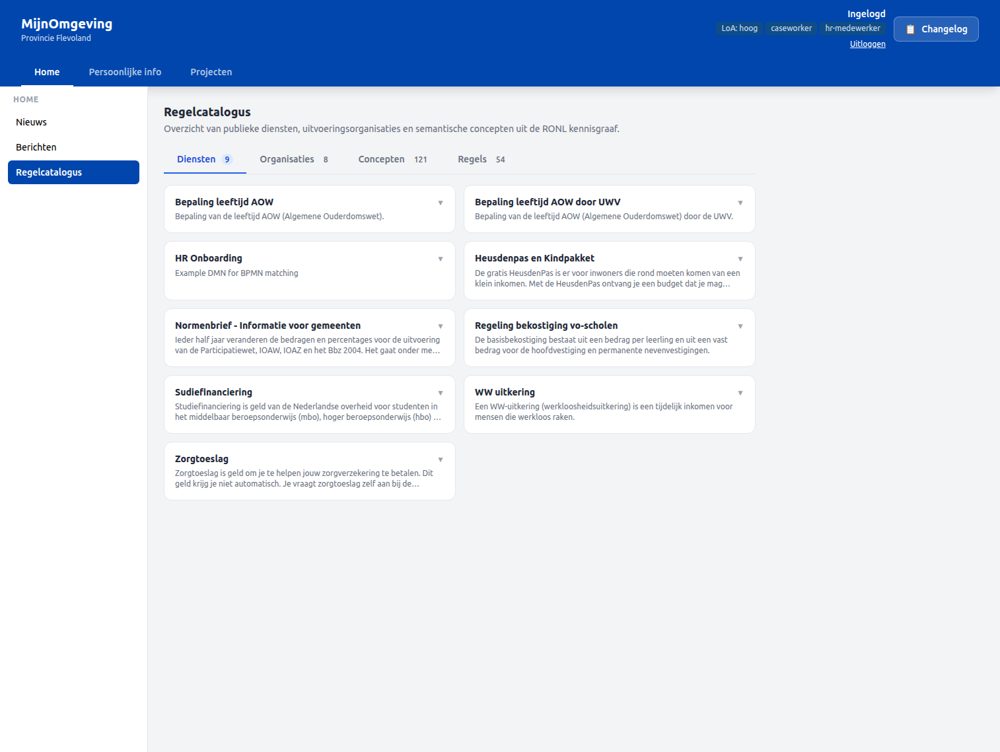
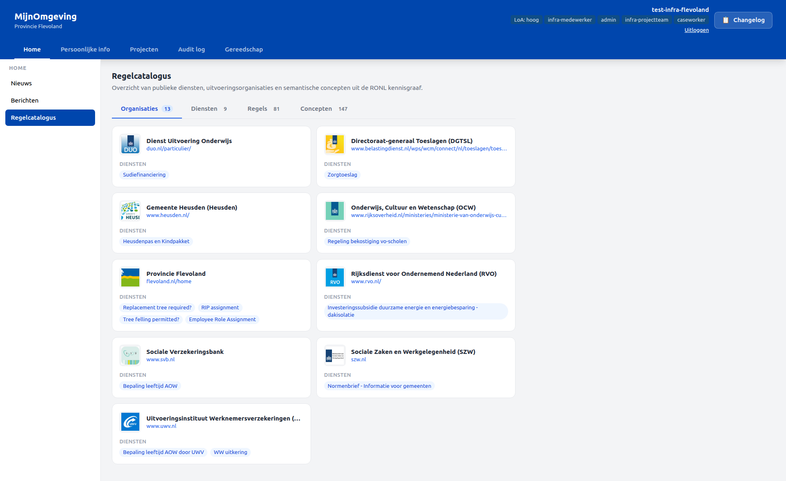
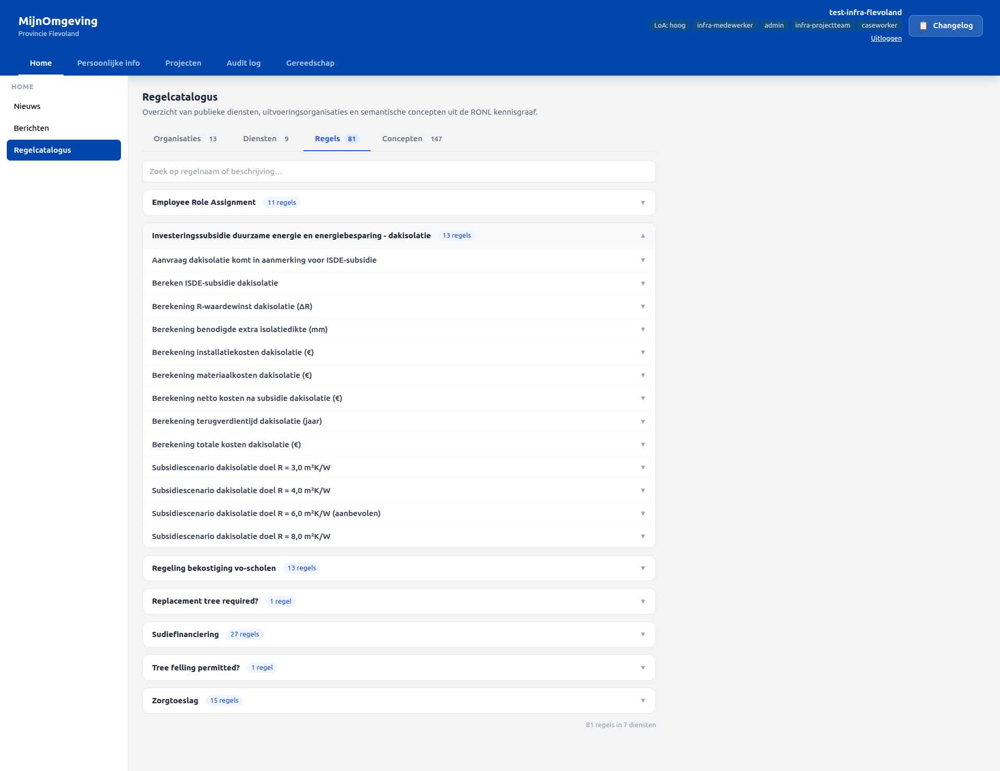
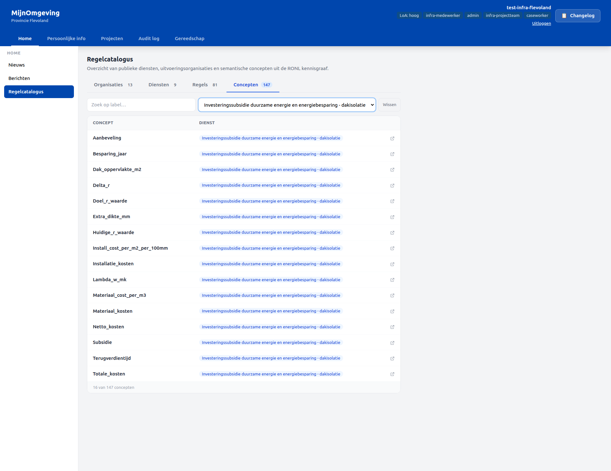

# Regelcatalogus

From v2.5.0, the RONL Business API caseworker dashboard includes a **Regelcatalogus** — a public-facing section that exposes the RONL knowledge graph directly inside MijnOmgeving, without requiring a caseworker login. It draws on five parallel SPARQL queries against the RONL TriplyDB endpoint and presents services, organisations, concepts, and implementation rules in a tabbed interface.

<figure markdown style="width:100%; margin:0;">
  
  <figcaption>Regelcatalogus — Diensten tab showing public service cards</figcaption>
</figure>

---

## Placement and access

The Regelcatalogus appears as a third item under the **Home** tab in the caseworker dashboard left panel. It is declared with `"isPublic": true` in `tenants.json`, so it is visible to unauthenticated visitors alongside Nieuws and Berichten.

The section is rendered by the `RegelCatalogus` React component (`src/components/CaseWorkerDashboard/RegelCatalogus.tsx`), which calls `GET /v1/public/regelcatalogus` on mount and distributes the response across four internal tabs.

---

## The four tabs

From v2.9.2 the tabs render in this order: **Organisaties**, **Diensten**, **Regels**, **Concepten**.

### Organisaties

Implementing organisations are listed with their logo (resolved via the TriplyDB assets API to a versioned CDN URL), homepage link, and the services they implement. The same logo resolution mechanism is used in the Linked Data Explorer.

<figure markdown style="width:100%; margin:0;">
  
  <figcaption>Regelcatalogus — Organisaties tab with implementing organisations</figcaption>
</figure>

### Diensten

Public services from the RONL knowledge graph are shown as expandable cards. Each card displays the service title, a full description, and a link to the service URI in TriplyDB. Clicking **Toon concepten** navigates directly to the Concepten tab with that service pre-selected as a filter.

### Regels

Implementation rules are grouped by service. Each group is collapsible. A search input filters across all groups simultaneously; matching groups expand automatically. Each rule entry shows the rule title, optional validity date, and an expandable description.

<figure markdown style="width:100%; margin:0;">
  
  <figcaption>Regelcatalogus — Regels tab with grouped implementation rules</figcaption>
</figure>

### Concepten

NL-SBB concepts are searchable by label and filterable by service. Each row has an external link icon that opens the `skos:exactMatch` URI in a new tab.

<figure markdown style="width:100%; margin:0;">
  
  <figcaption>Regelcatalogus — Concepten tab with search and service filter</figcaption>
</figure>

---

## Backend endpoint

`GET /v1/public/regelcatalogus` — no authentication required.

The endpoint fires five parallel SPARQL queries against the RONL TriplyDB endpoint:

| Query | Data returned |
|---|---|
| `PublicService` | Service titles, descriptions, URIs |
| `PublicOrganisation` | Organisation names, homepages, logo assets |
| Competent authority links | Maps organisations to services |
| NL-SBB concept traversal | Concept labels, service links, `skos:exactMatch` URIs |
| `cpsv:Rule` implementations | Rule titles, descriptions, service grouping, validity dates |

Results are cached in-memory per data slice for 5 minutes. On TriplyDB failure the stale cache is returned so the UI never renders blank.

The SPARQL endpoint can be overridden per deployment using the `RONL_SPARQL_ENDPOINT` environment variable (see [Environment Variables](../references/environment-variables.md)).

**Response shape:**

```json
{
  "success": true,
  "data": {
    "services": [
      {
        "uri": "https://example.org/service/zorgtoeslag",
        "title": "Zorgtoeslag",
        "description": "...",
        "organisationUri": "https://example.org/org/belastingdienst"
      }
    ],
    "organisations": [
      {
        "uri": "https://example.org/org/belastingdienst",
        "name": "Belastingdienst",
        "homepage": "https://belastingdienst.nl",
        "logo": "https://api.triplydb.com/assets/..."
      }
    ],
    "concepts": [
      {
        "uri": "https://example.org/concept/toetsingsinkomen",
        "prefLabel": "Toetsingsinkomen",
        "serviceTitle": "Zorgtoeslag",
        "exactMatch": "https://wetten.overheid.nl/..."
      }
    ],
    "rules": [
      {
        "uri": "https://example.org/rule/zorgtoeslag-artikel-1",
        "ruleTitle": "Zorgtoeslag artikel 1",
        "description": "...",
        "serviceTitle": "Zorgtoeslag",
        "validFrom": "2026-01-01",
        "confidence": "high"
      }
    ]
  },
  "meta": { "generatedAt": "2026-03-12T12:00:00.000Z" }
}
```

---

## tenants.json configuration

All current tenants include `"regelcatalogus"` in their `home` left panel sections:

```json
{
  "id": "regelcatalogus",
  "label": "Regelcatalogus",
  "isPublic": true
}
```

---

## Related documentation

- [Environment Variables](../references/environment-variables.md) — `RONL_SPARQL_ENDPOINT`
- [API Endpoints](../references/api-endpoints.md) — `GET /v1/public/regelcatalogus`
- [Caseworker Workflow](../user-guide/caseworker-workflow.md) — Caseworker dashboard navigation
