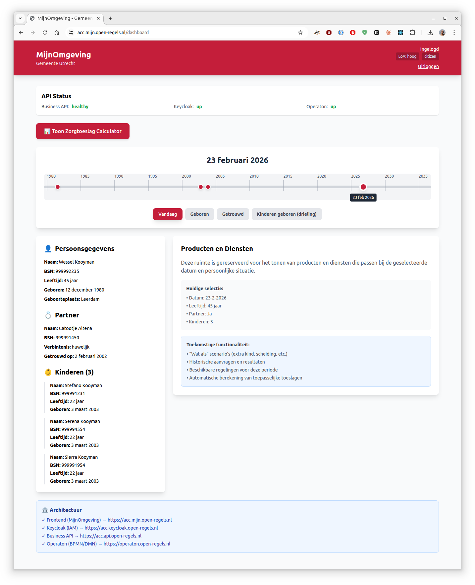

## Overview

The Timeline Navigation feature allows citizens to view their personal data at any point in time - past, present, or future. This enables "what if" scenario planning for life events and helps citizens understand how their circumstances affect eligibility for government services.

## What It Does

The timeline provides:

1. **Historical View** - See how your personal data looked at any date since birth
2. **Event Markers** - Visual indicators for major life events (birth, marriage, children)
3. **Dynamic Data** - Person, partner, and children information updates based on selected date
4. **Future Scenarios** - Select future dates to plan for upcoming life changes
5. **Interactive Navigation** - Drag slider or click event buttons to jump to specific dates

## User Flow

### Accessing the Timeline

1. **Login** to MijnOmgeving using DigiD
2. Navigate to **Dashboard**
3. Click **"📅 Toon Tijdlijn"** button
4. Timeline loads with your life events from BRP data

### Using the Timeline

**Navigation Methods:**

- **Drag the slider** - Smooth navigation through time
- **Click year markers** - Jump to a specific year (1980, 1985, 1990...)
- **Click event buttons** - Jump directly to major life events
  - Vandaag (Today)
  - Geboren (Birth)
  - Getrouwd (Marriage)
  - Kinderen geboren (Children born)

**What You See:**

- **Top Panel** - Interactive timeline with current date display
- **Left Panel** - Personal data that updates as you change the date:
  - Your information (name, BSN, age, birthplace)
  - Partner information (appears after marriage date)
  - Children information (appears after birth dates, ages update)
- **Right Panel** - Placeholder for products and services (future functionality)

### Example Scenarios

#### Viewing Past Data

**"What did my household look like in 2005?"**
1. Drag slider to 2005 or click near 2005 on timeline
2. See your age at that time (25 years old)
3. See partner information (married since 2002)
4. See children information (triplets age 2 years old)

#### Planning Future Changes

**"What if I have another child in 2027?"**

1. Select a date in 2027
2. See current household composition
3. (Future) Compare eligibility for toeslagen with/without additional child
4. (Future) See how income requirements change

## "What If" Scenario Planning (Vision)

The right panel will eventually support:

- **Add Life Events** - Simulate birth, marriage, divorce, moving
- **Compare Scenarios** - Side-by-side comparison of benefits
- **Historical Applications** - See past zorgtoeslag calculations
- **Service Matching** - Automatically show eligible services for that time period
- **Impact Analysis** - Understand how life changes affect your benefits

### Use Cases

**Financial Planning:**

- "How would my zorgtoeslag change if I get divorced?"
- "What benefits am I eligible for if I have another child?"

**Retroactive Understanding:**

- "Was my zorgtoeslag calculation correct in 2020?"
- "What services was I eligible for when my children were born?"

**Future Preparation:**

- "When will my child turn 18 and how does that affect my benefits?"
- "What happens to my toeslagen when I retire?"

## Data Sources

The timeline integrates with:

1. **BRP (Basisregistratie Personen)**
   - Municipal Personal Records Database
   - Current personal data
   - Partner information
   - Children information
   - Birth dates and relationships

2. **(Future) Verblijfplaatshistorie** - Address history
3. **(Future) Stored Applications** - Historical zorgtoeslag calculations

## Privacy & Security

- **Authentication Required** - DigiD login with LoA "hoog"
- **Personal Data Only** - You can only view your own timeline
- **Audit Logging** - All timeline access is logged for compliance
- **No Data Storage** - Timeline calculations are done in real-time

## Technical Notes

- Timeline range: Birth date - 2 years to Current date + 10 years
- Event detection: Automatic from BRP data (marriage, children)
- Age calculations: Dynamic based on selected date
- Section visibility: Partner/children sections only appear after relevant dates

## Current Limitations

- Only test data available (Wessel Kooyman, BSN: 999992235)
- No address history yet
- No historical application data
- No actual "what if" simulation yet
- Single persona across all municipalities

## Timeline View - Current date

## Related Documentation

- [BRP API Integration](../references/brp-timeline-integration.md)
- [Developer Guide](../developer/implementing-timeline.md)
- [API Reference](../references/brp-api-endpoints.md)
