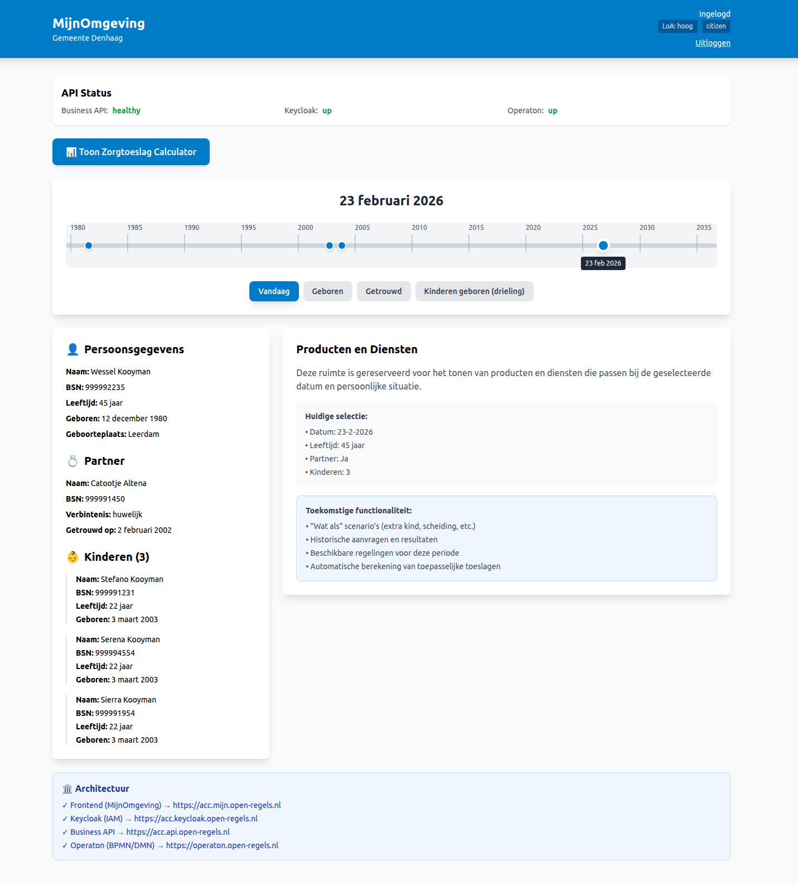

# RONL Business API

**Serves as a reference for implementing a compliant, secure, and reliable BPMN service for Dutch municipalities using open-source components.**

🌐 **Live application:** [mijn.open-regels.nl](https://mijn.open-regels.nl)  
🧪 **Acceptance environment:** [acc.mijn.open-regels.nl](https://acc.mijn.open-regels.nl)

[](https://ronl.open-regels.nl)
[](https://www.typescriptlang.org/)
[](https://react.dev/)
[](https://vitejs.dev/)
[](https://nodejs.org/)
[](https://expressjs.com/)
[](https://www.keycloak.org/)
[](https://www.postgresql.org/)
[](https://redis.io/)
[](https://operaton.open-regels.nl)
[](https://www.docker.com/)
[](https://tailwindcss.com/)


## What is the RONL Business API?

The **RONL Business API** is a secure, multi-tenant platform that enables Dutch municipalities to offer government digital services to residents. It implements the **Business API Layer** pattern: a security and business-logic layer that sits between a municipality's IAM system and the Operaton BPMN engine.



## What it does

Instead of exposing Operaton's REST API directly to municipality portals, RONL Business API provides:

- Secure OIDC/JWT token validation against Keycloak
- Multi-tenant isolation per municipality (Utrecht, Amsterdam, Rotterdam, Den Haag)
- Claims mapping from JWT to BPMN process variables
- Role-based authorization (citizen, caseworker, admin)
- Compliance-grade audit logging (BIO, NEN 7510, AVG/GDPR)
- A clean, versioned REST API (`/v1/*`) following the Dutch API Design Rules

## Architecture at a glance

```
Resident → Municipality Portal → Keycloak IAM → Business API → Operaton BPMN Engine
```

The system is hosted across two platforms. Azure hosts the stateless application layer (frontend, backend, PostgreSQL, Redis). A VM at `open-regels.nl` hosts the services requiring deep customisation or full control (Keycloak, Operaton, Caddy).

## Live environments

| Environment | Frontend | Backend | Keycloak |
|---|---|---|---|
| ACC | https://acc.mijn.open-regels.nl | https://acc.api.open-regels.nl | https://acc.keycloak.open-regels.nl |
| Production | https://mijn.open-regels.nl | https://api.open-regels.nl | https://keycloak.open-regels.nl |

## Technology stack

| Layer | Technology |
|---|---|
| Frontend | React 18, TypeScript, Vite, CSS Custom Properties |
| Backend | Node.js 20, Express 4, TypeScript |
| Authentication | Keycloak 23, OIDC Authorization Code Flow |
| Business rules | Operaton BPMN/DMN engine |
| Database | Azure PostgreSQL Flexible Server (audit logs) |
| Cache | Azure Cache for Redis (JWKS, sessions) |
| Hosting | Azure Static Web Apps (frontend), Azure App Service (backend) |
| IAM/BPMN hosting | VM — Caddy, Docker Compose |
| CI/CD | GitHub Actions |
| License | EUPL-1.2 |

## Documentation sections

- [**Features**](features/overview.md) — What RONL Business API does and why
- [**User Guides**](user-guide/login-digid-flow.md) — How residents, caseworkers, and operators use the system
- [**Developer Docs**](developer/local-development.md) — Local setup, backend, frontend, deployment
- [**References**](references/api-endpoints.md) — API endpoints, environment variables, JWT claims, standards
