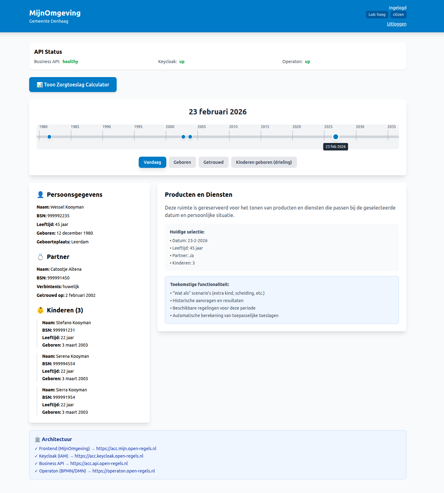

# RONL Business API

**Serves as a reference for implementing a compliant, secure, and reliable BPMN service using open-source components.**

🧪 **Current deployment:** [acc.mijn.open-regels.nl](https://acc.mijn.open-regels.nl) — Province of Flevoland, acceptance environment

[](https://ronl.open-regels.nl)
[](https://www.typescriptlang.org/)
[](https://react.dev/)
[](https://vitejs.dev/)
[](https://nodejs.org/)
[](https://expressjs.com/)
[](https://www.keycloak.org/)
[](https://www.postgresql.org/)
[](https://redis.io/)
[](https://operaton.open-regels.nl)
[](https://www.docker.com/)
[](https://tailwindcss.com/)


---

## What is the RONL Business API?

The **RONL Business API** implements the **Business API Layer** pattern: a security and business-logic layer that sits between an IAM system and the Operaton BPMN engine, exposing scoped capabilities — processes, tasks, forms, decisions — rather than raw engine access.

It is deployed for the **Province of Flevoland**, currently on the acceptance environment. Three surfaces put its capabilities to work: a signed-in **werkomgeving** where provincial staff work through role-scoped boards, a public **knowledge base** reachable with no login, and a public **cockpit demo** running on demonstration data with no backend behind it. See [Getting Started](user-guide/getting-started.md) for how these surfaces are organised, and [Features](features/overview.md) for the capabilities themselves.

<figure markdown style="width:100%; margin:0;">
  
  <figcaption>Example dashboard MijnOmgeving showing Timeline View</figcaption>
</figure>

---

## What it does

Instead of exposing Operaton's REST API directly to portal frontends, RONL Business API provides:

- Secure OIDC/JWT token validation against Keycloak
- Multi-tenant isolation as a platform mechanism — Operaton native tenant-ids and tenant-scoped queries keep each organisation's data apart, so the same deployment can serve more than one organisation without them seeing each other's data
- Claims mapping from JWT to BPMN process variables
- Role-based authorization (citizen, caseworker, admin)
- Compliance-grade audit logging (BIO, NEN 7510, AVG/GDPR)
- A clean, versioned REST API (`/v1/*`) following the Dutch API Design Rules

---

## Architecture at a glance

```
User → Portal → Keycloak IAM → Business API → Operaton BPMN Engine
```

The system is hosted across two platforms. Azure hosts the stateless application layer (frontend, backend, PostgreSQL, Redis). A VM at `open-regels.nl` hosts the services requiring deep customisation or full control (Keycloak, Operaton, Caddy).

---

## Environments

ACC is the environment of record for this documentation — the Province of Flevoland deployment currently runs there. A production environment is also configured in the codebase's deployment workflows:

| Environment | Frontend | Backend | Keycloak |
|---|---|---|---|
| ACC | https://acc.mijn.open-regels.nl | https://acc.api.open-regels.nl | https://acc.keycloak.open-regels.nl |
| Production | https://mijn.open-regels.nl | https://api.open-regels.nl | https://keycloak.open-regels.nl |

---

## Technology stack

| Layer | Technology |
|---|---|
| Frontend | React 18, TypeScript, Vite, CSS Custom Properties |
| Backend | Node.js 20, Express 4, TypeScript |
| Authentication | Keycloak 23, OIDC Authorization Code Flow |
| Business rules | Operaton BPMN/DMN engine |
| Database | Azure PostgreSQL Flexible Server (audit logs) |
| Cache | Azure Cache for Redis (JWKS, sessions) |
| Hosting | Azure Static Web Apps (frontend), Azure App Service (backend) |
| IAM/BPMN hosting | VM — Caddy, Docker Compose |
| CI/CD | GitHub Actions |
| License | EUPL-1.2 |

---

## Documentation sections

- [**Features**](features/overview.md) — What RONL Business API does and why
- [**User Guides**](user-guide/getting-started.md) — The werkomgeving's four boards and the public knowledge base
- [**Developer Docs**](developer/local-development.md) — Local setup, backend, frontend, deployment
- [**References**](reference/api-endpoints.md) — API endpoints, environment variables, JWT claims, standards
