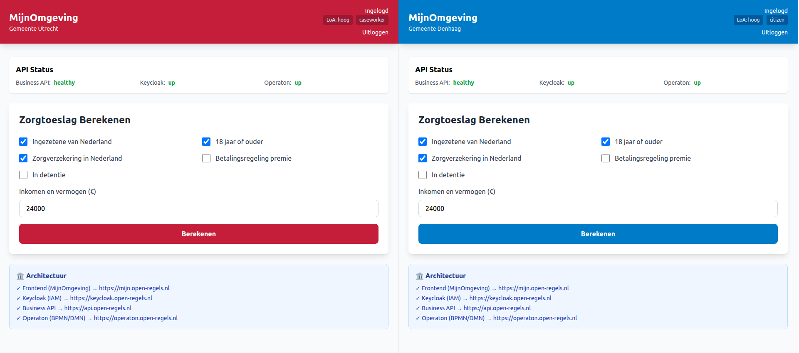

# Adding a Municipality

This guide is for system operators and developers onboarding a new Dutch municipality to RONL Business API. Three things need to be configured: the tenant configuration file, Keycloak users and groups, and (optionally) municipality-specific feature flags.

## 1. Add the tenant configuration

Edit `packages/frontend/public/tenants.json` and add an entry for the new municipality. Use the following structure:

```json
{
  "tenants": {
    "newtown": {
      "id": "newtown",
      "name": "newtown",
      "displayName": "Gemeente Nieuwstad",
      "municipalityCode": "0999",
      "theme": {
        "primary": "#2E4057",
        "primaryDark": "#1A2A3A",
        "primaryLight": "#6B8CAD",
        "secondary": "#F4A261",
        "accent": "#E76F51"
      },
      "features": {
        "zorgtoeslag": true,
        "kinderbijslag": false,
        "huurtoeslag": false,
        "processes": ["zorgtoeslag"]
      },
      "contact": {
        "phone": "14 0999",
        "email": "info@nieuwstad.nl",
        "address": "Stadhuis 1",
        "postalCode": "1234 AB",
        "city": "Nieuwstad"
      },
      "enabled": true
    }
  }
}
```

The `id` value must match the `municipality` claim that Keycloak will issue in the JWT for users of this municipality (see step 2 below).

Theme colours follow the municipality's visual identity. The `primary` colour is applied to buttons, headers, and active navigation items. Use sufficient contrast against white text (WCAG AA minimum).

## 2. Configure Keycloak

Open the Keycloak Admin Console (ACC: `https://acc.keycloak.open-regels.nl/admin`, PROD: `https://keycloak.open-regels.nl/admin`), realm `ronl`.

**Create roles:**

Under **Realm roles**, add:
- `citizen-newtown`
- `caseworker-newtown`

Or, if using the municipality-prefixed role convention that the JWT middleware already supports, simply add the generic `citizen` and `caseworker` roles to new user accounts with an attribute `municipality = newtown`.

**Add the municipality attribute mapper:**

The `municipality` claim in the JWT is populated by a Keycloak protocol mapper on the `ronl-business-api` client. Verify the mapper named `municipality` exists under:

```
Clients → ronl-business-api → Client scopes
  → ronl-business-api-dedicated → Mappers → municipality
```

The mapper reads the `municipality` user attribute and injects it into the access token. Set `municipality = newtown` on each user account belonging to the new municipality.

**Create test users:**

Under **Users**, create:

| Username | Attribute | Role |
|---|---|---|
| `test-citizen-newtown` | `municipality = newtown` | `citizen` |
| `test-caseworker-newtown` | `municipality = newtown` | `caseworker` |

Set a temporary password and mark it as non-temporary for test accounts.

## 3. Add backend tenant middleware allowlist

If `ENABLE_TENANT_ISOLATION=true` in the backend `.env`, verify that `newtown` is included in the allowed tenants list in `packages/backend/src/middleware/tenant.middleware.ts`. If the middleware uses a hard-coded list, add the new municipality ID.

## 4. Deploy and verify

After making these changes:

1. Rebuild and redeploy the frontend (the `tenants.json` change requires a new static build)
2. No backend restart is required if tenant isolation is configured via environment variables
3. Log in using `test-citizen-newtown` / `test123` on the portal
4. Verify the correct municipality theme and display name appear
5. Verify that `GET /v1/health` still returns `healthy`


