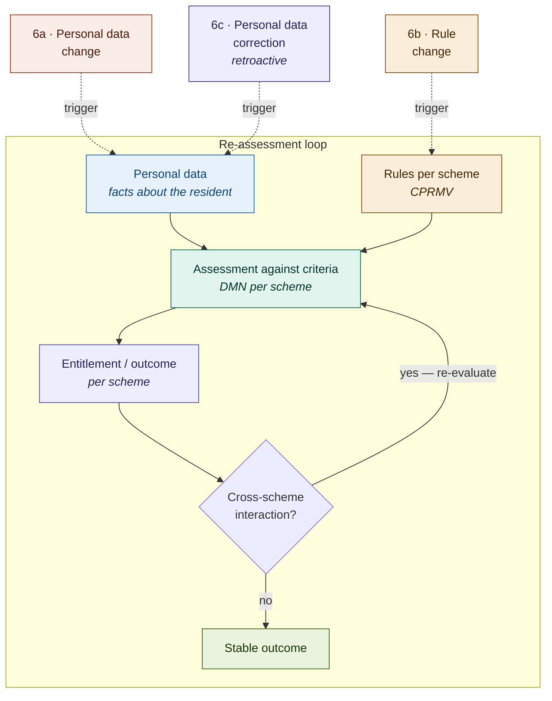

# Assessing income support schemes

Residents eligible for income support typically have entitlements under several schemes at the same time. Because schemes influence each other through their outcomes &mdash; the result of one scheme is input to the next &mdash; assessment is not a straight line but a **loop** that updates itself until a stable outcome is reached.

This diagram captures the three ingredients of that loop &mdash; personal data, rules and assessment &mdash; and shows how three kinds of change re-activate it.

## Conceptual diagram

## Interactive walkthrough

<figure style="width:100%; margin:0;">
  <iframe src="../assessing-income-support-schemes.html"
          width="100%"
          height="900px"
          frameborder="0"
          style="border-radius:12px; display:block;">
  </iframe>
  <figcaption>Example chain: AOW → AIO → Bijzondere bijstand → Huurtoeslag → Heusdenpas.</figcaption>
</figure>

---

## Components of the loop

### 1. Personal data

The facts about the resident on which assessment is based: age, household composition, income, assets, housing situation. Sources are BRP, SUWI/UWV, Belastingdienst, the housing register and the municipal administration. Personal data is the *input* to every assessment.

### 2. Rules (CPRMV)

Per scheme the applicable criteria, modelled as CPRMV and made executable as DMN. Each scheme &mdash; AOW, AIO, bijzondere bijstand, huurtoeslag, municipal schemes &mdash; has its own rule set with its own versions and validity periods.

### 3. Assessment, outcome and cross-scheme interaction

The assessment combines personal data with rules and produces an outcome per scheme (entitlement, amount, conditions). The critical point is **cross-scheme interaction**: the outcome of one scheme is typically input for the next. AOW determines whether AIO applies. AOW and AIO together determine the income used in the means tests for bijzondere bijstand, huurtoeslag and municipal schemes. A single assessment round is therefore rarely the end station; the loop runs until the outcome no longer changes.

### 4. Stable outcome

The state in which a next round yields the same outcomes. Only at that point can decisions be issued.

---

## Three change pathways

Changes always activate the same loop, but via different entry points.

| Pathway | Entry point | Effect |
| --- | --- | --- |
| **6a · Personal data change** | Personal data | All schemes that use the changed data as input are re-assessed. An income change in principle affects every income-dependent scheme. |
| **6b · Rule change** | Rules (CPRMV) | Only the affected scheme and the schemes that depend on its outcome *downstream* are re-assessed. Upstream schemes are unaffected. |
| **6c · Personal data correction** | Personal data | Like 6a, but **retroactive**. Earlier decisions are re-evaluated retrospectively; back-payments or recoveries may follow. |
