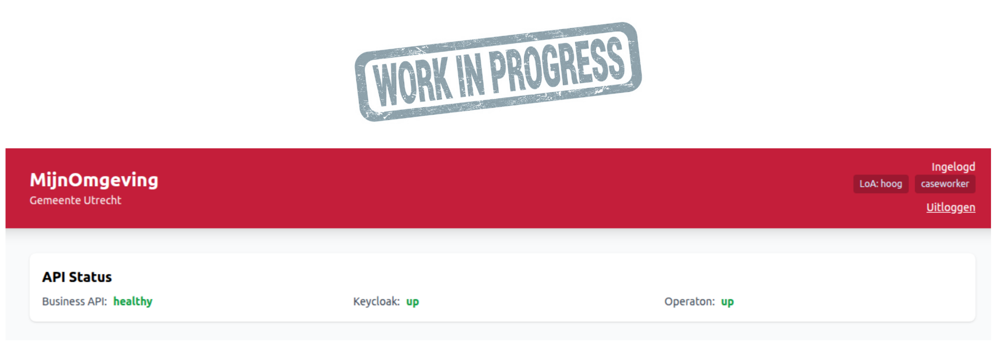

# Caseworker Workflow

Caseworkers (medewerkers) are municipal employees with elevated access to the RONL Business API portal. Unlike citizens, they authenticate via a dedicated Keycloak-native login path — not through DigiD, eHerkenning, or eIDAS.

## Logging in as a caseworker

Caseworkers use the **"Inloggen als Medewerker"** button on the MijnOmgeving landing page — a slate-coloured button visually separated from the three citizen identity provider options by a "MEDEWERKERS" section divider.

<figure markdown style="width:100%; margin:0;">
  
  <figcaption>MijnOmgeving landing page showing all four login options</figcaption>
</figure>

The caseworker login flow differs from the citizen flow in three important ways:

**No external identity provider.** Caseworker accounts are managed directly in the Keycloak `ronl` realm. There is no redirect to DigiD or eHerkenning.

**SSO session check first.** `AuthCallback.tsx` calls `keycloak.init({ onLoad: 'check-sso' })`. If the caseworker already has an active Keycloak SSO session in the browser (e.g. from an earlier login that day), they are taken directly to the dashboard — no login screen shown at all.

**Dedicated login screen.** If no SSO session exists, Keycloak is called with `loginHint: '__medewerker__'`. The custom `login.ftl` theme template detects this sentinel value and renders the Keycloak native login form with an indigo "Inloggen als gemeentemedewerker" context banner and "Medewerker portaal" as the page title, making the screen visually distinct from any citizen-facing Keycloak page.

<figure markdown style="width:100%; margin:0;">
  
  <figcaption>Keycloak native login form with caseworker context banner</figcaption>
</figure>

For the full technical flow and step-by-step instructions, see [Logging In — Citizen & Caseworker](login-flow.md#caseworker-login).

**Test environment accounts:**

| Username | Municipality |
|---|---|
| `test-caseworker-utrecht` | Utrecht |
| `test-caseworker-amsterdam` | Amsterdam |
| `test-caseworker-rotterdam` | Rotterdam |
| `test-caseworker-denhaag` | Den Haag |

Password for all test accounts: `test123`

After login, the JWT will contain `"roles": ["caseworker"]`. The portal detects this role and displays the caseworker dashboard.

## What caseworkers can do

| Action | Endpoint | Description |
|---|---|---|
| View application queue | `GET /v1/process?status=active` | All active process instances for the municipality |
| View a specific application | `GET /v1/process/:id/variables` | Full input and output variables for one instance |
| Update application status | `PUT /v1/process/:id/status` | Move an application to the next process step |
| Cancel an application | `DELETE /v1/process/:id` | Cancel a process instance |

All results are automatically filtered to the caseworker's own municipality via the `municipality` JWT claim. A caseworker from Utrecht cannot see Amsterdam's applications.

## Reviewing a citizen's application

**Step 1** — From the dashboard, select an application from the queue.

**Step 2** — The detail view shows all input variables the citizen submitted and the DMN evaluation result. The caseworker's name and timestamp are added to the audit trail on each view.

**Step 3** — If the result requires manual review (e.g. an edge case in the DMN), the caseworker can override the result and document the reason. The override is logged in the audit trail with the caseworker's user ID.

## Role differences at a glance

| Capability | Citizen | Caseworker | Admin |
|---|---|---|---|
| Submit a calculation | ✓ | ✓ | ✓ |
| View own applications | ✓ | ✓ | ✓ |
| View all municipality applications | — | ✓ | ✓ |
| Override DMN result | — | ✓ | ✓ |
| View audit logs | — | — | ✓ |
| Manage users in Keycloak | — | — | ✓ |

## Audit trail

Every action a caseworker takes is recorded in the audit log with their `sub` (user ID), the action performed, the affected process instance, and a UTC timestamp. Audit records are retained for 7 years.
