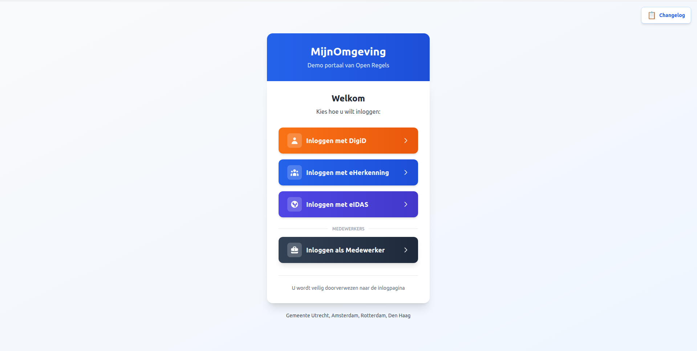
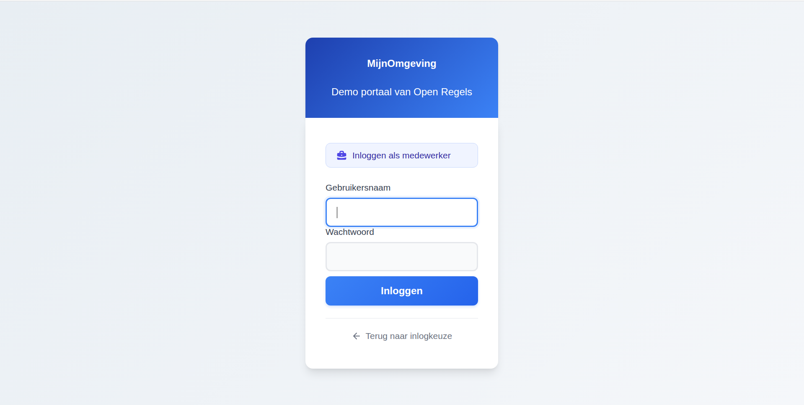
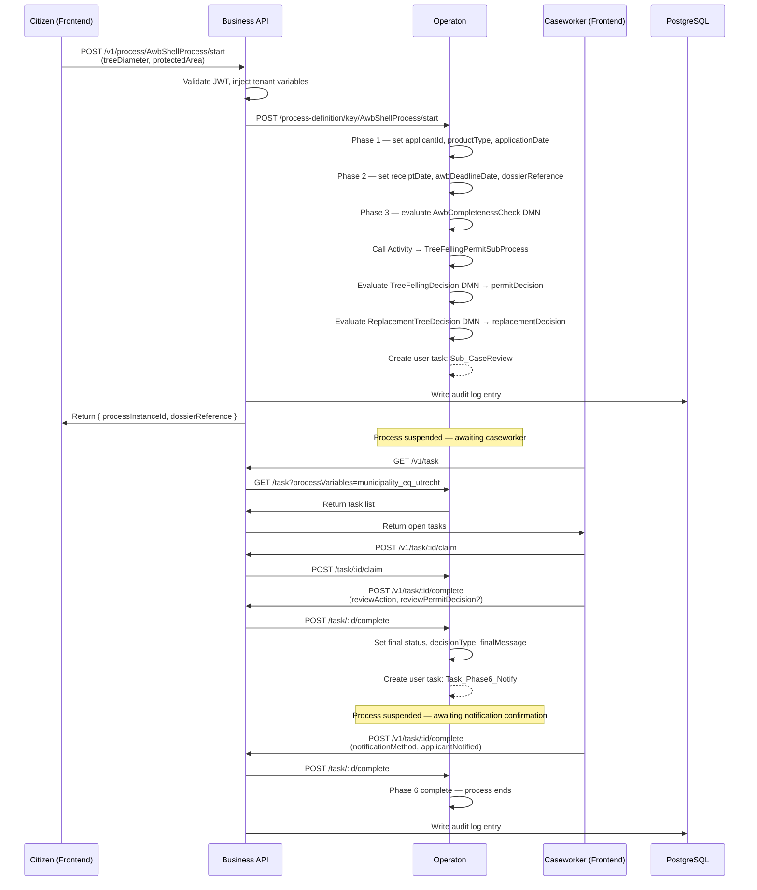
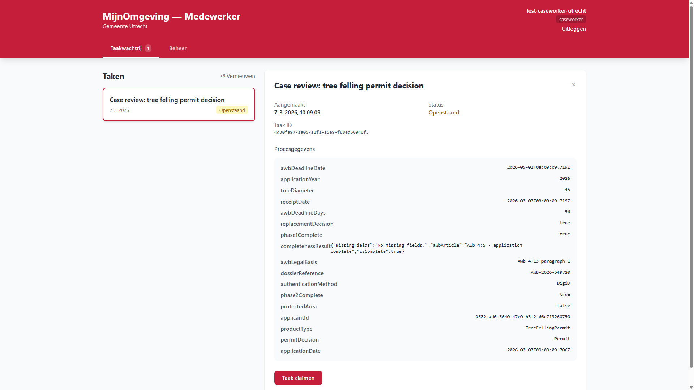
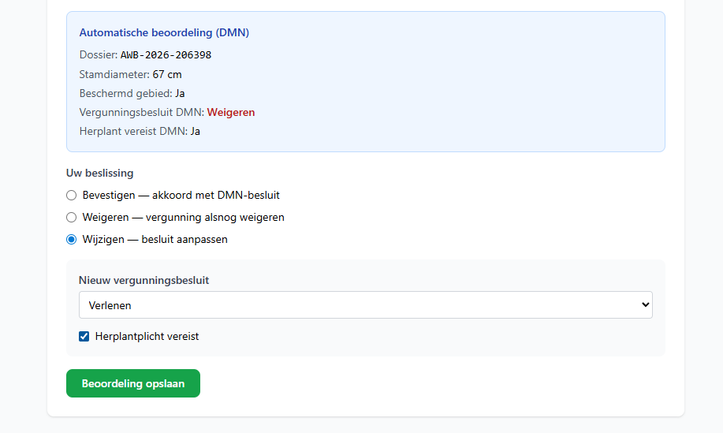
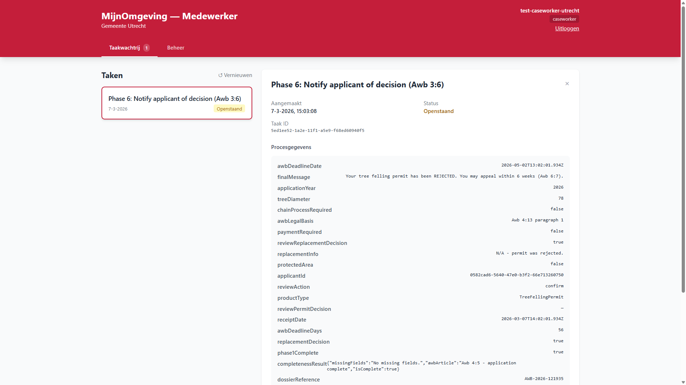
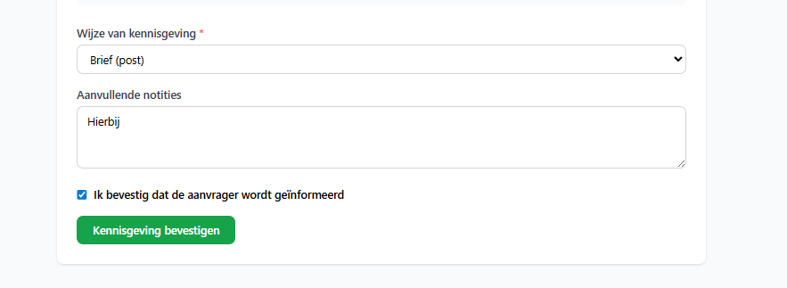
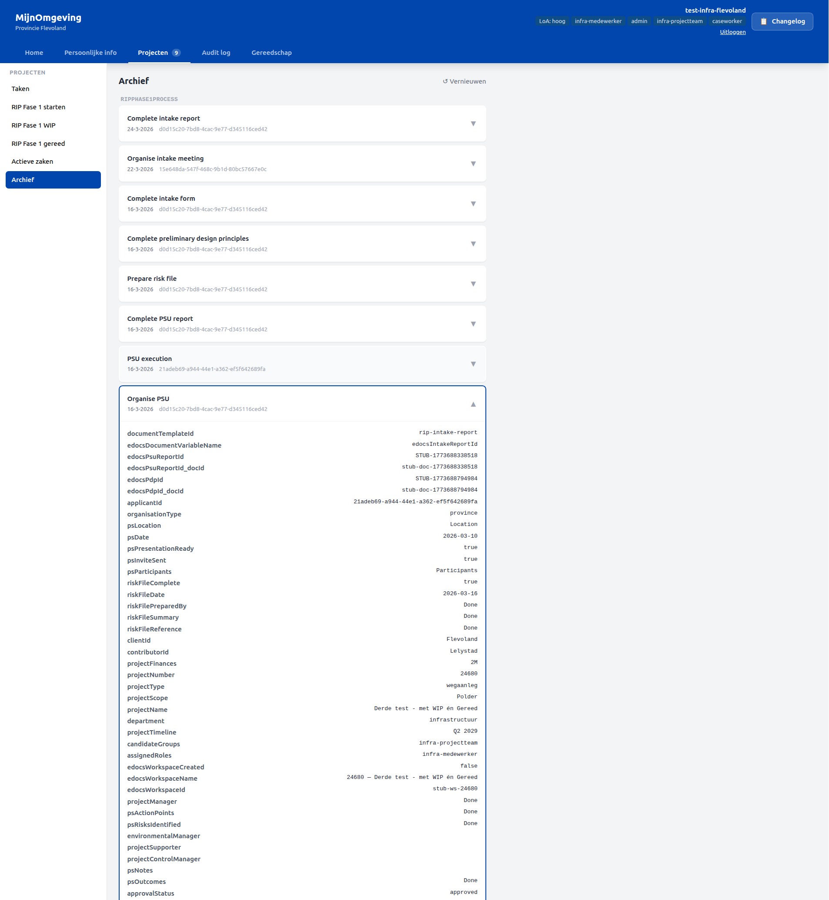

# Caseworker Workflow

Caseworkers (medewerkers) are municipal employees with elevated access to the RONL Business API portal. Unlike citizens, they authenticate via a dedicated Keycloak-native login path — not through DigiD, eHerkenning, or eIDAS.

---

## Dashboard navigation

The caseworker dashboard at `/dashboard/caseworker` uses a three-zone shell: a top navigation bar with three pages (Home, Persoonlijke info, Projecten), a left panel whose contents change per page, and a main content area. The Projecten page hosts the task queue. A task count badge on the Projecten tab button shows pending work without requiring navigation.

The dashboard is accessible without login — public sections (Nieuws, Berichten, Regelcatalogus) under the Home tab are visible to anyone. Private sections show a login prompt when clicked unauthenticated; no page redirect occurs.

See [Caseworker Dashboard](../features/caseworker-dashboard.md) for the full shell architecture.

---

## Logging in as a caseworker

Caseworkers use the **"Inloggen als Medewerker"** button on the MijnOmgeving landing page — a slate-coloured button visually separated from the three citizen identity provider options by a "MEDEWERKERS" section divider.

<figure markdown style="width:100%; margin:0;">
  
  <figcaption>MijnOmgeving landing page showing all four login options</figcaption>
</figure>

The caseworker login flow differs from the citizen flow in three important ways:

**No external identity provider.** Caseworker accounts are managed directly in the Keycloak `ronl` realm. There is no redirect to DigiD or eHerkenning.

**SSO session check first.** `AuthCallback.tsx` calls `keycloak.init({ onLoad: 'check-sso' })`. If the caseworker already has an active Keycloak SSO session in the browser (e.g. from an earlier login that day), they are taken directly to the dashboard — no login screen shown at all.

**Dedicated login screen.** If no SSO session exists, Keycloak is called with `loginHint: '__medewerker__'`. The custom `login.ftl` theme template detects this sentinel value and renders the Keycloak native login form with an indigo "Inloggen als gemeentemedewerker" context banner and "Medewerker portaal" as the page title, making the screen visually distinct from any citizen-facing Keycloak page.

<figure markdown style="width:100%; margin:0;">
  
  <figcaption>Keycloak native login form with caseworker context banner</figcaption>
</figure>

For the full technical flow and step-by-step instructions, see [Logging In — Citizen & Caseworker](login-flow.md#caseworker-login).

**Test environment accounts:**

| Username                    | Municipality |
| --------------------------- | ------------ |
| `test-caseworker-utrecht`   | Utrecht      |
| `test-caseworker-amsterdam` | Amsterdam    |
| `test-caseworker-rotterdam` | Rotterdam    |
| `test-caseworker-denhaag`   | Den Haag     |

Password for all test accounts: `test123`

After login, the JWT will contain `"roles": ["caseworker"]`. The portal detects this role and displays the caseworker dashboard.

---

## What caseworkers can do

| Action              | Endpoint                     | Description                                                |
| ------------------- | ---------------------------- | ---------------------------------------------------------- |
| View task queue     | `GET /v1/task`               | All open tasks for the municipality, claimed and unclaimed |
| View task variables | `GET /v1/task/:id/variables` | Full process variables for one task                        |
| Claim a task        | `POST /v1/task/:id/claim`    | Assign the task to the authenticated caseworker            |
| Complete a task     | `POST /v1/task/:id/complete` | Submit the caseworker's decision and close the task        |

All results are filtered to the caseworker's own municipality. A caseworker from Utrecht cannot see Amsterdam's tasks.

---

## Reviewing a citizen's application

**Step 1** — From the Taakwachtrij tab, select an open task. Tasks marked **Openstaand** are unclaimed; tasks marked **Geclaimd** are assigned to a caseworker.

**Step 2** — Click **Taak claimen** to assign the task to yourself. The task status changes to Geclaimd.

**Step 3** — Review the process variables panel, which shows all variables from the running process instance including DMN outputs (`permitDecision`, `replacementDecision`), AWB metadata (`dossierReference`, `awbDeadlineDate`), and citizen inputs.

**Step 4** — Complete the task using the task-specific form:

- **Sub_CaseReview** — Review the DMN outcome. Select Bevestigen (confirm), Afwijzen (reject), or Wijzigen (override). If overriding, choose the revised permit and replacement decisions.
- **Task_Phase6_Notify** — Select the notification method (email, letter, phone, or portal), add optional notes, and confirm that the citizen has been notified.

**Step 5** — The process advances automatically. If no further tasks are created, the process instance completes.

---

## AWB Kapvergunning — full process flow

The tree felling permit is an asynchronous, multi-actor process. The citizen submits an application and the process runs automatically through three preparatory phases before suspending at the first caseworker task. A second suspension follows before the process ends. The diagram below shows the complete flow across all participants.


```mermaid
sequenceDiagram
    participant C as Citizen (Frontend)
    participant B as Business API
    participant O as Operaton
    participant CW as Caseworker (Frontend)
    participant D as PostgreSQL

    C->>B: POST /v1/process/AwbShellProcess/start<br/>(treeDiameter, protectedArea)
    B->>B: Validate JWT, inject tenant variables
    B->>O: POST /process-definition/key/AwbShellProcess/start
    O->>O: Phase 1 — set applicantId, productType, applicationDate
    O->>O: Phase 2 — set receiptDate, awbDeadlineDate, dossierReference
    O->>O: Phase 3 — evaluate AwbCompletenessCheck DMN
    O->>O: Call Activity → TreeFellingPermitSubProcess
    O->>O: Evaluate TreeFellingDecision DMN → permitDecision
    O->>O: Evaluate ReplacementTreeDecision DMN → replacementDecision
    O-->>O: Create user task: Sub_CaseReview
    B->>D: Write audit log entry
    B->>C: Return { processInstanceId, dossierReference }

    Note over O: Process suspended — awaiting caseworker

    CW->>B: GET /v1/task
    B->>O: GET /task?processVariables=municipality_eq_utrecht
    O->>B: Return task list
    B->>CW: Return open tasks

    CW->>B: POST /v1/task/:id/claim
    B->>O: POST /task/:id/claim
    CW->>B: POST /v1/task/:id/complete<br/>(reviewAction, reviewPermitDecision?)
    B->>O: POST /task/:id/complete
    O->>O: Set final status, decisionType, finalMessage
    O-->>O: Create user task: Task_Phase6_Notify

    Note over O: Process suspended — awaiting notification confirmation

    CW->>B: POST /v1/task/:id/complete<br/>(notificationMethod, applicantNotified)
    B->>O: POST /task/:id/complete
    O->>O: Phase 6 complete — process ends
    B->>D: Write audit log entry
```

### Sub_CaseReview — permit decision

This task is created inside `TreeFellingPermitSubProcess` after both DMNs have been evaluated. It appears in the task queue as **Openstaand** with `taskDefinitionKey: Sub_CaseReview`.

<figure markdown style="width:100%; margin:0;">
  
  <figcaption>Sub_CaseReview task in the task queue — unclaimed (Openstaand)</figcaption>
</figure>

After claiming, the **`tree-felling-review`** Camunda Form is rendered by `TaskFormViewer`. The form is fetched live from the deployed process via `GET /v1/task/:id/form-schema` and pre-populated with the current DMN outputs (`permitDecision`, `replacementDecision`) so the caseworker sees the engine's recommendation immediately. FEEL conditional visibility hides the override fields unless the caseworker selects **Wijzigen**.

The caseworker selects one of three actions:

| Action     | `reviewAction` value                        | Effect                                                          |
| ---------- | ------------------------------------------- | --------------------------------------------------------------- |
| Bevestigen | `confirm`                                   | DMN outcome is accepted as-is; `permitDecision` unchanged       |
| Afwijzen   | `change` + `reviewPermitDecision: "Reject"` | Overrides DMN — permit rejected regardless of DMN result        |
| Wijzigen   | `change` + custom values                    | Overrides both `permitDecision` and `reviewReplacementDecision` |

The `Sub_ResolveDecision` script task in the subprocess applies the override when `reviewAction = "change"`, then routes through the final gateway to `Sub_SetGranted` or `Sub_SetRejected`, which write `status`, `finalMessage`, `decisionType`, `replacementInfo`, `paymentRequired`, and `chainProcessRequired` back to the AWB shell.

<figure markdown style="width:100%; margin:0;">
  
  <figcaption>Sub_CaseReview task - Review</figcaption>
</figure>

### Task_Phase6_Notify — notification confirmation

After `Sub_CaseReview` completes and the subprocess ends, the AWB shell creates `Task_Phase6_Notify`. This task also appears as **Openstaand** and requires a claim before it can be completed.

<figure markdown style="width:100%; margin:0;">
  
  <figcaption>Task_Phase6_Notify task - unclaimed (Openstaand)</figcaption>
</figure>

After claiming, the **`awb-notify-applicant`** Camunda Form is rendered by `TaskFormViewer`. The form displays the final decision variables (`status`, `permitDecision`, `finalMessage`, `replacementInfo`) as readonly fields so the caseworker can confirm the correct decision before notifying the citizen.

The caseworker selects how the citizen was notified and confirms:

| Field                    | Variable             | Required                                      |
| ------------------------ | -------------------- | --------------------------------------------- |
| Wijze van kennisgeving   | `notificationMethod` | Yes — `email`, `letter`, `phone`, or `portal` |
| Aanvullende notities     | `notificationNotes`  | No                                            |
| Bevestiging kennisgeving | `applicantNotified`  | Yes — must be checked                         |

<figure markdown style="width:100%; margin:0;">
  
  <figcaption>Task_Phase6_Notify form — notification method and confirmation</figcaption>
</figure>

Completing this task ends the AWB shell process. The process instance moves to history and is retrievable via `GET /v1/process/history?applicantId=`.

---

## Role differences at a glance

| Capability                         | Citizen | Caseworker | HR Medewerker | Admin |
| ---------------------------------- | ------- | ---------- | ------------- | ----- |
| Submit a calculation               | ✓       | ✓          | ✓             | ✓     |
| View own applications              | ✓       | ✓          | ✓             | ✓     |
| View all municipality applications | —       | ✓          | ✓             | ✓     |
| Override DMN result                | —       | ✓          | ✓             | ✓     |
| Start HR onboarding process        | —       | —          | ✓             | ✓     |
| View completed onboardings         | —       | —          | ✓             | ✓     |
| View audit logs                    | —       | —          | —             | ✓     |
| Manage users in Keycloak           | —       | —          | —             | ✓     |

---

## Audit trail

Every action a caseworker takes is recorded in the audit log with their `sub` (user ID), the action performed, the affected process instance, and a UTC timestamp. Audit records are retained for 7 years.

---

---

## Archief — Completed tasks

From v2.9.1, the **Archief** section in the Projecten tab provides a read-only view of all completed tasks for the caseworker's municipality.

Tasks are fetched from `GET /v1/task/history` and grouped by `processDefinitionKey`, using the same mono uppercase group headers and sort order as the active task queue. Within each group, tasks are sorted by completion date descending. Each task card shows:

- Task name
- Completion date and time
- Assignee at time of completion

Expanding a task card loads its historic process variables via `GET /v1/process/:instanceId/historic-variables`. Variables are cached per `processInstanceId` — expanding a card a second time costs no additional API call.

<figure markdown style="width:100%; margin:0;">
  
  <figcaption>Archief — completed tasks grouped by process definition key. Expanded card shows historic process variables.</figcaption>
</figure>

The Archief section is tenant-scoped and must be added to the tenant's `leftPanelSections.projects` in `tenants.json` to appear:
```json
{ "id": "archief", "label": "Archief", "isPublic": false }
```

---

## Persoonlijke info — HR and profile sections

From v2.4.0, the **Persoonlijke info** top-nav item exposes four left-panel subsections. Two are available to all authenticated caseworkers; two require the `hr-medewerker` role:

| Subsection | Accessible to | Description |
|---|---|---|
| Profiel | All caseworkers | JWT identity card and onboarding data fetched via `employeeId` claim |
| Rollen & rechten | All caseworkers | JWT roles and onboarding-assigned roles with access level description |
| Medewerker onboarden | `hr-medewerker` only | Start a new `HrOnboardingProcess` instance |
| Afgeronde onboardingen | `hr-medewerker` only | Browse completed onboardings and view IT handover documents |

For the full walkthrough of each subsection — including the HR onboarding BPMN flow, IT handover document, and completed onboarding archive — see [HR Onboarding Workflow](hr-onboarding.md).

---

## Projecten — RIP Phase 1 (Flevoland)

From v2.6.0, Provincie Flevoland exposes three RIP-specific sections under the **Projecten** top-nav item, accessible to users with the `infra-projectteam` role:

| Section | Description |
|---|---|
| RIP Fase 1 starten | Start a new `RipPhase1Process` instance — 17-step process covering intake, PSU, and PDP |
| RIP Fase 1 WIP | Browse active RIP projects and view produced documents inline |
| RIP Fase 1 gereed | Browse completed RIP projects and their final document archive |

For the full process walkthrough — forms, document templates, eDOCS integration, and LDE deployment — see [RIP Phase 1 Workflow](rip-phase1-workflow.md).