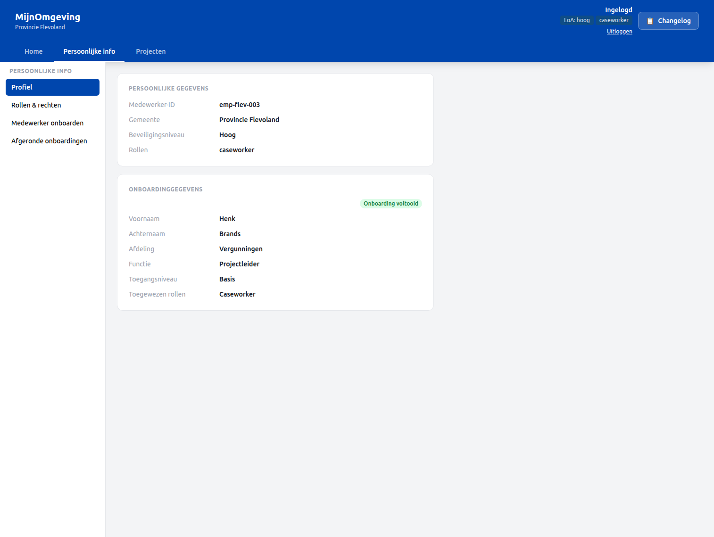
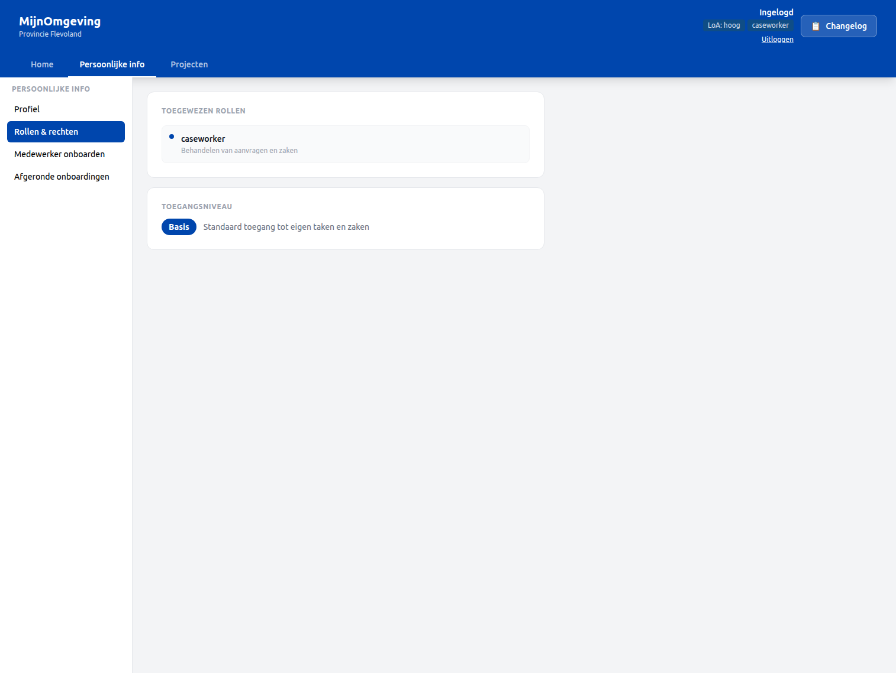
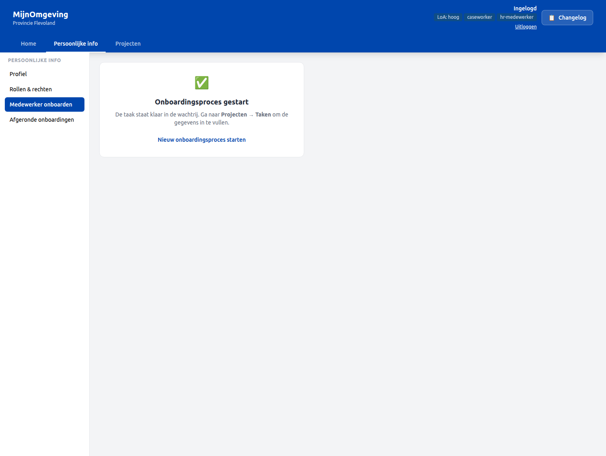
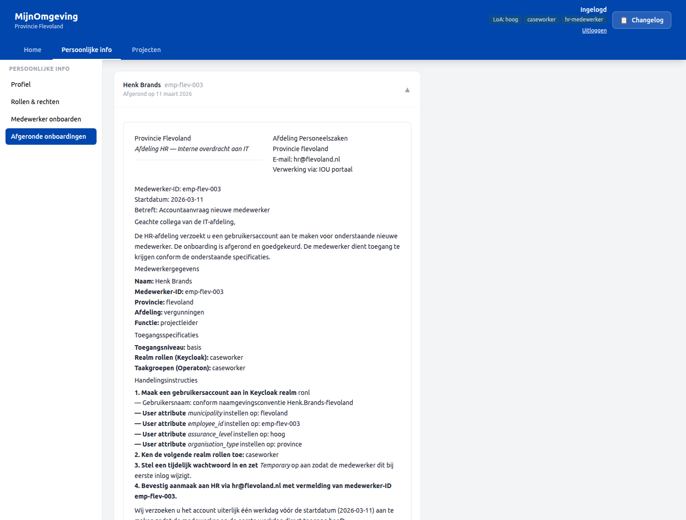

# HR Onboarding Workflow

From v2.4.0, the RONL Business API caseworker dashboard includes an **HR onboarding flow** that lets HR staff start, track, and complete a structured employee onboarding process entirely within MijnOmgeving. The process is backed by the `HrOnboardingProcess` BPMN and the `EmployeeRoleAssignment` DMN, using the same claim-first caseworker task queue as the AWB Kapvergunning.

---

## Who can use this

| Role | What they can do |
|---|---|
| `caseworker` | View own Profiel, view own Rollen & rechten |
| `hr-medewerker` | All of the above, plus start onboarding processes, view Afgeronde onboardingen |

The `hr-medewerker` role is a Keycloak realm role. In test environments, `test-hr-denhaag` holds this role for Den Haag.

---

## Navigating the Persoonlijke info section

After login, the **Persoonlijke info** top nav item exposes four left-panel subsections:

| Subsection | Label | Accessible to |
|---|---|---|
| `profiel` | Profiel | All caseworkers |
| `rollen` | Rollen & rechten | All caseworkers |
| `hr-onboarding` | Medewerker onboarden | `hr-medewerker` only |
| `onboarding-archief` | Afgeronde onboardingen | `hr-medewerker` only |

---

## Profiel

The **Profiel** subsection shows a JWT identity card alongside onboarding data fetched automatically via the `employeeId` claim:

- `GET /v1/hr/onboarding/profile?employeeId=<employeeId>` is called on mount with the `employeeId` from the JWT.
- If onboarding data is found, the card shows first name, last name, department, job function, access level, and assigned roles — with an "Onboarding voltooid" badge.
- If the `employeeId` claim is absent (account not yet onboarded), a manual input fallback is shown so the caseworker can look up their own record by ID.

<figure markdown style="width:100%; margin:0;">
  
  <figcaption>Persoonlijke info → Profiel — JWT identity card with onboarding data</figcaption>
</figure>

---

## Rollen & rechten

The **Rollen & rechten** subsection lists:

1. **JWT roles** — roles currently present in the access token (`realm_access.roles`)
2. **Onboarding roles** — `assignedRoles` from the completed `HrOnboardingProcess` instance, fetched via the same `/v1/hr/onboarding/profile` endpoint
3. **Access level** — the `accessLevel` variable from the onboarding DMN, with a description card:

| Access level | Description |
|---|---|
| `basis` | Standaard toegang tot eigen taken en zaken |
| `uitgebreid` | Uitgebreide toegang inclusief rapportages |
| `admin` | Volledige toegang tot alle functionaliteiten |

<figure markdown style="width:100%; margin:0;">
  
  <figcaption>Persoonlijke info → Rollen & rechten — role list and access level description</figcaption>
</figure>

---

## Starting an onboarding — Medewerker onboarden

The **Medewerker onboarden** subsection (visible only to `hr-medewerker`) starts a new `HrOnboardingProcess` instance:

**Step 1** — Click **Onboardingsproces starten**. The button calls `POST /v1/process/HrOnboardingProcess/start` with an empty variables body.

**Step 2** — A success card confirms the process has started and points to **Projecten → Taken** to continue.

**Step 3** — In the task queue, the first task **Collect employee data** appears with `taskDefinitionKey: Task_CollectEmployeeData` and status **Openstaand**.

**Step 4** — Claim the task and fill in the employee data form. The form collects:

| Field | Variable |
|---|---|
| First name | `firstName` |
| Last name | `lastName` |
| Department | `department` |
| Job function | `jobFunction` |
| Start date | `startDate` |
| Employee ID | `employeeId` |

**Step 5** — Complete the task. The `EmployeeRoleAssignment` DMN evaluates `department` + `jobFunction` and assigns `assignedRoles`, `candidateGroups`, and `accessLevel` automatically.

**Step 6** — The HR review task (`Task_HrReview`) appears in the queue. The HR medewerker reviews the DMN output and confirms or adjusts.

**Step 7** — The final task (`Task_NotifyEmployee`) completes the process. An IT handover document (`hr-it-handover.document`, linked via `ronl:documentRef`) becomes available via the Afgeronde onboardingen archive.

<figure markdown style="width:100%; margin:0;">
  
  <figcaption>Persoonlijke info → Medewerker onboarden — started and success state</figcaption>
</figure>

---

## Viewing completed onboardings — Afgeronde onboardingen

The **Afgeronde onboardingen** subsection (visible only to `hr-medewerker`) shows all completed `HrOnboardingProcess` instances for the current municipality, fetched via `GET /v1/hr/onboarding/completed`.

Each row shows:

- Full name (`firstName` + `lastName`)
- Employee ID
- Completion date

Clicking a row expands it and renders the IT handover document using `DecisionViewer`, which fetches the `hr-it-handover.document` via `GET /v1/process/:id/decision-document`.

The document includes:

- **Medewerkergegevens** — employee identity and start date
- **Toegangsspecificaties** — assigned roles, candidate groups, access level
- **Keycloak account aanmaken** — step-by-step instructions for IT to create the Keycloak account

<figure markdown style="width:100%; margin:0;">
  
  <figcaption>Persoonlijke info → Afgeronde onboardingen — expanded IT handover document</figcaption>
</figure>

---

## HrOnboardingProcess — BPMN overview

```
StartEvent
  └─ Task_CollectEmployeeData    (candidateGroups: hr-medewerker)
       └─ EmployeeRoleAssignment DMN
            └─ Task_HrReview              (candidateGroups: hr-medewerker)
                 └─ Task_NotifyEmployee   (candidateGroups: hr-medewerker)
                      └─ EndEvent
```

All user tasks use `candidateGroups="hr-medewerker"`, following the same claim-first pattern as the AWB Kapvergunning. `camunda:historyTimeToLive` is set per AWB retention requirements.

---

## EmployeeRoleAssignment DMN

The DMN maps `department` + `jobFunction` to:

| Output variable | Description |
|---|---|
| `assignedRoles` | Comma-separated Keycloak realm roles to assign |
| `candidateGroups` | BPMN candidate group for tasks in this tenant |
| `accessLevel` | `basis`, `uitgebreid`, or `admin` |

---

## Backend endpoints

| Method | Endpoint | Auth | Description |
|---|---|---|---|
| `GET` | `/v1/hr/onboarding/profile` | Bearer JWT (caseworker) | Returns the flattened historic variables for a completed `HrOnboardingProcess` by `?employeeId=`. Applies tenant isolation. |
| `GET` | `/v1/hr/onboarding/completed` | Bearer JWT (caseworker) | Returns all completed `HrOnboardingProcess` instances for the caseworker's municipality, enriched with `employeeId`, `firstName`, `lastName`. |

---

## Test accounts

| Username | Municipality | Role |
|---|---|---|
| `test-hr-denhaag` | Den Haag | `caseworker`, `hr-medewerker` |
| `test-onboarded-denhaag` | Den Haag | `caseworker` (has completed onboarding record) |

Password for all test accounts: `test123`

---

## Related documentation

- [Caseworker Workflow](caseworker-workflow.md) — General task queue and claim-first workflow
- [API Endpoints](../references/api-endpoints.md) — HR endpoints
- [Keycloak Realm Configuration](../references/keycloak-realm.md) — `hr-medewerker` role, `employeeId` mapper
- [BPMN Design Criteria](../references/bpmn-design-criteria.md) — `candidateGroups` pattern
