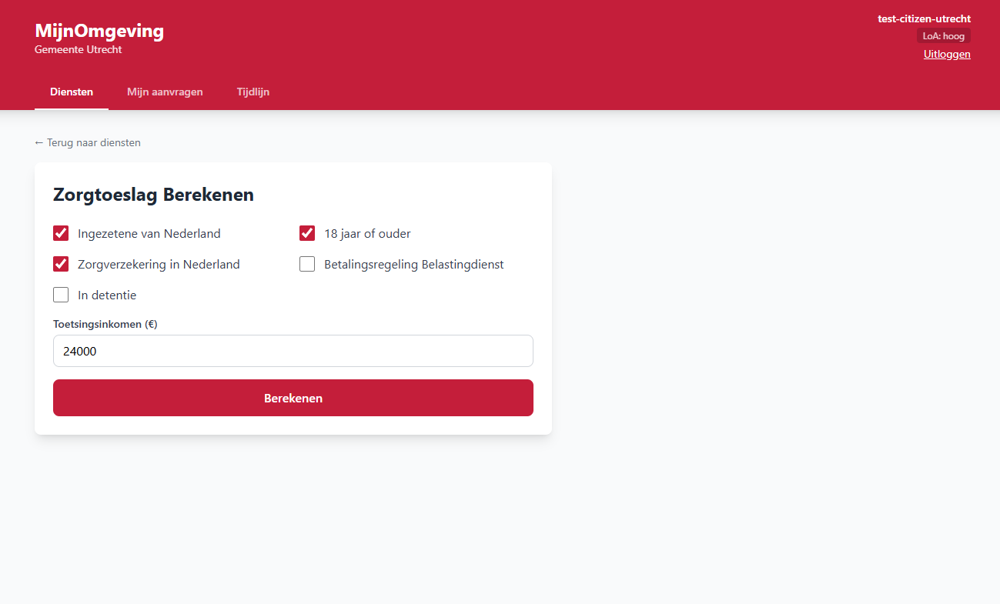
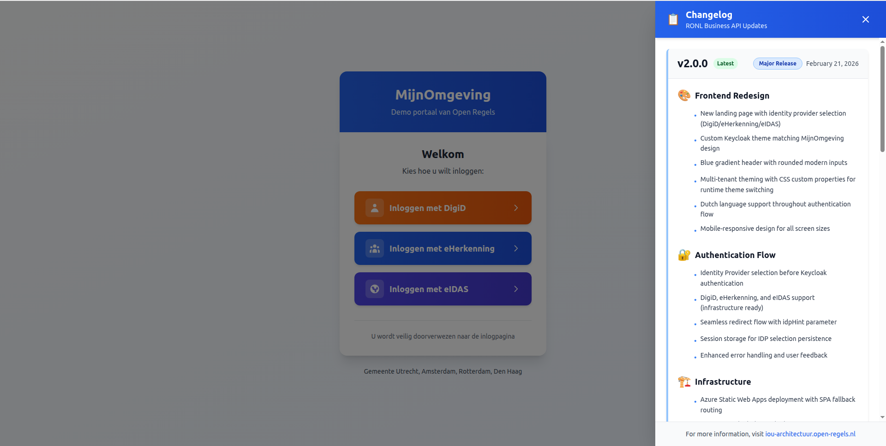

# Logging In

This guide explains what happens when a resident (burger) or caseworker logs into a municipality portal powered by RONL Business API.

## What you need

- A DigiD account (for citizens)
- An eHerkenning account (for businesses/organizations)
- An eIDAS credential (for EU residents)
- The URL of your municipality's portal

**Test environment:**

- **ACC:** `https://acc.mijn.open-regels.nl`
- **PROD:** `https://mijn.open-regels.nl`

In the test environment, use the Keycloak test accounts listed in [Local Development Setup](../developer/local-development.md) instead of real DigiD credentials.

## Step-by-step login

### Step 1 — Visit the portal

Open the municipality portal in your browser (e.g., `https://mijn.open-regels.nl`).

You'll see the **MijnOmgeving** landing page with a blue gradient header and three login options.


*MijnOmgeving landing page showing DigiD, eHerkenning, and eIDAS login options*

### Step 2 — Choose your identity provider

The landing page displays three authentication methods:

**🟠 DigiD** (Digitale Identiteit)
- For Dutch residents accessing citizen services
- Requires a valid DigiD account
- Supports multiple assurance levels (basis, midden, hoog)

**🔵 eHerkenning** (Business Authentication)
- For businesses and organizations
- Used by caseworkers and business users
- Requires an eHerkenning account

**🟣 eIDAS** (EU Digital Identity)
- For EU residents without DigiD
- Cross-border authentication
- Compliant with eIDAS regulation

Click the appropriate button for your login method.

### Step 3 — Keycloak authentication

After selecting an identity provider, you're redirected to Keycloak. The system automatically pre-selects your chosen identity provider using the `idpHint` parameter.


*Custom themed Keycloak login matching MijnOmgeving design*

**Custom theme features:**
- Blue gradient header matching the landing page
- Modern rounded input fields
- Dutch language throughout
- Mobile-responsive design

### Step 4 — Identity provider authentication

**DigiD authentication:**

1. Enter your DigiD username
2. Enter your password
3. Complete two-factor authentication (if required for higher LoA)
4. DigiD verifies your identity

**eHerkenning authentication:**

Similar flow with eHerkenning credentials and optionally mandates (machtiging) for acting on behalf of an organization.

**eIDAS authentication:**

EU member state authentication via the eIDAS network.

### Step 5 — Token issuance

After successful authentication, Keycloak:

1. Validates the authentication response from the identity provider
2. Maps user attributes (BSN for DigiD, KVK number for eHerkenning)
3. Applies tenant-specific settings (municipality)
4. Issues a JWT access token

**Example JWT payload:**

```json
{
  "sub": "abc123def456",
  "name": "Jan de Vries",
  "preferred_username": "test-citizen-utrecht",
  "municipality": "utrecht",
  "loa": "hoog",
  "realm_access": {
    "roles": ["citizen"]
  },
  "aud": "ronl-business-api",
  "iss": "https://acc.keycloak.open-regels.nl/realms/ronl",
  "exp": 1708534800,
  "iat": 1708533900
}
```

### Step 6 — Dashboard access

The portal receives the JWT token and displays your personalized dashboard with:

- Municipality-specific theming (colors, logo)
- Your name and role displayed in the header
- Assurance level (LoA) badge
- Available services and calculators


*Dashboard showing zorgtoeslag calculator with Utrecht municipality theming*

The JWT token is:

- **Valid for:** 15 minutes
- **Automatically refreshed** while you're active
- **Stored in memory** (not in localStorage for security)

### Step 7 — View recent updates (optional)

Click the **📋 Updates** button in the top-right corner to see the changelog panel with recent platform updates.


*Sliding changelog panel showing version history*

## Assurance levels (LoA)

DigiD supports three Level of Assurance (betrouwbaarheidsniveau) levels:

| Level | Dutch | English | Method | Use Cases |
|-------|-------|---------|--------|-----------|
| `low` | basis | Basic | Username + password | General information viewing |
| `substantial` | midden | Medium | Username + password + SMS code | Most government services |
| `high` | hoog | High | Username + password + DigiD app | Sensitive data, financial transactions |

**Important:** Some services require minimum LoA levels. If your token's `loa` is insufficient, the Business API returns:

```http
HTTP/1.1 403 Forbidden
Content-Type: application/json

{
  "success": false,
  "error": {
    "code": "LOA_INSUFFICIENT",
    "message": "This action requires assurance level 'substantial' or higher. Current level: 'low'"
  }
}
```

## Multi-municipality support

The platform supports four municipalities with distinct branding:

| Municipality | Primary Color | Test User |
|--------------|---------------|-----------|
| Utrecht | Red | test-citizen-utrecht |
| Amsterdam | Bright Red | test-citizen-amsterdam |
| Rotterdam | Green | test-citizen-rotterdam |
| Den Haag | Blue | test-citizen-denhaag |

Your municipality is determined by the `municipality` attribute in your user profile and reflected in:

- Header color scheme
- Municipality name display
- Available services (future: municipality-specific feature flags)

## Logging out

Click the **"Uitloggen"** (log out) button in the portal header. This:

1. Calls Keycloak's `end_session_endpoint`
2. Invalidates the Keycloak SSO session
3. Clears the frontend token from memory
4. Redirects you to the landing page

**Session timeout:**

- **SSO session:** Expires after **30 minutes of inactivity**
- **Access token:** Expires after **15 minutes** (automatically refreshed while active)

Closing the browser tab without logging out does not immediately invalidate the session—the SSO session remains active until timeout.

## Troubleshooting

### "Session expired" message

Your SSO session timed out after 30 minutes of inactivity. Click the login button to start a new session.

### Redirect loop

**Cause:** Invalid or expired redirect URI configuration.

**Solution:** Verify Keycloak client configuration includes:
```
Valid Redirect URIs: https://acc.mijn.open-regels.nl/*
Web Origins: +
```

### Wrong municipality shown

**Cause:** User profile has incorrect `municipality` attribute.

**Solution:** In Keycloak Admin Console:

1. Users → Select user → Attributes
2. Set `municipality` to correct value (utrecht/amsterdam/rotterdam/denhaag)
3. Log out and log in again

### Authentication works but dashboard is blank

**Cause:** Frontend environment variables not configured.

**Solution:** Verify `.env` file contains:
```bash
VITE_KEYCLOAK_URL=https://acc.keycloak.open-regels.nl
VITE_API_URL=https://acc.api.open-regels.nl
```

Rebuild the frontend and redeploy.

---

## Related Documentation

- [Authentication & IAM Features](../features/authentication-iam.md) — Technical details of the authentication system
- [Frontend Development](../developer/frontend-development.md) — How the login flow is implemented
- [Keycloak Deployment](../developer/deployment/keycloak.md) — Keycloak VM setup and theme customization
- [JWT Claims Reference](../references/jwt-claims.md) — Complete JWT token structure

---

**Questions or issues?** See [Troubleshooting](../developer/troubleshooting.md) or contact the development team.