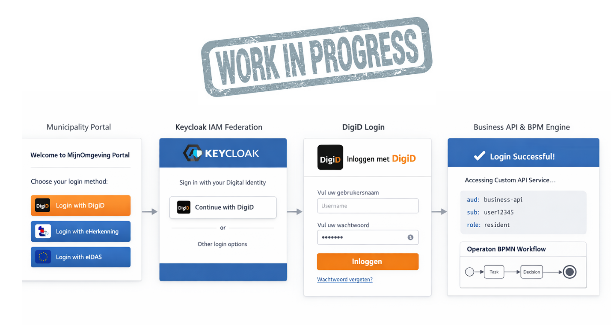

# Logging In — DigiD Flow

This guide explains what happens when a resident (burger) or caseworker logs into a municipality portal powered by RONL Business API.



## What you need

- A DigiD account (or, for business matters, eHerkenning)
- The URL of your municipality's portal (e.g. `https://mijn.open-regels.nl` for Utrecht)

In the **test environment**, use the Keycloak test accounts listed in [Local Development Setup](../developer/local-development.md) instead of a real DigiD account.

## Step-by-step login

**Step 1 — Visit the portal**

Open the municipality portal in your browser. The portal checks for a valid session token. If none is found, it automatically redirects you to Keycloak.

**Step 2 — Choose your identity provider**

The Keycloak login page shows the available login methods: DigiD (for citizens), eHerkenning (for businesses), or eIDAS (for EU residents). Select the appropriate method.

```
+----------------------------------------------------+
|  Gemeente Utrecht — MijnOmgeving                   |
|----------------------------------------------------|
|  Kies hoe u wilt inloggen:                         |
|                                                    |
|  [ 🔐 Inloggen met DigiD           ]               |
|  [ 🏢 Inloggen met eHerkenning     ]               |
|  [ 🇪🇺 Inloggen met eIDAS          ]               |
+----------------------------------------------------+
```

**Step 3 — Authenticate with DigiD**

You are redirected to DigiD for authentication. DigiD verifies your identity and returns a signed SAML assertion to Keycloak.

**Step 4 — Keycloak issues a token**

Keycloak validates the SAML assertion, maps your attributes (BSN, assurance level), and issues a JWT access token containing:

```json
{
  "municipality": "utrecht",
  "roles": ["citizen"],
  "loa": "substantial"
}
```

**Step 5 — You are redirected back to the portal**

The portal receives the JWT, stores it in memory, and displays your personalised dashboard with Utrecht's red-and-green branding. The token is valid for **15 minutes** and is automatically refreshed while you are active.

## Assurance levels (LoA)

DigiD issues three assurance levels depending on the authentication method used:

| Level | Dutch | Method |
|---|---|---|
| `low` | basis | Username + password |
| `substantial` | midden | Username + password + SMS code |
| `high` | hoog | Username + password + ID check app |

Some government services require a minimum LoA. If your token's `loa` is insufficient for a requested action, the Business API returns HTTP 403 with error code `LOA_INSUFFICIENT`.

## Logging out

Click the "Uitloggen" (log out) button in the portal header. This calls Keycloak's `end_session_endpoint`, which:

1. Invalidates the Keycloak session
2. Clears the frontend token from memory
3. Redirects you to the login page

Closing the browser tab without logging out does not immediately invalidate the session. The SSO session expires after **30 minutes of inactivity** (configurable in the Keycloak realm).
