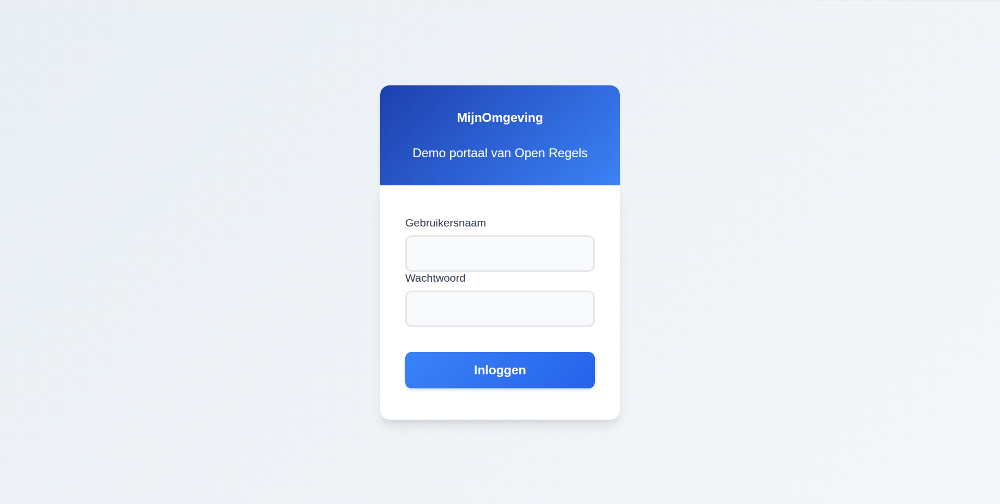
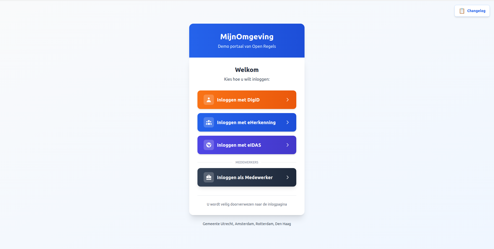
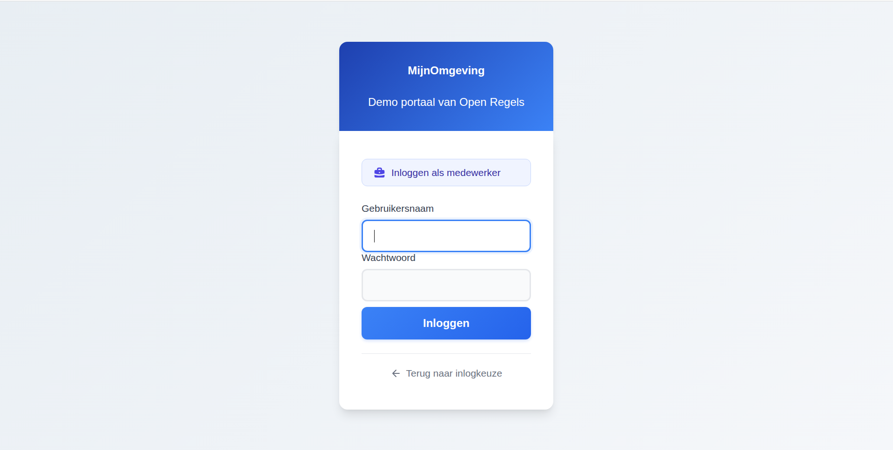

# Logging In — Citizen & Caseworker

This guide explains what happens when a citizen (burger) or caseworker (medewerker) logs into a municipality portal powered by RONL Business API. The two roles use different authentication paths, which are reflected in both the landing page and the Keycloak login experience.

**Environments:**

| | URL |
|---|---|
| Acceptance | `https://acc.mijn.open-regels.nl` |
| Production | `https://mijn.open-regels.nl` |

In the test environment, use the Keycloak test accounts listed in [Local Development Setup](../developer/local-development.md) instead of real DigiD or employee credentials.

---

## Citizen login

Citizens are Dutch residents, EU residents, or businesses accessing government services. They authenticate through a government-issued identity provider.

### What you need

- A DigiD account (Dutch residents), or
- An eHerkenning account (businesses / organisations), or
- An eIDAS credential (EU residents without DigiD)

### Step 1 — Visit the portal

Open the municipality portal in your browser. You will see the **MijnOmgeving** landing page with four login options — three for citizens and one for caseworkers.

<figure markdown>
  
  <figcaption>MijnOmgeving landing page showing all four login options</figcaption>
</figure>

### Step 2 — Choose your identity provider

Select the option that matches your credential:

**🟠 DigiD** (Digitale Identiteit)
For Dutch residents. Requires a valid DigiD account. Supports assurance levels basis, midden, and hoog.

**🔵 eHerkenning**
For businesses and organisations. Requires an eHerkenning account. Supports mandates (machtiging) for acting on behalf of an organisation.

**🟣 eIDAS**
For EU residents without DigiD. Cross-border authentication compliant with the eIDAS regulation.

### Step 3 — Redirect to identity provider

After clicking a citizen button, `AuthCallback.tsx` calls:

```typescript
keycloak.init({
  onLoad: 'login-required',
  checkLoginIframe: false,
  idpHint: 'digid' // or 'eherkenning' / 'eidas'
});
```

The `idpHint` tells Keycloak to skip its own login form and redirect immediately to the selected identity provider. In production, this takes you directly to DigiD, eHerkenning, or the eIDAS network. In the test environment (no real IdPs configured), Keycloak falls back to its native username/password form without a context banner.

<figure markdown>
  
  <figcaption>Keycloak native login without caseworker banner</figcaption>
</figure>

### Step 4 — Authenticate

**DigiD:** Enter your DigiD username and password. Complete two-factor authentication if your assurance level requires it.

**eHerkenning:** Enter your eHerkenning credentials. Optionally select a mandate if acting on behalf of an organisation.

**eIDAS:** Authenticate through your EU member state's identity provider.

### Step 5 — Token issuance

After successful authentication, Keycloak validates the identity provider response, maps user attributes (BSN for DigiD, KvK number for eHerkenning, eIDAS PersonIdentifier), applies municipality settings, and issues a signed JWT access token.

**Example JWT payload (citizen):**

```json
{
  "sub": "abc123def456",
  "name": "Jan de Vries",
  "preferred_username": "test-citizen-utrecht",
  "municipality": "utrecht",
  "loa": "hoog",
  "realm_access": {
    "roles": ["citizen"]
  },
  "aud": "ronl-business-api",
  "iss": "https://acc.keycloak.open-regels.nl/realms/ronl",
  "exp": 1708534800,
  "iat": 1708533900
}
```

### Step 6 — Dashboard

The portal receives the JWT and displays the citizen dashboard with municipality-specific theming and the zorgtoeslag calculator. The JWT is valid for 15 minutes and refreshed automatically while the session is active.

---

## Caseworker login

Caseworkers (medewerkers) are municipal employees managed directly in the Keycloak realm. They do not authenticate through DigiD or eHerkenning — they use Keycloak's native username/password form, which is visually distinguished from the citizen login with a dedicated context banner.

### What you need

- A Keycloak account in the `ronl` realm with the `caseworker` role assigned
- The `municipality` attribute set to your municipality (e.g. `utrecht`)

**Test environment accounts:**

| Username | Municipality | Role |
|---|---|---|
| `test-caseworker-utrecht` | utrecht | caseworker |
| `test-caseworker-amsterdam` | amsterdam | caseworker |
| `test-caseworker-rotterdam` | rotterdam | caseworker |
| `test-caseworker-denhaag` | denhaag | caseworker |

Password for all test accounts: `test123`

### Step 1 — Visit the portal and select "Inloggen als Medewerker"

On the MijnOmgeving landing page, scroll past the three citizen options. Below a "MEDEWERKERS" divider you will find the slate-coloured caseworker button.

<figure markdown>
  
  <figcaption>Caseworker login button, visually separated from citizen IdP options</figcaption>
</figure>

### Step 2 — AuthCallback checks for an existing SSO session

Clicking "Inloggen als Medewerker" stores `medewerker` in `sessionStorage` and navigates to `/auth`. `AuthCallback.tsx` detects this and calls:

```typescript
keycloak.init({
  onLoad: 'check-sso',
  checkLoginIframe: false,
});
```

Unlike the citizen flow (`login-required`), `check-sso` does **not** trigger a redirect. It silently checks whether a Keycloak SSO session already exists in the browser:

- **Session found** → navigates directly to `/dashboard` without any login screen.
- **No session** → proceeds to step 3.

### Step 3 — Keycloak login with caseworker banner

When no SSO session exists, `AuthCallback` calls:

```typescript
keycloak.login({ loginHint: '__medewerker__' });
```

This redirects to Keycloak and passes `__medewerker__` as the `login_hint` parameter. The `login.ftl` FreeMarker template reads this value via `login.username`, detects the sentinel string `__medewerker__`, and:

- Sets the page title to **"Medewerker portaal"** instead of the default "Inloggen"
- Renders an indigo context banner: **"Inloggen als medewerker"**
- Suppresses the sentinel value from the username field (the field renders empty, so the caseworker types their own username)

<figure markdown>
  
  <figcaption>Keycloak native login with caseworker context banner</figcaption>
</figure>

### Step 4 — Enter credentials

Enter the Keycloak username and password for the caseworker account. Click **Inloggen**.

A "← Terug naar inlogkeuze" link is available below the login button to return to the landing page without completing login.

### Step 5 — Token issuance

Keycloak issues a JWT with `roles: ["caseworker"]` and the caseworker's `municipality` attribute.

**Example JWT payload (caseworker):**

```json
{
  "sub": "xyz789abc012",
  "name": "Petra van Dam",
  "preferred_username": "test-caseworker-utrecht",
  "municipality": "utrecht",
  "loa": "hoog",
  "realm_access": {
    "roles": ["caseworker"]
  },
  "aud": "ronl-business-api",
  "iss": "https://acc.keycloak.open-regels.nl/realms/ronl",
  "exp": 1708534800,
  "iat": 1708533900
}
```

### Step 6 — Caseworker dashboard

The portal detects the `caseworker` role in the JWT and renders the caseworker dashboard. See [Caseworker Workflow](caseworker-workflow.md) for what caseworkers can do once logged in.

---

## Common behaviour

### Multi-municipality support

The `municipality` claim in the JWT determines branding and data scope. The platform supports four municipalities:

| Municipality | Primary colour | Citizen test user | Caseworker test user |
|---|---|---|---|
| Utrecht | Red | `test-citizen-utrecht` | `test-caseworker-utrecht` |
| Amsterdam | Bright red | `test-citizen-amsterdam` | `test-caseworker-amsterdam` |
| Rotterdam | Green | `test-citizen-rotterdam` | `test-caseworker-rotterdam` |
| Den Haag | Blue | `test-citizen-denhaag` | `test-caseworker-denhaag` |

### Assurance levels (LoA) — citizen only

DigiD supports three assurance levels:

| Level | Dutch | Method | Use cases |
|---|---|---|---|
| `low` | basis | Username + password | General information viewing |
| `substantial` | midden | Username + password + SMS | Most government services |
| `high` | hoog | Username + password + DigiD app | Sensitive data, financial transactions |

If the token's `loa` is insufficient for a requested operation, the Business API returns:

```http
HTTP/1.1 403 Forbidden

{
  "error": {
    "code": "LOA_INSUFFICIENT",
    "message": "This action requires assurance level 'substantial' or higher."
  }
}
```

Caseworker accounts are not subject to LoA enforcement — they authenticate with Keycloak-native credentials.

### Token lifetime

- **Access token:** 15 minutes, automatically refreshed while the session is active
- **SSO session idle timeout:** 30 minutes of inactivity
- **SSO session maximum:** 10 hours
- Token is stored in memory only (never in `localStorage`)

### Logging out

Click **Uitloggen** in the portal header. This calls Keycloak's `end_session_endpoint`, invalidates the SSO session, clears the in-memory token, and redirects to the landing page.

---

## Troubleshooting

### "Session expired" message

The SSO session timed out after 30 minutes of inactivity. Return to the landing page and log in again.

### Redirect loop

**Cause:** Invalid redirect URI configuration in Keycloak.

**Fix:** Verify the `ronl-business-api` client in Keycloak Admin has:
```
Valid Redirect URIs: https://acc.mijn.open-regels.nl/*
Web Origins: +
```

### "Terug naar inlogkeuze" requires two clicks

**Cause:** The `/auth` route (`AuthCallback.tsx`) is an intermediate step in the browser history. Navigating back once lands on `/auth`, which immediately redirects to Keycloak again.

**Fix:** The cancel link in `login.ftl` uses `history.go(-2)` to skip past `/auth` in a single click.

### Wrong municipality shown after login

**Cause:** The user account has an incorrect `municipality` attribute in Keycloak.

**Fix:** In Keycloak Admin Console → Users → select the user → Attributes → set `municipality` to the correct value, then log out and back in.

### Caseworker banner not showing

**Cause:** The `__medewerker__` `login_hint` is not being passed, or the `login.ftl` template version on the server is outdated.

**Fix:** Verify that `sessionStorage` contains `selected_idp = medewerker` before `/auth` loads (check DevTools → Application → Session Storage). If the theme file is outdated, redeploy the theme and restart the Keycloak container (see [Keycloak Deployment](../developer/deployment/keycloak.md)).

---

## Related documentation

- [Authentication & IAM](../features/authentication-iam.md) — Technical architecture of both authentication flows
- [Caseworker Workflow](caseworker-workflow.md) — What caseworkers can do after login
- [Frontend Development](../developer/frontend-development.md) — `LoginChoice.tsx` and `AuthCallback.tsx` implementation details
- [Keycloak Deployment](../developer/deployment/keycloak.md) — Theme files, caseworker banner, container management
- [JWT Claims Reference](../references/jwt-claims.md) — Complete JWT token structure
