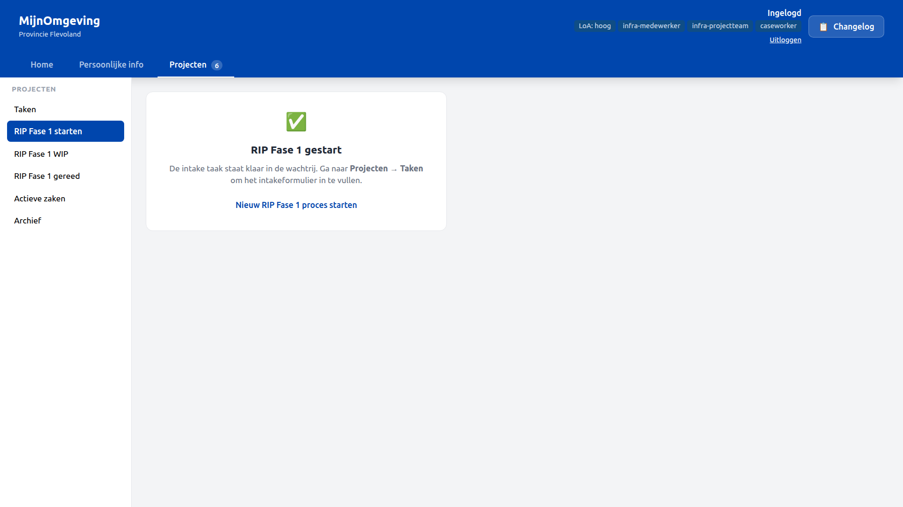
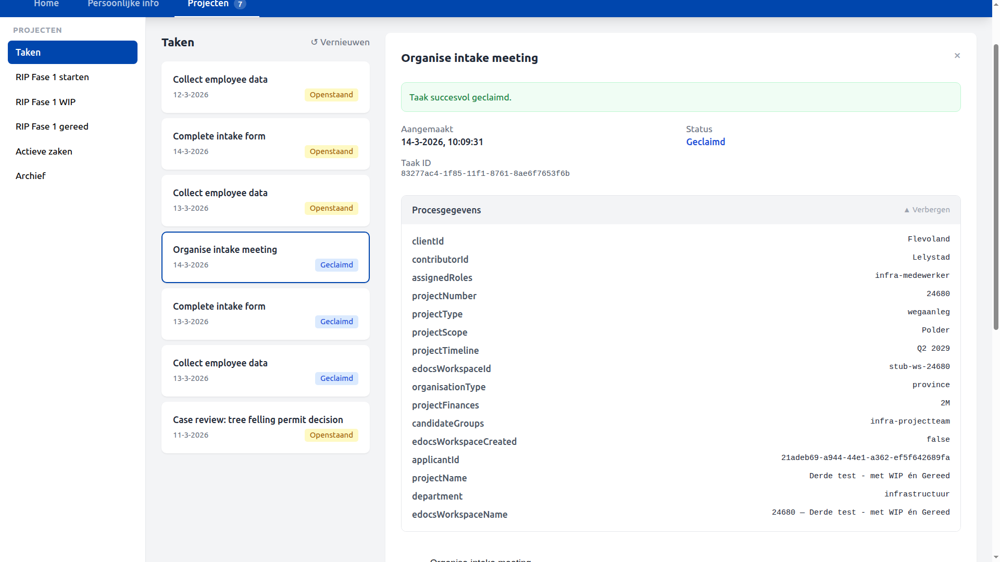
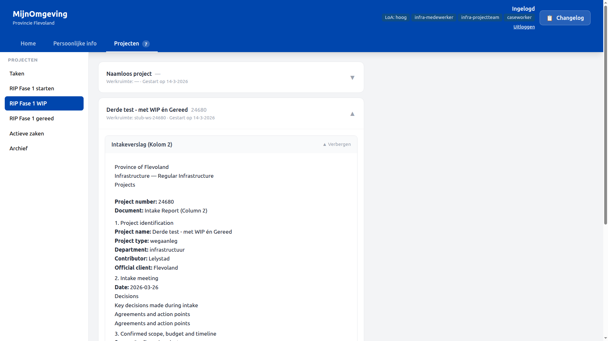
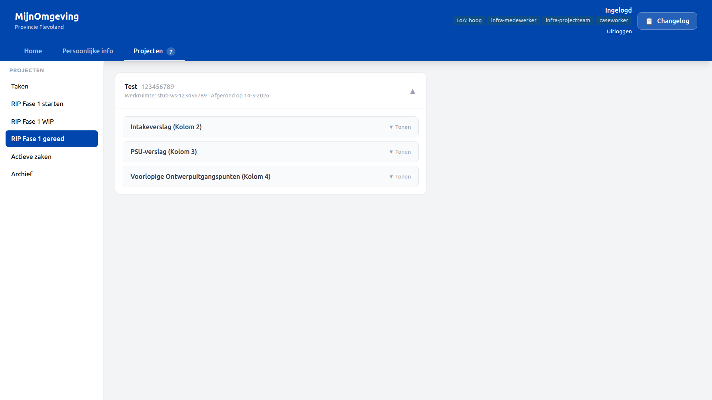
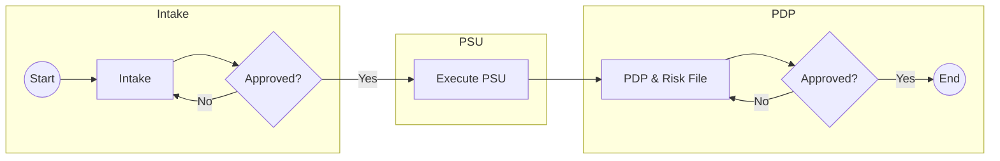
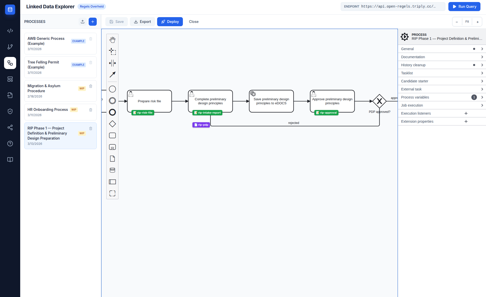

# RIP Phase 1 Workflow

From v2.6.0, the RONL Business API caseworker dashboard includes a **RIP Phase 1 flow** that lets infrastructure project team members start, track, and complete the two-phase project definition and preliminary design preparation process entirely within MijnOmgeving. The process is backed by the `RipPhase1Process` BPMN and the `RipProjectTypeAssignment` DMN, using the same claim-first caseworker task queue as the AWB Kapvergunning and HR onboarding.

This implementation is specific to **Provincie Flevoland** and uses the `infra-projectteam` realm role as the access gate.

---

## Who can use this

| Role                | What they can do                                                                            |
| ------------------- | ------------------------------------------------------------------------------------------- |
| `caseworker`        | View own Profiel, Rollen & rechten, Taken                                                   |
| `infra-projectteam` | All of the above, plus start RIP Fase 1 processes, view WIP and completed project documents |

The `infra-projectteam` role is a Keycloak realm role assigned to infrastructure employees after they complete the HR onboarding flow (via `EmployeeRoleAssignment` DMN output `candidateGroups`).

In test environments, `test-infra-flevoland` holds this role for Flevoland.

---

## Projecten tab — three RIP sections

After login with the Flevoland tenant, the **Projecten** top-nav item exposes three RIP-specific left-panel sections in addition to Taken:

| Section            | Label              | Accessible to       |
| ------------------ | ------------------ | ------------------- |
| `rip-fase1`        | RIP Fase 1 starten | `infra-projectteam` |
| `rip-fase1-wip`    | RIP Fase 1 WIP     | `infra-projectteam` |
| `rip-fase1-gereed` | RIP Fase 1 gereed  | `infra-projectteam` |

---

## Starting a process — RIP Fase 1 starten

The **RIP Fase 1 starten** section starts a new `RipPhase1Process` instance:

**Step 1** — Click **RIP Fase 1 starten**. The button calls `POST /v1/process/RipPhase1Process/start` with an empty variables body.

**Step 2** — A success card confirms the process has started and points to **Projecten → Taken** to continue.

**Step 3** — In the task queue, the first task **Complete intake form** appears with status **Openstaand**.

<figure markdown style="width:100%; margin:0;">
  
  <figcaption>Projecten → RIP Fase 1 starten — launch button and success state</figcaption>
</figure>

---

## Process flow — 17 steps

The `RipPhase1Process` covers two phases: project definition (intake) and preliminary design preparation (PSU + PDP). All user tasks use `candidateGroups="infra-projectteam"`.

| Step | Task                                     | Form / Document                                         |
| ---- | ---------------------------------------- | ------------------------------------------------------- |
| 1    | Complete intake form                     | `rip-intake.form`                                       |
| —    | DMN: determine project roles             | `RipProjectTypeAssignment`                              |
| —    | ServiceTask: create eDOCS workspace      | writes `edocsWorkspaceId`                               |
| 2    | Organise intake meeting                  | `rip-intake-meeting.form`                               |
| 3    | Complete intake report                   | `rip-intake-report.form` + `rip-intake-report.document` |
| —    | ServiceTask: save intake report to eDOCS | writes `edocsIntakeReportId`                            |
| 4    | Approve intake report                    | `rip-approval.form`                                     |
| ↺    | Rejected → loops back to step 3          |                                                         |
| 5    | Organise PSU                             | `rip-psu-organize.form`                                 |
| 6    | PSU execution                            | `rip-psu-execution.form`                                |
| 7    | Complete PSU report                      | `rip-psu-report.document`                               |
| —    | ServiceTask: save PSU report to eDOCS    | writes `edocsPsuReportId`                               |
| 8    | Prepare risk file                        | `rip-risk-file.form`                                    |
| 9    | Complete preliminary design principles   | `rip-pdp.document`                                      |
| —    | ServiceTask: save PDP to eDOCS           | writes `edocsPdpId`                                     |
| 10   | Approve preliminary design principles    | `rip-approval.form`                                     |
| ↺    | Rejected → loops back to step 9          |                                                         |
| —    | End                                      | Phase 1 complete                                        |

### Key process variables

| Variable              | Type   | Set by                                       |
| --------------------- | ------ | -------------------------------------------- |
| `projectNumber`       | String | Intake form — eDOCS workspace key            |
| `projectName`         | String | Intake form                                  |
| `projectType`         | String | Intake form — DMN input                      |
| `department`          | String | Intake form — DMN input                      |
| `candidateGroups`     | String | DMN output                                   |
| `assignedRoles`       | String | DMN output                                   |
| `edocsWorkspaceId`    | String | eDOCS workspace ServiceTask                  |
| `edocsIntakeReportId` | String | eDOCS document ServiceTask                   |
| `edocsPsuReportId`    | String | eDOCS document ServiceTask                   |
| `edocsPdpId`          | String | eDOCS document ServiceTask                   |
| `approvalStatus`      | String | Approval form — `"approved"` or `"rejected"` |

---

## Working through tasks — Taken

Each task in the queue follows the standard claim-first pattern:

1. Navigate to **Projecten → Taken**
2. Select the task — Procesgegevens shows current project variables (collapsed by default when task is claimed)
3. Click **Taak claimen** — status changes to **Geclaimd**
4. Fill in the form and click **Submit**
5. The next task in the process appears in the queue

<figure markdown style="width:100%; margin:0;">
  
  <figcaption>Projecten → Taken — RIP Phase 1 task queue with Procesgegevens panel</figcaption>
</figure>

---

## Tracking live projects — RIP Fase 1 WIP

The **RIP Fase 1 WIP** section lists all active `RipPhase1Process` instances for the current organisation via `GET /v1/rip/phase1/active`. Each card shows:

- Project name and number
- eDOCS workspace ID
- Start date

Clicking a project expands it to show the three document sections:

| Section                                    | Document                     | Available when         |
| ------------------------------------------ | ---------------------------- | ---------------------- |
| Intakeverslag (Kolom 2)                    | `rip-intake-report.document` | After step 3 completed |
| PSU-verslag (Kolom 3)                      | `rip-psu-report.document`    | After step 7 completed |
| Voorlopige Ontwerpuitgangspunten (Kolom 4) | `rip-pdp.document`           | After step 9 completed |

Documents not yet produced show **Nog niet beschikbaar**. All three documents render using the same TipTap/ProseMirror zone renderer as the citizen DecisionViewer, with process variables substituted inline.

<figure markdown style="width:100%; margin:0;">
  
  <figcaption>Projecten → RIP Fase 1 WIP — active project with expanded Intakeverslag</figcaption>
</figure>

---

## Completed projects — RIP Fase 1 gereed

The **RIP Fase 1 gereed** section lists all completed `RipPhase1Process` instances via `GET /v1/rip/phase1/completed`. The layout is identical to the WIP view, with completion date instead of start date. All three documents are rendered in the same collapsible sections.

<figure markdown style="width:100%; margin:0;">
  
  <figcaption>Projecten → RIP Fase 1 gereed — completed project archive with all three documents</figcaption>
</figure>

---

## RipPhase1Process — BPMN overview

---

## RipProjectTypeAssignment DMN

|                |                                    |
| -------------- | ---------------------------------- |
| **Inputs**     | `projectType`, `department`        |
| **Outputs**    | `candidateGroups`, `assignedRoles` |
| **Hit policy** | FIRST                              |

All current rules resolve to `infra-projectteam` / `infra-medewerker`, allowing any team member to claim tasks. The table is structured to accept granular per-role rules in future iterations — new rows can be added and the bundle redeployed without BPMN changes.

---

## LDE build — what to deploy

The full RIP Phase 1 bundle lives in `examples/organizations/flevoland/rip-phase1/` and must be deployed as a single Operaton deployment. The LDE one-click deploy bundles BPMN, DMN, forms, and documents together.

### Files in the bundle

| File                           | Type     | Description                                  |
| ------------------------------ | -------- | -------------------------------------------- |
| `RipPhase1Process.bpmn`        | BPMN     | Main process definition                      |
| `RipProjectTypeAssignment.dmn` | DMN      | Role assignment rules                        |
| `rip-intake.form`              | Form     | Project details — step 1                     |
| `rip-intake-meeting.form`      | Form     | Meeting confirmation — step 2                |
| `rip-intake-report.form`       | Form     | Intake report fields — step 3                |
| `rip-psu-organize.form`        | Form     | PSU organisation — step 5                    |
| `rip-psu-execution.form`       | Form     | PSU execution notes — step 6                 |
| `rip-risk-file.form`           | Form     | Risk file confirmation — step 8              |
| `rip-approval.form`            | Form     | Reusable approval/rejection — steps 4 and 10 |
| `rip-intake-report.document`   | Document | Intake Report (Column 2)                     |
| `rip-psu-report.document`      | Document | PSU Report (Column 3)                        |
| `rip-pdp.document`             | Document | Preliminary Design Principles (Column 4)     |

### LDE deploy steps

1. Open the LDE BPMN Canvas and load `RipPhase1Process.bpmn`
2. Ensure all seven forms are authored and linked to their respective UserTasks via `camunda:formRef`
3. Ensure the three documents are authored in the Document Composer and linked to their UserTasks via `ronl:documentRef` in the properties panel
4. Click **Deploy** — the LDE packages all files into a single Operaton deployment
5. Verify the deployment in the Operaton Cockpit under `RipPhase1Process`

!!! note "DMNs are not part of the deploy bundle"
    Decision models referenced via `camunda:decisionRef` on `BusinessRuleTask` elements are **not** included in this deployment. DMNs reach Operaton through a separate path: they are published to TriplyDB by the [CPSV Editor](../../cpsv-editor/index.md) and deployed to Operaton from there. The BPMN process resolves `camunda:decisionRef` at runtime against whatever is already deployed — as long as the DMN key matches, no additional action is needed here.

<figure markdown style="width:100%; margin:0;">
  
  <figcaption>LDE BPMN Canvas showing a small part of the RipPhase1Process with PDP steps and eDOCS ServiceTask</figcaption>
</figure>

### Also deploy — HR Onboarding update

The `EmployeeRoleAssignment` DMN in the HR onboarding bundle was updated to prepend `infra-projectteam` to the `candidateGroups` output for all `infrastructuur` department rules. This update must be redeployed as part of the same release so that infra employees onboarded via HR get the `infra-projectteam` candidate group automatically.

Bundle: `examples/organizations/flevoland/HrOnboardingProcess.bpmn` + `EmployeeRoleAssignment.dmn` + all HR forms + `hr-it-handover.document`

---

## eDOCS integration

The `RipPhase1Process` uses the Operaton external task pattern for eDOCS integration. The LDE backend worker polls two topics:

| Topic                 | Triggered by                                                  | Reads                                                            | Writes                                                            |
| --------------------- | ------------------------------------------------------------- | ---------------------------------------------------------------- | ----------------------------------------------------------------- |
| `rip-edocs-workspace` | `Task_EnsureWorkspace`                                        | `projectNumber`, `projectName`                                   | `edocsWorkspaceId`, `edocsWorkspaceName`, `edocsWorkspaceCreated` |
| `rip-edocs-document`  | `Task_SaveIntakeReport`, `Task_SavePsuReport`, `Task_SavePDP` | `edocsWorkspaceId`, `documentTemplateId`, all template variables | `edocsIntakeReportId` / `edocsPsuReportId` / `edocsPdpId`         |

**Stub mode** (`EDOCS_STUB_MODE=true`, default in development): all eDOCS calls return realistic fake responses. Set `EDOCS_STUB_MODE=false` and configure `EDOCS_BASE_URL`, `EDOCS_LIBRARY`, `EDOCS_USER_ID`, and `EDOCS_PASSWORD` to connect to a live OpenText eDOCS server.

---

## Backend endpoints

| Method | Endpoint                               | Auth                      | Description                                                                                                                      |
| ------ | -------------------------------------- | ------------------------- | -------------------------------------------------------------------------------------------------------------------------------- |
| `GET`  | `/v1/rip/phase1/active`                | Bearer JWT (`caseworker`) | Lists active `RipPhase1Process` instances for the municipality, enriched with `projectNumber`, `projectName`, `edocsWorkspaceId` |
| `GET`  | `/v1/rip/phase1/:instanceId/documents` | Bearer JWT (`caseworker`) | Returns all three document templates + current process variables for one instance. Absent documents are `null`.                  |
| `GET`  | `/v1/rip/phase1/completed`             | Bearer JWT (`caseworker`) | Lists completed `RipPhase1Process` instances, enriched with `projectNumber`, `projectName`, `edocsWorkspaceId`, `endTime`        |
| `GET`  | `/v1/edocs/status`                     | Bearer JWT (`caseworker`) | eDOCS connectivity status and stub mode flag                                                                                     |
| `POST` | `/v1/edocs/workspaces/ensure`          | Bearer JWT (`caseworker`) | Create or retrieve a project workspace in eDOCS                                                                                  |
| `POST` | `/v1/edocs/documents`                  | Bearer JWT (`caseworker`) | Upload a rendered document to a workspace                                                                                        |
| `GET`  | `/v1/edocs/workspaces/:id/documents`   | Bearer JWT (`caseworker`) | List documents in an eDOCS workspace                                                                                             |

All `/v1/rip/` endpoints apply municipality-based tenant isolation: the `municipality` process variable is compared to the JWT `municipality` claim.

---

## Test accounts

| Username               | Organisation | Roles                                                 |
| ---------------------- | ------------ | ----------------------------------------------------- |
| `test-hr-flevoland`    | Flevoland    | `caseworker`, `hr-medewerker`                         |
| `test-infra-flevoland` | Flevoland    | `caseworker`, `infra-projectteam`, `infra-medewerker` |

Password for all test accounts: `test123`

`test-hr-flevoland` is used to onboard `test-infra-flevoland` via the HR onboarding flow. `test-infra-flevoland` arrives with `employeeId: EMP-FLV-001` pre-configured and can immediately start RIP Fase 1 processes.

---

## Related documentation

- [Caseworker Workflow](caseworker-workflow.md) — General task queue and claim-first pattern
- [HR Onboarding Workflow](hr-onboarding.md) — How `infra-projectteam` roles get assigned
- [API Endpoints](../references/api-endpoints.md) — RIP and eDOCS endpoints
- [Keycloak Realm Configuration](../references/keycloak-realm.md) — `infra-projectteam`, `infra-medewerker` roles and test users
- [BPMN Design Criteria](../references/bpmn-design-criteria.md) — `candidateGroups`, `ronl:documentRef` pattern
