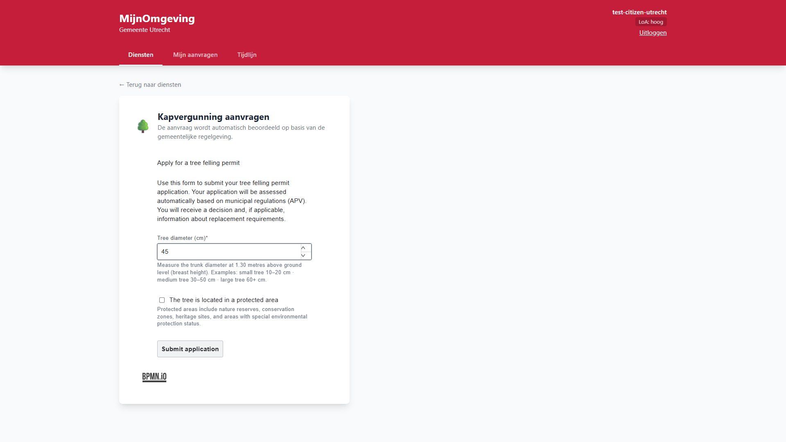
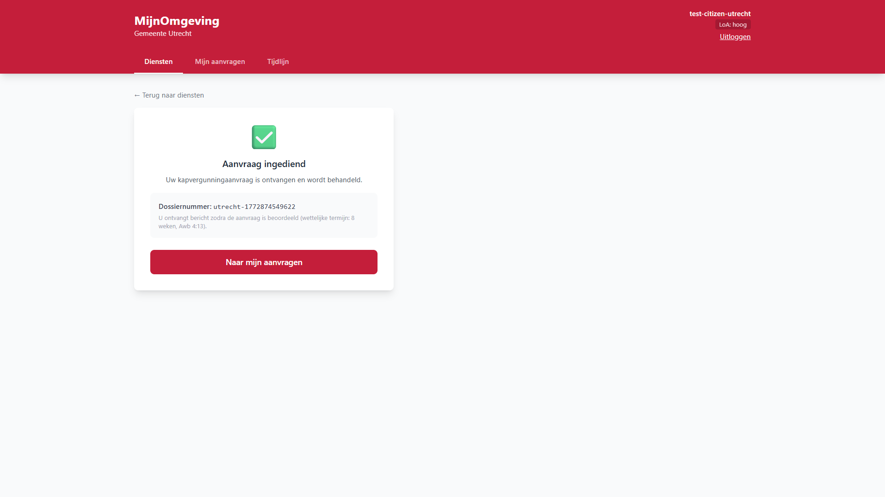
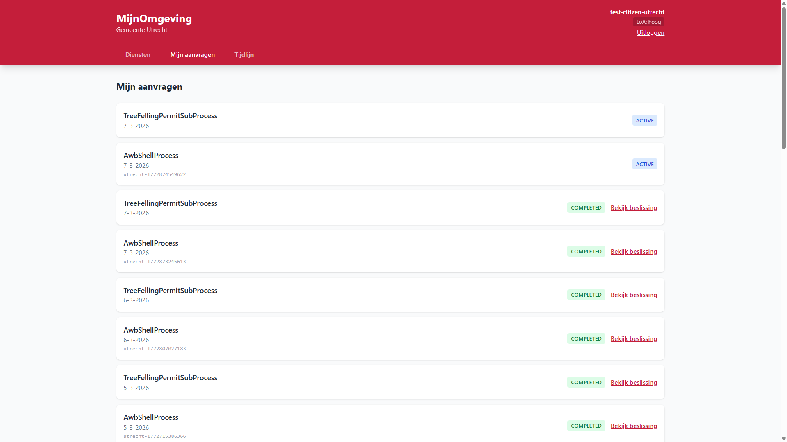
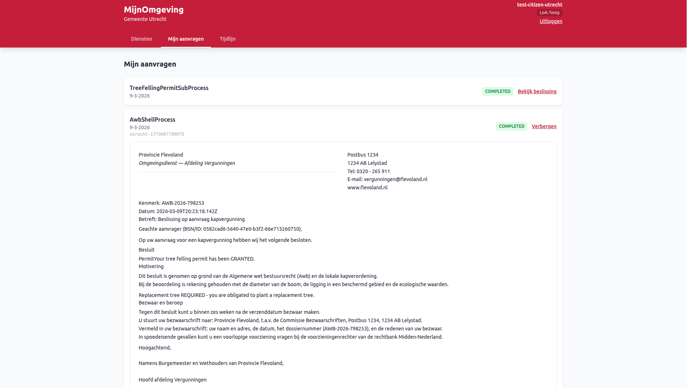
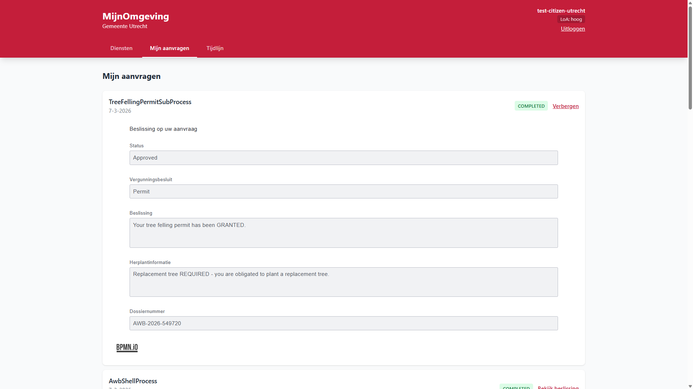

# Submitting an Application

This guide covers the **Kapvergunning** (tree felling permit) application — the AWB process currently available in the RONL Business API citizen portal. For the zorgtoeslag calculator and application, see [Applying for Zorgtoeslag via Unive](zorgtoeslag-cross-org-journey.md).

---

## Kapvergunning (tree felling permit application)

The tree felling permit is an **asynchronous, multi-actor process** implementing the Dutch Administrative Law Act (Awb). Unlike a simple calculation, the citizen submits an application and receives a dossier reference — the actual decision is made later by a caseworker and communicated separately.

<figure markdown style="width:100%; margin:0;">
  
  <figcaption>Example dashboard MijnOmgeving showing Kapvergunning application form</figcaption>
</figure>

### Prerequisites

You must be logged in with DigiD assurance level **midden** or higher. See [Logging In — Citizen & Caseworker](login-flow.md).

### Submitting the application

**Step 1 — Open the service**

After login, select **Vergunningen** from the services catalogue, then choose **Kapvergunning aanvragen**.

**Step 2 — Fill in the form**

The form is a live-fetched **Camunda Form** (`kapvergunning-start`) rendered by `@bpmn-io/form-js`. Your `applicantId` and `productType` are injected automatically as hidden initial data — you do not need to enter them.

| Field           | Label             | Input type    |
| --------------- | ----------------- | ------------- |
| `treeDiameter`  | Stamdiameter (cm) | Number, 1–500 |
| `protectedArea` | Beschermd gebied  | Checkbox      |

If no form schema is deployed for the process, the portal falls back to a static form and shows a brief notice.

**Step 3 — Submit**

Click **Aanvraag indienen**. The portal sends:

```http
POST /v1/process/AwbShellProcess/start
Authorization: Bearer <JWT>
Content-Type: application/json

{
  "treeDiameter": 45,
  "protectedArea": false,
  "productType": "TreeFellingPermit"
}
```

**Step 4 — Confirmation**

The portal immediately shows your dossier reference:

<figure markdown style="width:100%; margin:0;">
  
  <figcaption>Confirmation screen showing dossierReference after successful submission</figcaption>
</figure>
```
Uw aanvraag is ingediend.
Dossiernummer: AWB-2026-524494
Uiterste beslistermijn: 28 april 2026 (Awb 4:13, 8 weken)
```

**No decision is returned at this point.** The process is now waiting for caseworker review. You can track the status under **Mijn aanvragen**.

<figure markdown style="width:100%; margin:0;">
  
  <figcaption>Mijn aanvragen screen showing the submitted Kapvergunning application</figcaption>
</figure>

!!! note "Application list status"
    The list currently shows both completed and open applications. No distinction has yet been made between the shell process and its subprocess (**AwbShellProcess** and **TreeFellingPermitSubProcess**).

### What happens in the background

The AWB shell process runs automatically through phases 1–3 before pausing at the first user task:

1. **Phase 1** — Identity script sets `applicantId`, `productType`, `applicationDate`
2. **Phase 2** — Receipt script sets `receiptDate`, `awbDeadlineDate` (8 weeks, Awb 4:13), `dossierReference`
3. **Phase 3** — `AwbCompletenessCheck` DMN evaluates whether the application is complete (Awb 4:5)
4. **Call Activity** — `TreeFellingPermitSubProcess` starts:
   - `TreeFellingDecision` DMN evaluates `treeDiameter` and `protectedArea` → `permitDecision`
   - `ReplacementTreeDecision` DMN evaluates whether a replacement tree is required → `replacementDecision`
   - A `Sub_CaseReview` user task is created for caseworker review
5. **Process suspends** — awaiting caseworker action

After the caseworker completes the review and confirms citizen notification (`Task_Phase6_Notify`), the process ends and the final decision variables are stored.

### Viewing the decision

Once the caseworker completes both tasks and the process ends, a **Bekijk beslissing** toggle appears on the application card in **Mijn aanvragen**. Clicking the toggle expands the **Decision Viewer** panel below the card.

From v2.3.0, the Decision Viewer renders the official **decision letter** authored in the [LDE Document Composer](../../../linked-data-explorer/features/document-composer.md) and bundled with the deployed process. The letter includes the municipality letterhead, contact information, dossier reference, the substantive decision text, and — if applicable — replacement tree requirements. Variable placeholders in the template are resolved from the final process variables automatically.

<figure markdown style="width:100%; margin:0;">
  
  <figcaption>Mijn aanvragen — completed Kapvergunning application with Decision Document expanded</figcaption>
</figure>

For applications submitted before document templates were introduced, the viewer falls back to a compact readonly summary of the key decision fields.

<figure markdown style="width:100%; margin:0;">
  
  <figcaption>Decision Viewer expanded — readonly decision fields</figcaption>
</figure>

The panel shows five readonly fields drawn from the final process variable state:

| Field              | Variable           | Description                                             |
| ------------------ | ------------------ | ------------------------------------------------------- |
| Status             | `status`           | `Approved` or `Rejected`                                |
| Beslissing         | `permitDecision`   | `Permit` or `Reject`                                    |
| Beslissingstekst   | `finalMessage`     | Plain-text decision including appeal notice if rejected |
| Herplantinformatie | `replacementInfo`  | Whether a replacement tree is required                  |
| Dossiernummer      | `dossierReference` | The AWB dossier reference assigned at submission        |

The Decision Viewer calls `GET /v1/process/:id/historic-variables` — variables are available immediately after process completion with no polling needed.

---

### Test scenarios

#### Scenario A — Small tree, unprotected area → Permit granted

| Field            | Value |
| ---------------- | ----- |
| Stamdiameter     | 23 cm |
| Beschermd gebied | ✗     |

**Expected outcome (after caseworker review):** `permitDecision = Permit`, `replacementDecision = false`

#### Scenario B — Large tree, unprotected area → Permit rejected

| Field            | Value |
| ---------------- | ----- |
| Stamdiameter     | 78 cm |
| Beschermd gebied | ✗     |

**Expected outcome (after caseworker review):** `permitDecision = Reject`, `finalMessage` contains appeal information (Awb 6:7, 6-week window)

#### Scenario C — Any tree, protected area → Permit rejected

| Field            | Value |
| ---------------- | ----- |
| Stamdiameter     | any   |
| Beschermd gebied | ✓     |

**Expected outcome (after caseworker review):** `permitDecision = Reject` — protected area designation overrides diameter threshold

!!! note "Caseworker override"
    The caseworker can override the DMN outcome during `Sub_CaseReview` by selecting **Wijzigen** and choosing a different permit decision. The override is stored in `reviewAction = change` alongside `reviewPermitDecision`. Both the original DMN result and the caseworker override are preserved in the process variables for audit purposes.

---

## Troubleshooting

**Form submits but no result appears**
Check that the API Health indicator in the portal header shows all services as UP. If Operaton shows "down", the business rules engine is temporarily unavailable.

**500 error on submission**
The most common cause is a double-wrapped variable format in the tenant middleware. Check the backend log for `Must provide 'null' or String value for value of SerializableValue type 'Json'`. See [Troubleshooting](../developer/troubleshooting.md).

**Error: FORBIDDEN / LOA_INSUFFICIENT**
Your DigiD assurance level is too low for this service. Log out and log in again using DigiD with SMS code (midden) or the ID check app (hoog).

**Error: RATE_LIMIT_EXCEEDED**
Too many requests from your session. Wait one minute and try again.

**Task not visible in caseworker queue**
The task queue filters by `municipality` process variable. Verify that the citizen and caseworker accounts belong to the same municipality in Keycloak. See [Caseworker Workflow](caseworker-workflow.md).
