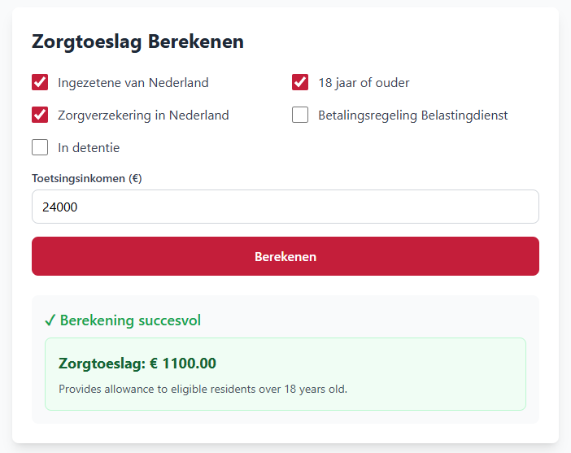

# Submitting a Calculation

This guide walks through how a citizen submits a zorgtoeslag (healthcare allowance) calculation — the reference use case for RONL Business API.

<figure markdown style="width:100%; margin:0;">
  
  <figcaption>Example dashboard MijnOmgeving showing Zorgtoeslag calculation</figcaption>
</figure>

## Prerequisites

You must be logged in. See [Logging In — Citizen & Caseworker](login-flow.md) if you have not yet authenticated.

## Submitting the zorgtoeslag form

**Step 1 — Open the service**

After login, the portal shows the services available for your municipality. Select **Zorgtoeslag berekenen** (calculate healthcare allowance).

**Step 2 — Fill in the form**

The form presents the eligibility criteria. The test environment pre-fills example values:

| Field | Label | Example value |
|---|---|---|
| `ingezeteneVanNederland` | Bent u ingezetene van Nederland? | ✓ |
| `18JaarOfOuder` | Bent u 18 jaar of ouder? | ✓ |
| `zorgverzekeringInNederland` | Heeft u een zorgverzekering in Nederland? | ✓ |
| `inkomenEnVermogen` | Jaarlijks inkomen (€) | 24000 |

**Step 3 — Submit**

Click **Berekenen** (Calculate). The portal sends:

```http
POST /v1/process/zorgtoeslag/start
Authorization: Bearer <JWT>
Content-Type: application/json

{
  "ingezeteneVanNederland": true,
  "18JaarOfOuder": true,
  "zorgverzekeringInNederland": true,
  "inkomenEnVermogen": 24000
}
```

**Step 4 — View the result**

The result appears within a few seconds:

<figure markdown style="width:100%; margin:0;">
  
  <figcaption>Example dashboard MijnOmgeving showing Zorgtoeslag calculation result</figcaption>
</figure>

```
Resultaat: U heeft recht op zorgtoeslag
Maandbedrag: € 103,33 (€ 1.240 per jaar)
Aanvraagnummer: abc-123-def
```

## Test scenarios

Use these to verify the calculation is working correctly end-to-end:

### Scenario 1 — Eligible, standard income

| Field | Value |
|---|---|
| Ingezetene van Nederland | ✓ |
| 18 jaar of ouder | ✓ |
| Zorgverzekering in Nederland | ✓ |
| Betalingsregeling | ✗ |
| Detentie | ✗ |
| Jaarlijks inkomen | €24,000 |

**Expected result:** Eligible — zorgtoeslag €1,250 per year

### Scenario 2 — Not eligible, income too high

| Field | Value |
|---|---|
| Ingezetene van Nederland | ✓ |
| 18 jaar of ouder | ✓ |
| Zorgverzekering in Nederland | ✓ |
| Betalingsregeling | ✗ |
| Detentie | ✗ |
| Jaarlijks inkomen | €50,000 |

**Expected result:** Not eligible — zorgtoeslag €0

### Scenario 3 — Active payment plan

Same as Scenario 1 but with **Betalingsregeling** set to ✓.

**Expected result:** Payment plan active — eligibility and amount depend on current DMN rules; may be reduced or blocked.

### Scenario 4 — Multiple disqualifying conditions active

| Field | Value |
|---|---|
| Ingezetene van Nederland | ✓ |
| 18 jaar of ouder | ✓ |
| Zorgverzekering in Nederland | ✓ |
| Betalingsregeling | ✓ |
| Detentie | ✓ |
| Jaarlijks inkomen | €24,000 |

**Expected result:** This combination currently triggers a DMN configuration error — two disqualifying rules match simultaneously and the decision table's hit policy does not permit this. See the note below.

!!! warning "Known DMN configuration issue"
    When both **betalingsregeling** and **detentie** are active at the same time, the decision table returns an error instead of a result. The DMN is being updated to use the `FIRST` hit policy, which evaluates rules top-to-bottom and stops at the first match. Until that fix is deployed:

    - **Citizens** see: *"De berekening kon niet worden afgerond vanwege een fout in de bedrijfsregels. Dit is bij de beheerder gemeld."*
    - **Caseworkers** see: the technical error message identifying the hit policy conflict.

## Verification checklist

Before signing off on a test environment:

- [ ] Can log in as `test-citizen-utrecht`
- [ ] Can log in as `test-caseworker-utrecht`
- [ ] API health indicator shows all services UP
- [ ] Municipality name displays correctly in the portal header
- [ ] Assurance level (LoA) shows `hoog`
- [ ] Zorgtoeslag calculation completes and shows a result
- [ ] Results display correctly (amount, process instance ID)
- [ ] Can log out and log in again without error
- [ ] Token auto-refreshes — session remains active beyond 15 minutes without manual re-login

1. The Business API validates your JWT
2. Your `municipality` claim (`utrecht`) is used to scope the request to your tenant
3. The input variables are combined with your user identity and submitted to Operaton
4. Operaton executes the `zorgtoeslag` BPMN workflow and evaluates the DMN decision table
5. The result is returned and an audit record is written

The process typically completes in under 2 seconds. The `processInstanceId` in the response (`abc-123`) can be used to retrieve the result later via `GET /v1/process/abc-123/variables`.

## Troubleshooting

**Form submits but no result appears**  
Check that the API Health indicator in the portal header shows all services as UP. If Operaton shows "down", the business rules engine is temporarily unavailable.

**Error: FORBIDDEN / LOA_INSUFFICIENT**  
Your DigiD assurance level is too low for this service. Log out and log in again using DigiD with SMS code (midden) or the ID check app (hoog).

**Error: RATE_LIMIT_EXCEEDED**  
Too many requests from your session. Wait one minute and try again.
