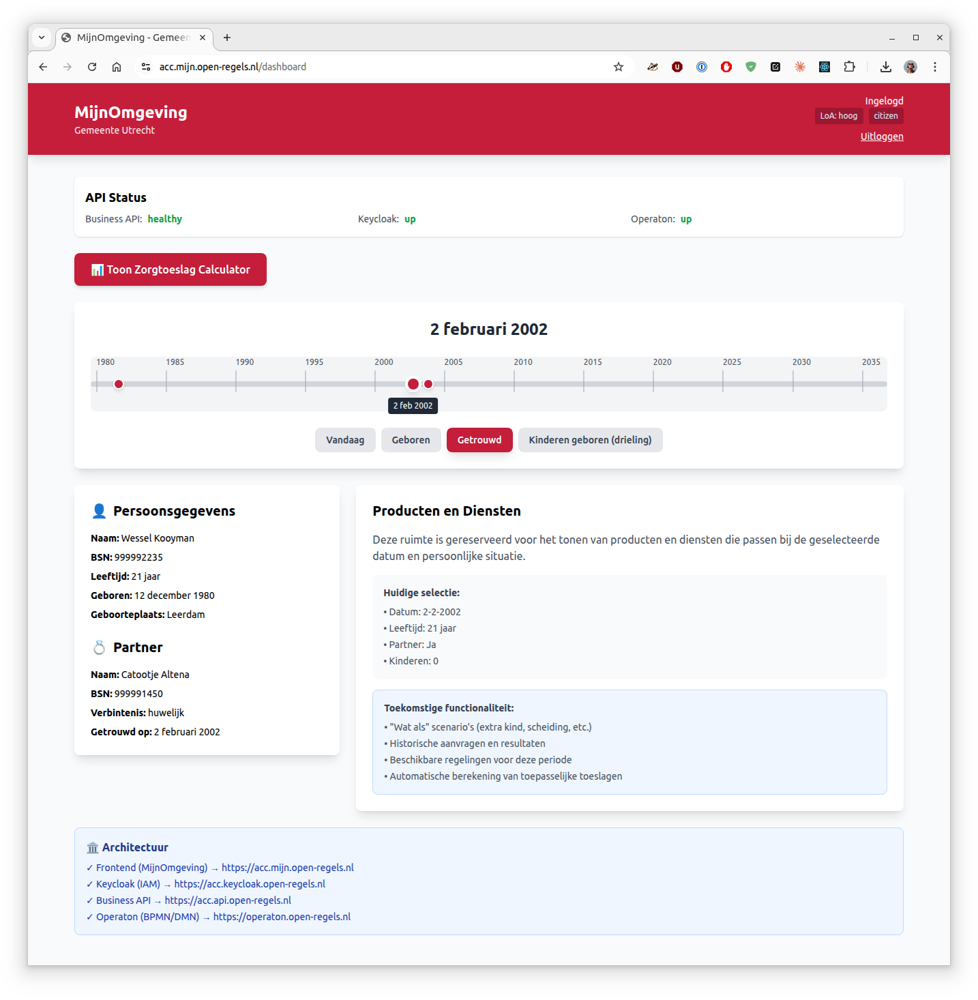

## What is Timeline Navigation?

Timeline Navigation lets you view your personal data from the BRP (Basisregistratie Personen) at any point in time - past, present, or future. This helps you:

- **Understand your history** — See how your household looked at any date
- **Plan for changes** — Explore how future life events affect your benefits
- **Check eligibility** — Understand which services you qualified for in the past
- **Verify data** — Confirm your BRP data is correct

---

## Getting Started

### Step 1: Login

1. Go to **MijnOmgeving** for your municipality:
   - Utrecht: https://mijn.open-regels.nl (or ACC: https://acc.mijn.open-regels.nl)
   - Amsterdam, Rotterdam, Den Haag: Same URL, different theme
2. Click **"Inloggen met DigiD"**
3. Login with your DigiD credentials
4. You'll see the Dashboard

### Step 2: Open Timeline

1. On the Dashboard, click the **"📅 Toon Tijdlijn"** button
2. The timeline loads your life events from BRP
3. You'll see:
   - **Timeline bar** at the top with your life events
   - **Your personal data** on the left
   - **Products/services** on the right (coming soon)

---

## Using the Timeline

<figure markdown style="width:100%; margin:0;">
  
  <figcaption>Example dashboard MijnOmgeving Timeline showing Wessel Kooyman on marriage date</figcaption>
</figure>

### Navigation Methods

You have three ways to move through time:

#### 1. Drag the Slider

- **Click and hold** the blue circle on the timeline
- **Drag left** to go back in time
- **Drag right** to go forward in time
- The date updates as you drag

#### 2. Click Year Markers

- **Year markers** appear every 5 years (1980, 1985, 1990...)
- **Click a year** to jump to January 1st of that year

#### 3. Click Event Buttons

Below the timeline, you'll see buttons for major life events:

- **Vandaag** — Jump to today's date
- **Geboren** — Jump to your birth date
- **Getrouwd** — Jump to your marriage date (if married)
- **Kinderen geboren** — Jump to when your children were born

**Tip:** The selected button is highlighted in your municipality's color.

---

## Understanding What You See

### Personal Data Panel (Left Side)

This panel shows your data at the selected date:

#### 👤 Persoonsgegevens (Your Information)

Always visible, shows:

- **Naam** — Your full name
- **BSN** — Your citizen service number
- **Leeftijd** — Your age at the selected date
- **Geboren** — Your birth date and place
- **Geboorteplaats** — Where you were born

#### 💑 Partner (Partner Information)

Only appears after your marriage date, shows:

- **Naam** — Partner's full name
- **BSN** — Partner's citizen service number
- **Verbintenis** — Type of relationship (marriage/partnership)
- **Getrouwd op** — Marriage date and place

#### 👶 Kinderen (Children Information)

Only appears after children are born, shows for each child:

- **Naam** — Child's full name
- **BSN** — Child's citizen service number
- **Leeftijd** — Child's age at the selected date
- **Geboren** — Child's birth date

**Note:** Ages automatically update based on the date you select!

---

## Example Scenarios

### Scenario 1: "How old were my children in 2010?"

1. Click **"Kinderen geboren"** button
2. Drag slider to **2010**
3. Look at the **Kinderen** section
4. See each child's age calculated for 2010

### Scenario 2: "Was I married in 2000?"

1. Drag slider to **2000**
2. Look for the **Partner** section
3. If it's not there, you weren't married yet
4. Click **"Getrouwd"** to jump to your marriage date

### Scenario 3: "What did my household look like when I was 25?"

1. Calculate: Birth year + 25 = target year
2. Drag slider to that year
3. See your complete household at age 25
4. Check if you had partner/children at that time

### Scenario 4: "Planning for the future"

1. Drag slider **beyond today**
2. See how your children's ages will change
3. (Future feature) See how benefits eligibility changes
4. Plan for when children turn 18, etc.

---

## Tips & Tricks

### Quick Date Selection

- **Double-click** a year marker to jump there instantly
- Use **"Vandaag"** button to return to present
- Event buttons show **tooltips** on hover with full descriptions

### Understanding the Colors

- **Blue circle** = Current selected date
- **Blue/Red events** = Life events on timeline
- **Municipality color** = Selected buttons and highlights

### Reading Dates

All dates are shown in Dutch format:

- **Short:** 12-12-1980
- **Long:** 12 december 1980

Ages are always calculated based on the selected date, not today.

### What If No Data Appears?

If sections are missing:

- **No Partner section** = Not married/partnered at that date
- **No Children section** = No children born yet at that date
- This is normal! Sections only appear when relevant.

---

## Privacy & Your Data

### What Data Do We Use?

The timeline uses data from:

- **BRP (Basisregistratie Personen)** — Your municipal records
- **Your DigiD login** — To verify your identity

### Is My Data Stored?

**No.** The timeline:

- ✅ Fetches your current BRP data when you open it
- ✅ Calculates historical views in your browser
- ❌ Does NOT store your personal data
- ❌ Does NOT track what dates you view

### Who Can See My Timeline?

- **Only you** — No one else can access your timeline
- **Audit logs** — System logs that you accessed the timeline (for security)
- **No sharing** — Your timeline data is never shared with third parties

### Your Rights

Under AVG/GDPR, you have the right to:

- **Access** — Request your audit log data
- **Correction** — Report incorrect BRP data to your municipality
- **Erasure** — Request anonymization of audit logs

---

## Common Questions

### Q: Why can't I see my address history?

**A:** Address history (verblijfplaatshistorie) is coming in a future update. Currently, only person/partner/children data is shown.

### Q: Can I change my past data?

**A:** No, the timeline shows BRP data which is the official government record. To correct errors, contact your municipality's BRPloket.

### Q: Why does it say I'm 0 years old?

**A:** You selected your birth date. At birth, age is 0. Move forward in time to see your age increase.

### Q: Can I print or export my timeline?

**A:** Not yet. Export to PDF is planned for a future release.

### Q: What are "what if" scenarios?

**A:** This is a future feature where you can simulate life changes (having a child, getting divorced) to see how they affect your benefits eligibility.

### Q: Why do I only see one test person?

**A:** The test environment currently has one demo persona (Wessel Kooyman). More diverse test data will be added.

### Q: How far into the future can I go?

**A:** You can select dates up to 10 years in the future for planning purposes.

---

## Troubleshooting

### Timeline Won't Load

**Symptoms:** Blank screen, endless loading

**Try:**
1. Refresh the page (F5)
2. Logout and login again
3. Clear your browser cache
4. Try a different browser

If still not working, contact your municipality's helpdesk.

### Events Not Showing

**Symptoms:** Timeline shows but no event buttons

**Possible cause:** Your BRP record might not have marriage/children data

**Note:** If you're single with no children, only "Geboren" and "Vandaag" buttons appear. This is normal.

### Wrong Data Displayed

**Symptoms:** Names, dates, or ages look incorrect

**Action:**

1. Verify the selected date is correct
2. Check your BRP data is accurate (contact municipality BRPloket)
3. Report the issue to your municipality's helpdesk with:
   - Date selected
   - What data looks wrong
   - Screenshot if possible

### Page is Slow

**Symptoms:** Timeline loads but dragging is laggy

**Try:**

1. Close other browser tabs
2. Disable browser extensions
3. Use a modern browser (Chrome, Firefox, Edge, Safari)

---

## Keyboard Shortcuts

Coming in future release:
- Arrow keys to move timeline
- Spacebar to toggle timeline view
- Number keys to jump to specific years

---

## Giving Feedback

We'd love to hear your thoughts:

- **Like the feature?** Let us know what works well
- **Found a bug?** Report it with as much detail as possible
- **Have ideas?** Suggest improvements for future releases

**Contact:** Your municipality's MijnOmgeving helpdesk or support@open-regels.nl

---

## What's Coming Next?

Planned features:

- 📍 **Address history** — See where you lived at any date
- 🔮 **"What if" scenarios** — Simulate life changes and see benefit impacts
- 📊 **Historical applications** — View past zorgtoeslag calculations
- 📄 **Export to PDF** — Download your timeline
- 🎯 **Service matching** — See which services you're eligible for at any date

---

## Related Help Articles

- [Login (DigiD Flow)](login-flow.md)
- [Privacy & Security](../references/standards-compliance.md)

---

**Need more help?** Contact your municipality's helpdesk or visit your municipality's website.
