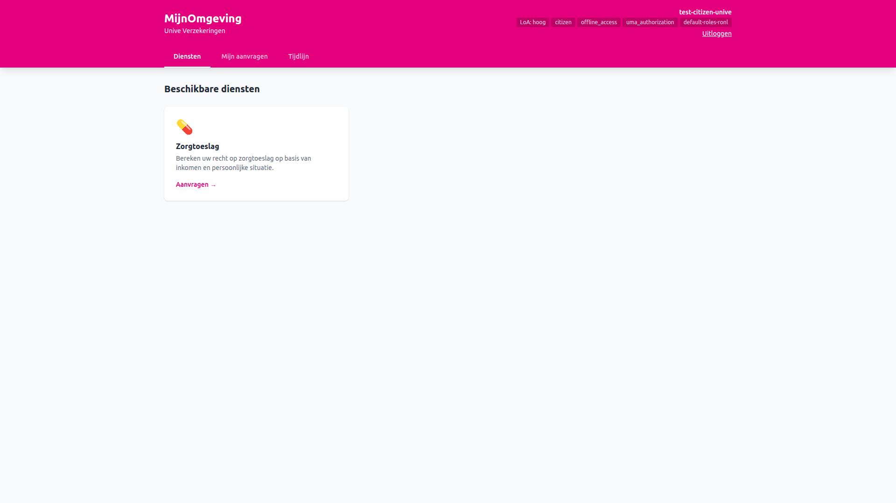
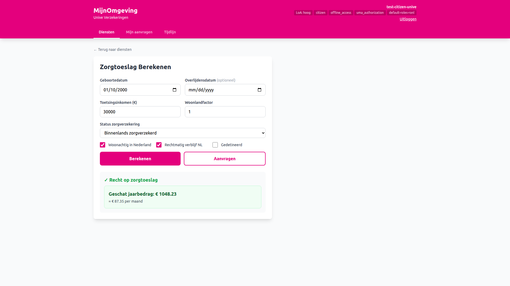
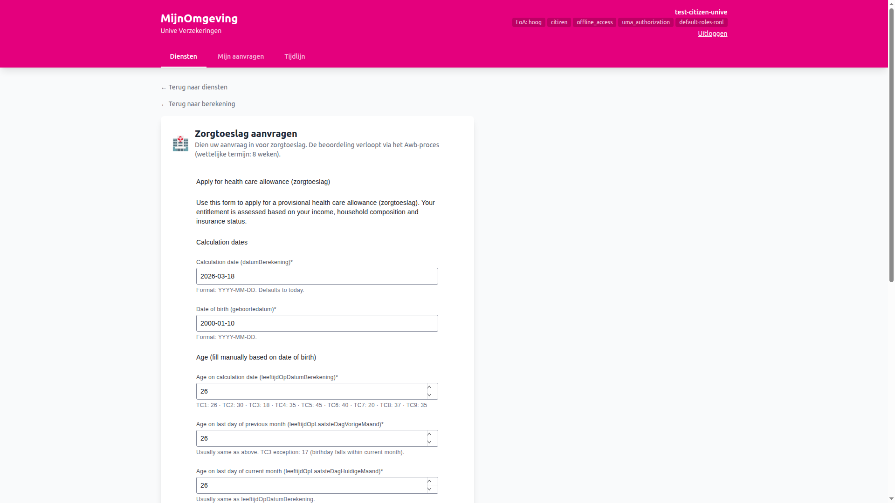
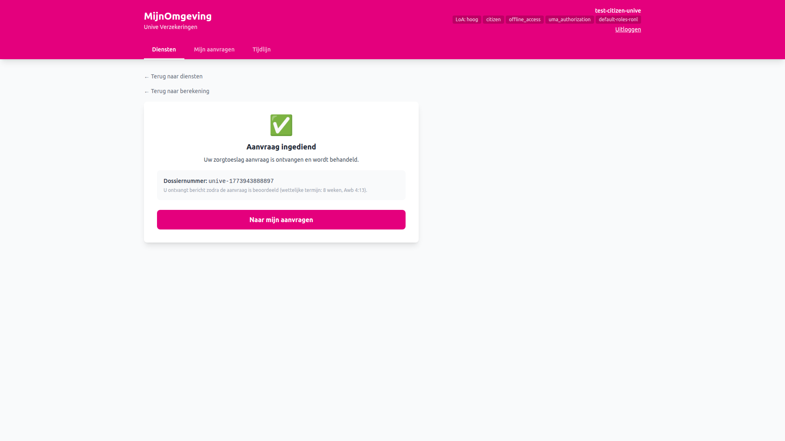
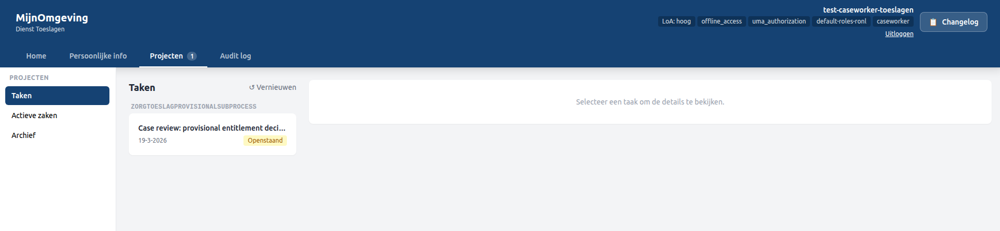
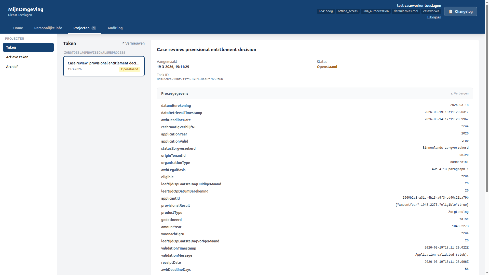
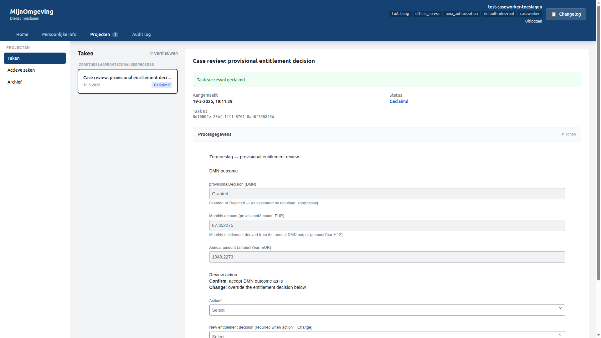
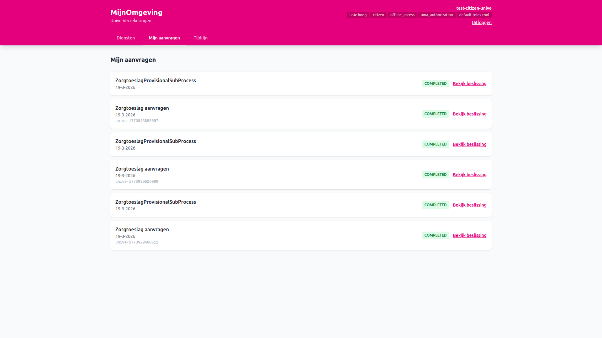
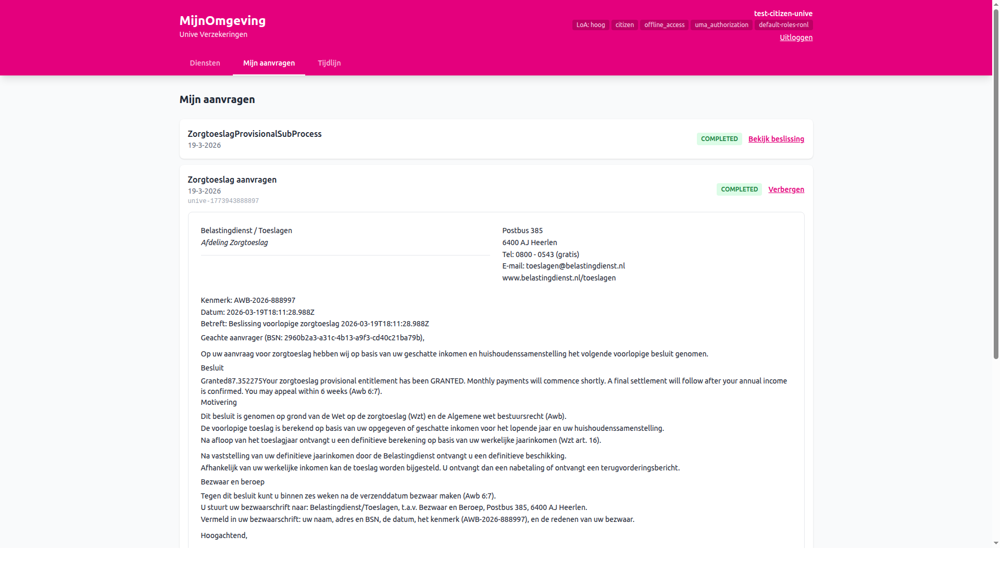

# User guide: applying for zorgtoeslag via Unive

This guide walks through the complete end-to-end journey for the AWB zorgtoeslag cross-organisation scenario. No prior knowledge of the platform is needed — follow the steps in order.

**What this demonstrates:** A citizen logs into a private insurer's (Unive) portal, calculates their zorgtoeslag entitlement, submits a formal AWB application, and receives a decision — all without leaving the Unive environment. The application is handled by a Dienst Toeslagen caseworker on the government side.

**Environment:** [https://acc.mijn.open-regels.nl](https://acc.mijn.open-regels.nl)

---

## Step 1 — Log in as the Unive citizen

Open [https://acc.mijn.open-regels.nl](https://acc.mijn.open-regels.nl) in your browser. You will see the login choice screen. Click **Inloggen met DigiD** to proceed to the Keycloak login form and enter the following credentials:

| Field | Value |
|---|---|
| Username | `test-citizen-unive` |
| Password | `test123` |

After login you are redirected to MijnOmgeving. The portal renders in the **Unive theme** — a magenta/pink primary colour. The header reads **Unive Verzekeringen**.

<figure markdown style="width:100%; margin:0;">
  
  <figcaption>Unive MijnOmgeving — Diensten tab as seen by test-citizen-unive. The Zorgtoeslag card is the only available service. The Unive magenta theme is visible in the header.</figcaption>
</figure>

---

## Step 2 — Calculate and apply for zorgtoeslag

Click the **Zorgtoeslag** service card. The zorgtoeslag view opens with a calculator card and an Aanvragen button.

### 2a — Run the calculation (optional but recommended)

Fill in or adjust the following fields in the **Zorgtoeslag Berekenen** card:

| Field | Example value |
|---|---|
| Geboortedatum | `2000-01-10` |
| Toetsingsinkomen | `30000` |
| Woonlandfactor | `1.0` |
| Status zorgverzekering | `Binnenlands zorgverzekerd` |
| Woonachtig in Nederland | ✅ |
| Rechtmatig verblijf NL | ✅ |
| Gedetineerd | ☐ |

Click **Berekenen**. The result card shows whether there is entitlement and the estimated annual and monthly amounts.

<figure markdown style="width:100%; margin:0;">
  
  <figcaption>Zorgtoeslag Berekenen — completed calculation showing the eligible result, annual amount, and monthly breakdown. Both Berekenen and Aanvragen buttons are visible.</figcaption>
</figure>

### 2b — Submit the application

Click **Aanvragen**. The view switches to the **Zorgtoeslag aanvragen** card, which renders the deployed `zorgtoeslag-provisional-start` form via the Operaton process definition. The form fields are pre-filled from the values you entered in the calculator. Review the pre-filled values and submit the form to start the `AwbZorgtoeslagProcess`.

<figure markdown style="width:100%; margin:0;">
  
  <figcaption>Zorgtoeslag aanvragen — ProcessStartFormViewer rendering the zorgtoeslag start form with pre-filled values from the calculator.</figcaption>
</figure>

After submission a success card appears showing the **dossiernummer**. The process is now running under Dienst Toeslagen (`municipality = toeslagen`).

<figure markdown style="width:100%; margin:0;">
  
  <figcaption>Zorgtoeslag aanvragen — success card with dossiernummer and the 8-week statutory notice (Awb 4:13). The "Naar mijn aanvragen" button is visible.</figcaption>
</figure>

---

## Step 3 — Process the application as the Toeslagen caseworker

Open a new browser session (incognito or a different browser) and go to [https://acc.mijn.open-regels.nl](https://acc.mijn.open-regels.nl). Click **Inloggen als medewerker** on the login choice screen and enter the following credentials:

| Field | Value |
|---|---|
| Username | `test-caseworker-toeslagen` |
| Password | `test123` |

Navigate to the **Taken** section in the left panel. The zorgtoeslag task submitted by the Unive citizen appears in the task queue.

<figure markdown style="width:100%; margin:0;">
  
  <figcaption>Caseworker dashboard — task queue for test-caseworker-toeslagen. The zorgtoeslag task (AwbZorgtoeslagProcess) is visible as Openstaand.</figcaption>
</figure>

Click the task to open the detail panel. Click **Claimen** to assign it to yourself. The status changes to **Geclaimd**.

<figure markdown style="width:100%; margin:0;">
  
  <figcaption>Task detail panel — zorgtoeslag process variables (toetsingsinkomen, geboortedatum, etc.) and the Claimen button.</figcaption>
</figure>

The task form renders via `TaskFormViewer`. Fill in the review fields and click **Submit review** to complete the task. Work through any subsequent tasks (`Sub_CaseReview`, `Task_Phase6_Notify`) in the same way until the process reaches its end event.

<figure markdown style="width:100%; margin:0;">
  
  <figcaption>Task form — deployed review form rendered inside the caseworker detail panel after claiming. The provisionalDecision and related fields are visible.</figcaption>
</figure>

---

## Step 4 — View the decision in the Unive portal

Return to the first browser session (the Unive citizen). Click **Mijn aanvragen** in the tab bar. The dossier appears in the list with the label **Zorgtoeslag aanvragen** and the status **Afgerond**.

<figure markdown style="width:100%; margin:0;">
  
  <figcaption>Mijn aanvragen — completed AwbZorgtoeslagProcess dossier with the label "Zorgtoeslag aanvragen" and a Bekijk beslissing toggle.</figcaption>
</figure>

Click **Bekijk beslissing** on the dossier row. The `DecisionViewer` component fetches the document template bundled in the process deployment and renders it with the final process variables — including the provisional decision, amounts, and dossier reference.

<figure markdown style="width:100%; margin:0;">
  
  <figcaption>Mijn aanvragen — zorgtoeslag decision document rendered inside the Unive portal. The document shows the provisionalDecision outcome and the dossierReference.</figcaption>
</figure>

The citizen has now received their zorgtoeslag decision entirely within the Unive MijnOmgeving, while the process was handled by Dienst Toeslagen.