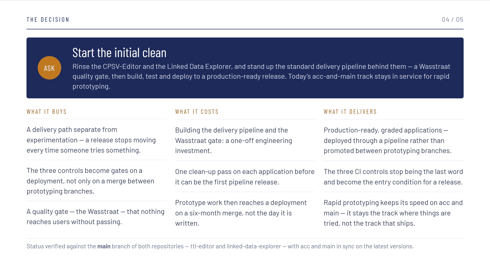
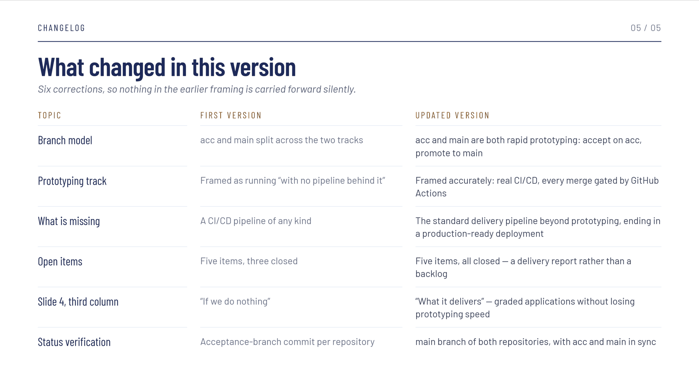

# CI-posture over de repositories — presentatie

!!! info "Documentatie in ontwikkeling"
    De Nederlandse vertaling van deze pagina is nog niet beschikbaar.
    Raadpleeg de <a href="/contributing/ci-posture-deck/">Engelse versie</a> voor de huidige inhoud.
    De dia's zelf zijn Engelstalig.

---

**Status:** Concept  
**Engelstalige bron:** `contributing/ci-posture-deck.md`

---

Een presentatie van vijf dia's, *CPSV-Editor & Linked Data Explorer — Software Delivery
Decision*, geëxporteerd op **9 september 2026**. De vraag erin is er één: goedkeuring voor een
**initiële schoonmaak** van beide applicaties en het inrichten van een standaard
leveringspijplijn daarachter, terwijl het huidige `acc`-en-`main`-spoor in gebruik blijft voor
rapid prototyping.

!!! abstract "Downloaden"
    [CI Posture Across Repos — presentatie (PDF, 82 KB)](../../assets/downloads/ci-posture-across-repos-deck.pdf)

---

## Twee sporen

<figure markdown style="width:100%; margin:0;">
  
  <figcaption>Alles gaat vandaag via het prototypingspoor; het spoor daaronder moet nog gebouwd worden</figcaption>
</figure>

---

## Wat GitHub Actions al bewaakt

<figure markdown style="width:100%; margin:0;">
  
  <figcaption>De drie controles als vragen, en de tabel erachter</figcaption>
</figure>

Elke controle heeft een eigen pagina: [Build Provenance](build-provenance.md),
[Supply-Chain Pinning](supply-chain.md) en de [Coverage Floor](coverage-floor.md).

---

## Vijf punten, alle gesloten

<figure markdown style="width:100%; margin:0;">
  
  <figcaption>Een opleveringsverslag in plaats van een backlog</figcaption>
</figure>

---

## De vraag

<figure markdown style="width:100%; margin:0;">
  
  <figcaption>Wat het oplevert, wat het kost, wat het brengt</figcaption>
</figure>

---

## Wat er tussen versies veranderde

<figure markdown style="width:100%; margin:0;">
  
  <figcaption>De presentatie draagt haar eigen correcties</figcaption>
</figure>

---

## Verwante pagina's

- [Build Provenance](build-provenance.md)
- [Supply-Chain Pinning](supply-chain.md)
- [Coverage Floor](coverage-floor.md)
- [Code Standards](code-standards.md)
