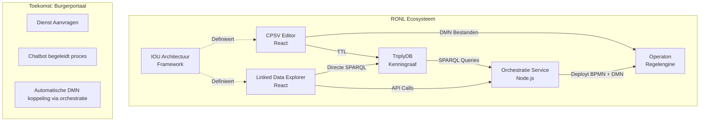

# IOU Architectuur Documentatie

Welkom bij de uitgebreide documentatie voor het IOU Architectuur Framework en het RONL ecosysteem.

## Wat is IOU Architectuur?

Het Informatie Architectuur Framework voor het Lelystad-Zuid Ringweg Project integreert semantische webtechnologieën, beslismodellen en Nederlandse overheidsstandaarden tot een uniform systeem voor het beheren van regelgevende naleving en ruimtelijke ordening.

## Ecosysteem Componenten

### 🏗️ IOU Architectuur Framework
De kern informatiearchitectuur die ontologieën, implementatiepatronen en governance definieert voor infrastructuurprojecten.

[Verken Framework →](iou-architectuur/index.md){ .md-button .md-button--primary }

### ✏️ CPSV Editor
React-applicatie voor het maken van CPSV-AP 3.2.0 conforme RDF/Turtle bestanden voor Nederlandse overheidsdiensten.

[Open CPSV Editor →](cpsv-editor/index.md){ .md-button }

### 🔍 Linked Data Explorer
Webapplicatie voor het visualiseren en bevragen van SPARQL endpoints met DMN orkestratie ondersteuning.

[Open Explorer →](linked-data-explorer/index.md){ .md-button }

### 🔗 Gedeelde Backend
Node.js/Express API die TriplyDB integratie en Operaton DMN executie biedt voor beide applicaties.

[Bekijk Backend Docs →](gedeelde-backend/index.md){ .md-button }

## Architectuur Overzicht

---

**Documentatie Versie**: 1.0  
**Laatst Bijgewerkt**: Januari 2026  
**Licentie**: EUPL v1.2
