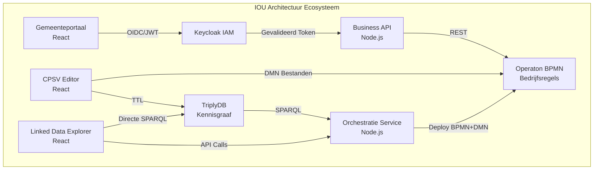

# IOU Architectuur Documentatie

Welkom bij de uitgebreide documentatie voor het IOU Architectuur Framework en het RONL ecosysteem.

## Wat is IOU Architectuur?

Het Informatie Architectuur Framework voor het Lelystad-Zuid Ringweg Project integreert semantische webtechnologieën, beslismodellen en Nederlandse overheidsstandaarden tot een uniform systeem voor het beheren van regelgevende naleving en ruimtelijke ordening.

## Ecosysteem Componenten

### 🏗️ RONL Business API
De kern business API-laag die veilige authenticatie en proces orkestratie biedt voor Nederlandse overheidsdiensten.

**Belangrijkste Features**:
- OpenID Connect (OIDC) authenticatie met DigiD/eIDAS
- Multi-tenant architectuur (per gemeente)
- Integratie met Keycloak IAM en Operaton BPMN
- Volledige audit logging voor compliance

[Verken Documentatie →](ronl-business-api/index.md){ .md-button .md-button--primary }

### ✏️ CPSV Editor
React-applicatie voor het maken van CPSV-AP 3.2.0 conforme RDF/Turtle bestanden voor Nederlandse overheidsdiensten.

**Live Applicatie**: [cpsv.open-regels.nl](https://cpsv.open-regels.nl)

[Bekijk Documentatie →](cpsv-editor/index.md){ .md-button }

### 🔍 Linked Data Explorer
Webapplicatie voor SPARQL queries en DMN orkestratie met TriplyDB integratie.

**Live Applicatie**: [linkeddata.open-regels.nl](https://linkeddata.open-regels.nl)

[Bekijk Documentatie →](linked-data-explorer/index.md){ .md-button }

### 🔗 Gedeelde Backend
Node.js/Express API die TriplyDB en Operaton integratie biedt voor beide applicaties.

[Bekijk Documentatie →](shared-backend/index.md){ .md-button }

## Architectuur Overzicht

## Snelle Links

| Resource | Link |
|----------|------|
| **CPSV Editor** | [cpsv.open-regels.nl](https://cpsv.open-regels.nl) |
| **Linked Data Explorer** | [linkeddata.open-regels.nl](https://linkeddata.open-regels.nl) |
| **Backend API** | [backend.linkeddata.open-regels.nl](https://backend.linkeddata.open-regels.nl) |
| **Operaton** | [operaton.open-regels.nl](https://operaton.open-regels.nl) |
| **Keycloak IAM** | [keycloak.open-regels.nl](https://keycloak.open-regels.nl) |

## Documentatie Secties

### Voor Ontwikkelaars
- [Architectuur Overzicht](ronl-business-api/architecture/overview.md) - Begrijp het Business API Layer patroon
- [Development Workflow](ronl-business-api/development/workflow.md) - Begin met lokale ontwikkeling
- [Snelle Referentie](ronl-business-api/development/quick-reference.md) - Veelgebruikte commando's en credentials

### Voor DevOps
- [Deployment Architectuur](ronl-business-api/architecture/deployment.md) - VM + Azure hybride deployment
- [Keycloak Setup](ronl-business-api/deployment/keycloak.md) - IAM deployment handleiding
- [Omgevingsvariabelen](ronl-business-api/deployment/environment-variables.md) - Configuratie referentie

### Voor Integrators
- [Beveiligings Architectuur](ronl-business-api/architecture/security.md) - Authenticatie flows en compliance
- [DigiD Integratie](ronl-business-api/digid-mockup/digid-keycloak-login-mockup.md) - DigiD/eIDAS mockup flows

## Technologie Stack

Het IOU Architectuur ecosysteem is volledig gebouwd op **open source technologieën**:

| Component | Technologie | Licentie |
|-----------|------------|----------|
| **IAM** | Keycloak | Apache 2.0 |
| **BPMN Engine** | Operaton | Apache 2.0 |
| **Backend** | Node.js + Express | MIT |
| **Frontend** | React | MIT |
| **Database** | PostgreSQL | PostgreSQL License |
| **Cache** | Redis | BSD 3-Clause |
| **Reverse Proxy** | Caddy | Apache 2.0 |
| **Kennisgraaf** | TriplyDB | - |

## Standaarden Compliance

- **CPSV-AP 3.2.0** - EU Public Service Vocabulary
- **CPRMV** - Core Public Rule Management Vocabulary
- **RONL** - Nederlandse Regels Vocabulaire
- **BIO** - Baseline Informatiebeveiliging Overheid
- **NEN 7510** - Informatiebeveiliging in de zorg
- **AVG/GDPR** - Gegevensbescherming

## Bijdragen

Bijdragen zijn welkom! Zie de [Bijdrage Handleiding](contributing/index.md) voor details.

---

**Documentatie Versie**: 2.0  
**Laatste Update**: Januari 2026  
**Licentie**: EUPL v1.2
