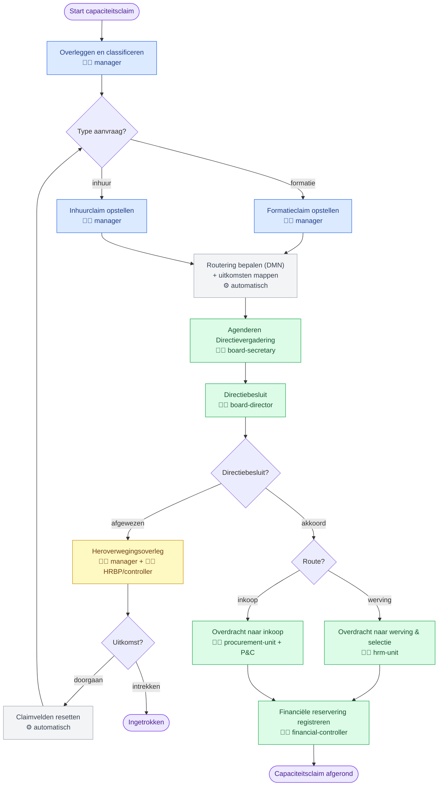

# Beheer capaciteitsclaim — Testhandleiding

**Provincie Flevoland · versie 3.8.1**

---

## Inleiding

### Wat is het Caseworker dashboard?

Het **Caseworker dashboard** is een medewerkersomgeving van IOU. De schil is opgedeeld in drie werkstanden:

- **Werk** — de dagelijkse werkvloer, met de **Taken**-inbox als startpunt;
- **Zoeken** — de naslag- en referentiebibliotheek (regels, processen, producten);
- **Beheer** — account, onboarding, capaciteit, projecten en hulpmiddelen.

Processen draaien in de procesmotor **Operaton**. Elke stap in een proces die door een mens moet worden gedaan, komt als **taak** in de Taken-inbox terecht van de medewerkers wiens rol bij die stap hoort. Automatische stappen (beslistabellen, scripts) verlopen zonder taak en zijn alleen zichtbaar in de processtappen-tijdlijn.

### Wat is "Beheer capaciteitsclaim"?

**Beheer capaciteitsclaim** is het proces waarmee een lijnmanager capaciteit aanvraagt — hetzij **formatie** (een vaste/interne aanstelling) hetzij **inhuur** (extern, incidenteel, via inkoop). De manager overlegt eerst met de HR-businesspartner en de personeelscontroller, stelt de claim op, waarna de claim wordt geagendeerd voor de **Directievergadering**. De Directie besluit; bij **akkoord** wordt de claim overgedragen aan werving & selectie (formatie) of aan inkoop (inhuur), en wordt de financiële reservering vastgelegd. Bij **afwijzing** volgt een **heroverwegingsoverleg**, waarna de claim herzien en opnieuw ingediend, of ingetrokken wordt.

De **routering** (werving vs. inkoop, welke kandidaatgroepen, welke adviesgroep) wordt automatisch bepaald door de beslistabel `CapacityClaimRouting` op basis van het type aanvraag en de afdeling — daar hoeft de tester niets voor in te vullen.

### Processtroom in beeld

Onderstaand schema toont het volledige proces. 🧑‍💼 = taken voor `test-mngr-flevoland`, 🧑‍💻 = taken voor `test-hr-flevoland`, ⚙️ = automatische stappen (geen taak). De gekleurde blokken corresponderen met de testblokken verderop.

### Doel van deze testronde

Deze handleiding test de **volledige processtroom** van begin tot eind, inclusief alle vertakkingen:

- de **happy path** (formatie → akkoord → werving & selectie → reservering);
- de **afwijzing + heroverweging** (afwijzen → heroverwegen → doorgaan óf intrekken);
- de **inkooproute** (inhuur → akkoord → overdracht naar inkoop);
- het **schoonmaken van claimvelden** bij herziening (geen spookdata in het overdrachtsdocument);
- de **rolafscherming** (elke gebruiker ziet alleen zijn eigen taken).

Het gaat om de **werking**, niet om vormgeving, tekstkeuzes of gebruiksgemak — daar is een aparte ronde voor. Meld een bevinding dus alleen als:

- een taak niet verschijnt bij de gebruiker die hem hoort te zien (of juist bij de verkeerde gebruiker verschijnt);
- een actie niet doet wat er beloofd wordt (of niets doet, of iets anders doet);
- het proces naar de verkeerde vervolgstap gaat;
- een verplicht veld toch leeg mag blijven, of een ingevulde waarde verloren gaat;
- een document verkeerde of achtergebleven gegevens toont;
- de applicatie vastloopt of een fout toont zonder duidelijke melding.

Vind je een label onduidelijk of een indeling onhandig? Noteer het gerust apart — dat is voor nu geen testblokkade.

---

## Voorbereiding

Voor een volledige processtroom zijn **twee testgebruikers** nodig die samenwerken. Test bij voorkeur met twee personen (of twee browsers/incognitovensters naast elkaar), zodat je de overdracht van taak naar taak echt ziet gebeuren.

| Testgebruiker | Wachtwoord | Rollen | Doet in dit proces |
| ------------- | ---------- | ------ | ------------------ |
| **`test-mngr-flevoland`** | `test123` | `caseworker`, `manager` | Start de claim, overleg & classificatie, claim opstellen, meepraten in de heroverweging |
| **`test-hr-flevoland`** | `test123` | de acht overige procesrollen: `board-secretary`, `board-director`, `hrm-unit`, `procurement-unit`, `planning-control-officer`, `financial-controller`, `hr-business-partner`, `personnel-controller` | Agenderen, Directiebesluit, overdracht (werving óf inkoop), financiële reservering, meepraten in de heroverweging |

> De Taken-inbox toont per gebruiker **alleen** de taken waarvan de kandidaatgroep overeenkomt met een van zijn rollen. Dat is precies het mechanisme dat deze testronde bewaakt: `test-mngr-flevoland` ziet de managertaken, `test-hr-flevoland` de directie-, overdracht- en reserveringstaken. Eén taak — het heroverwegingsoverleg — is voor **beide** gebruikers zichtbaar.

### Rolverdeling over de processtappen

Deze tabel is je routekaart: bij elke taak zie je wie hem moet oppakken.

| # | Processtaak | Kandidaatgroep(en) | Uitvoerder |
| - | ----------- | ------------------ | ---------- |
| 1 | Overleggen en classificeren | `manager` | 🧑‍💼 mngr |
| 2 | Formatieclaim opstellen **of** Inhuurclaim opstellen | `manager` | 🧑‍💼 mngr |
| — | *Routering bepalen* (beslistabel) | *automatisch* | — |
| — | *Routering-uitkomsten mappen* (script) | *automatisch* | — |
| 3 | Agenderen Directievergadering | `board-secretary` | 🧑‍💻 hr |
| 4 | Directiebesluit | `board-director` | 🧑‍💻 hr |
| 5a | Heroverwegingsoverleg *(alleen bij afwijzing)* | `manager`, `hr-business-partner`, `personnel-controller` | 🧑‍💼 mngr **én** 🧑‍💻 hr |
| — | *Claimvelden resetten* (script, bij doorgaan) | *automatisch* | — |
| 6a | Overdracht naar werving & selectie *(formatie)* | `hrm-unit` | 🧑‍💻 hr |
| 6b | Overdracht naar inkoop *(inhuur)* | `procurement-unit`, `planning-control-officer` | 🧑‍💻 hr |
| 7 | Financiële reservering registreren | `financial-controller` | 🧑‍💻 hr |

🧑‍💼 = `test-mngr-flevoland`  ·  🧑‍💻 = `test-hr-flevoland`

### Werken met de Taken-inbox

Open **Werk → Taken**. De inbox heeft drie kolommen: **filters** (links), de **takenlijst** (midden) en de **taakdetails** (rechts).

- Een taak in de lijst toont zijn naam, de procesdefinitiesleutel (`ManagementCapacityClaimProcess`) en een pil **Open** of **Geclaimd**.
- Klik een taak aan → rechts verschijnen **Procesgegevens**, **Processtappen** en **Acties**.
- Is de taak nog **Open**, dan zie je onder Acties de knop **Taak claimen**. Na claimen verschijnt het **formulier** dat je invult en met de eigen knop onderaan afrondt.
- Nadat een taak is voltooid, gaat het proces automatisch verder. Klik **↺ Vernieuwen** om de volgende taak te zien verschijnen (bij de juiste gebruiker).

### Live tegen Operaton

Er is **geen mock-modus** voor dit proces. Elke start, claim en voltooiing raakt direct de echte Operaton-motor; procesinstanties en documenten blijven bestaan. Werk daarom netjes elke gestarte claim af (afronden, intrekken of afwijzen-en-intrekken), zodat je geen halve instanties laat staan.

---

## Deel A — Happy path: formatie → akkoord → werving & selectie

Dit is de kernstroom. Voer de blokken op volgorde uit; let goed op **wie** elk blok doet.

### Testblok 0 — Inloggen en rolcontrole

| # | Wie | Actie | Verwacht resultaat |
| - | --- | ----- | ------------------- |
| 0.1 | 🧑‍💼 mngr | Log in als `test-mngr-flevoland` en open het Caseworker dashboard | Dashboard opent; links de standen **Werk / Zoeken / Beheer** |
| 0.2 | 🧑‍💼 mngr | Open **Beheer → Capaciteit** | Menu-item **Start capacity claim** is zichtbaar |
| 0.3 | 🧑‍💻 hr | Log (in een tweede venster) in als `test-hr-flevoland`, open **Beheer → Capaciteit** | **Start capacity claim** is **niet** zichtbaar (managertaak); **Completed capacity claims** is wél zichtbaar |
| 0.4 | beiden | Open bij beiden **Werk → Taken** | Beide inboxen zijn (nog) leeg voor deze claim |

### Testblok 1 — Manager start de capaciteitsclaim

| # | Wie | Actie | Verwacht resultaat |
| - | --- | ----- | ------------------- |
| 1.1 | 🧑‍💼 mngr | **Beheer → Capaciteit → Start capacity claim** | Scherm "Management capacity claim" met knop **Start capacity claim** |
| 1.2 | 🧑‍💼 mngr | Klik **Start capacity claim** | Bevestiging "Capacity claim started"; er is een intaketaak aangemaakt |
| 1.3 | 🧑‍💼 mngr | Ga naar **Werk → Taken**, klik **↺ Vernieuwen** | Taak **Overleggen en classificeren** verschijnt met pil **Open** |
| 1.4 | 🧑‍💻 hr | Vernieuw de Taken-inbox van hr | Deze taak is **niet** zichtbaar bij hr (kandidaatgroep is `manager`) |

### Testblok 2 — Overleggen en classificeren (intake)

| # | Wie | Actie | Verwacht resultaat |
| - | --- | ----- | ------------------- |
| 2.1 | 🧑‍💼 mngr | Selecteer **Overleggen en classificeren**, klik **Taak claimen** | Pil wordt **Geclaimd**; het intakeformulier verschijnt |
| 2.2 | 🧑‍💼 mngr | Klik **Doorgaan** zonder velden in te vullen | Afronden wordt geblokkeerd; de verplichte velden (Type aanvraag, Organisatieonderdeel, Afdeling, beide overleg-vinkjes, Datum) worden gemarkeerd |
| 2.3 | 🧑‍💼 mngr | Kies **Type aanvraag = Formatie**, **Organisatieonderdeel** = bijv. "INH 12 - Vergunningen Omgevingswet", **Afdeling = Vergunningen**, vink **beide overleggen** aan, kies een **Datum van overleg**, vul eventueel **Notities** in | Alle verplichte velden zijn geldig |
| 2.4 | 🧑‍💼 mngr | Klik **Doorgaan** | Taak voltooid ("Taak voltooid"); taak verdwijnt uit de lijst |
| 2.5 | 🧑‍💼 mngr | Klik **↺ Vernieuwen** | Vervolgtaak **Formatieclaim opstellen** verschijnt (omdat het type **formatie** is; bij inhuur zou hier **Inhuurclaim opstellen** staan) |

### Testblok 3 — Formatieclaim opstellen

| # | Wie | Actie | Verwacht resultaat |
| - | --- | ----- | ------------------- |
| 3.1 | 🧑‍💼 mngr | Selecteer **Formatieclaim opstellen** → **Taak claimen** | Het formatieformulier verschijnt |
| 3.2 | 🧑‍💼 mngr | Klik **Claim opslaan** zonder invulling | Geblokkeerd; verplichte velden gemarkeerd (Beschrijving, Functiecode, Functietitel, Duur aanstelling, Startdatum, Uren/week, FTE, Schaal, Jaarkosten, Dekkingsbron) |
| 3.3 | 🧑‍💼 mngr | Zet **FTE** op **0** of **> 1**, en **Uren/week** op **0** of **> 40** | Waarden buiten bereik worden geweigerd (FTE 0,01–1; uren 1–40) |
| 3.4 | 🧑‍💼 mngr | Vul geldige waarden in: Functietitel = bijv. "Vergunningverlener Omgevingswet", Duur = **Structureel**, een Startdatum, Uren = 32, FTE = 0,89, Schaal = 10, Jaarkosten = bijv. 78000, Dekkingsbron = "Programma Vergunningen" | Formulier is geldig |
| 3.5 | 🧑‍💼 mngr | Klik **Claim opslaan** | Taak voltooid; de routering en agendering verlopen nu automatisch |
| 3.6 | 🧑‍💼 mngr | Klik **↺ Vernieuwen** | De managerlijst heeft **geen** nieuwe taak — het proces ligt nu bij hr |

### Testblok 4 — Agenderen Directievergadering (hr)

| # | Wie | Actie | Verwacht resultaat |
| - | --- | ----- | ------------------- |
| 4.1 | 🧑‍💻 hr | Open **Werk → Taken**, klik **↺ Vernieuwen** | Taak **Agenderen Directievergadering** verschijnt (kandidaatgroep `board-secretary`) |
| 4.2 | 🧑‍💻 hr | Selecteer de taak, bekijk **Procesgegevens** en **Processtappen** | Processtappen tonen de eerdere stappen als **Afgerond**, inclusief de automatische stap *Routering bepalen* |
| 4.3 | 🧑‍💻 hr | Klik **Taak claimen** | Het agenderingsformulier verschijnt |
| 4.4 | 🧑‍💻 hr | Controleer de alleen-lezen velden, m.n. **Adviesgroep (routering)** | Toont automatisch **"HRM unit (Vergunningen)"** — afgeleid uit *formatie* + *Vergunningen* |
| 4.5 | 🧑‍💻 hr | Kies een **Geplande Directievergadering**, vul **Ingediend door** in, eventueel een **Toelichting**; klik **Op de agenda zetten** | Taak voltooid |

### Testblok 5 — Directiebesluit: akkoord (hr)

| # | Wie | Actie | Verwacht resultaat |
| - | --- | ----- | ------------------- |
| 5.1 | 🧑‍💻 hr | Vernieuw, selecteer **Directiebesluit** → **Taak claimen** | Besluitformulier met de claim als alleen-lezen samenvatting |
| 5.2 | 🧑‍💻 hr | Kies **Besluit = Akkoord**, vul **Referentie directiebesluit** en **Besluit vastgelegd door** in (voeg eventueel **Voorwaarden** toe); klik **Besluit vastleggen** | Taak voltooid; er wordt een **besluitnotificatie** (board-decision-notification) gegenereerd |
| 5.3 | 🧑‍💻 hr | Vernieuw | Vervolgtaak **Overdracht naar werving & selectie** verschijnt (route = werving, kandidaatgroep `hrm-unit`) — **niet** de inkoopvariant |

### Testblok 6 — Overdracht naar werving & selectie (hr)

| # | Wie | Actie | Verwacht resultaat |
| - | --- | ----- | ------------------- |
| 6.1 | 🧑‍💻 hr | Selecteer **Overdracht naar werving & selectie** → **Taak claimen** | Overdrachtsformulier; alleen-lezen veld **Route** toont **recruitment** |
| 6.2 | 🧑‍💻 hr | Klik **Overdracht bevestigen** zonder invulling | Geblokkeerd: **bevestigingsvinkje**, **Overdrachtsdatum** en **Interne referentie** zijn verplicht |
| 6.3 | 🧑‍💻 hr | Vink de bevestiging aan, kies een Overdrachtsdatum, vul een referentie in (bijv. "VAC-2026-0042"); klik **Overdracht bevestigen** | Taak voltooid; er wordt een **overdrachtsdocument** (capacity-claim-handover) gegenereerd |

### Testblok 7 — Financiële reservering registreren (hr)

| # | Wie | Actie | Verwacht resultaat |
| - | --- | ----- | ------------------- |
| 7.1 | 🧑‍💻 hr | Vernieuw, selecteer **Financiële reservering registreren** → **Taak claimen** | Reserveringsformulier met de claim als alleen-lezen samenvatting |
| 7.2 | 🧑‍💻 hr | Kies **Type reservering = Formatie — salarisreservering**, vul **Reserverings-id**, **Reserveringsbedrag** en **Datum** in; klik **Reservering vastleggen** | Taak voltooid; het proces bereikt het einde **Capaciteitsclaim afgerond** |
| 7.3 | 🧑‍💻 hr | Vernieuw beide inboxen | Er staan **geen** taken meer voor deze claim, bij beide gebruikers |

### Testblok 8 — Afgeronde claim en documenten controleren

| # | Wie | Actie | Verwacht resultaat |
| - | --- | ----- | ------------------- |
| 8.1 | 🧑‍💻 hr | **Beheer → Capaciteit → Completed capacity claims** | De zojuist afgeronde claim staat in de lijst, met een groene badge **approved** en de adviesgroep |
| 8.2 | 🧑‍💻 hr | Klap de claim open | Beide documenten zijn zichtbaar: **besluitnotificatie** en **overdrachtsdocument**, gevuld met de ingevoerde gegevens |
| 8.3 | 🧑‍💼 mngr | Open óók **Beheer → Capaciteit → Completed capacity claims** | De manager (procesdeelnemer) ziet dezelfde afgeronde claim |

---

## Deel B — Afwijzing en heroverweging

Start hiervoor een **nieuwe** claim en herhaal Testblok 1–4 tot en met het Directiebesluit. Kies deze keer bij het besluit **Afgewezen**.

### Testblok 9 — Directie wijst af

| # | Wie | Actie | Verwacht resultaat |
| - | --- | ----- | ------------------- |
| 9.1 | 🧑‍💼 mngr | Start een nieuwe claim en doorloop intake + **Formatieclaim opstellen** (zoals Testblok 1–3) | Proces ligt weer bij hr |
| 9.2 | 🧑‍💻 hr | Agendeer en open **Directiebesluit** → **Taak claimen** | Besluitformulier |
| 9.3 | 🧑‍💻 hr | Kies **Besluit = Afgewezen**, vul **Reden van afwijzing** en **Referentie directiebesluit** + **Besluit vastgelegd door** in; klik **Besluit vastleggen** | Taak voltooid; het proces gaat **niet** naar overdracht |
| 9.4 | beiden | Vernieuw beide inboxen | Taak **Heroverwegingsoverleg** verschijnt bij **beide** gebruikers (kandidaatgroepen `manager`, `hr-business-partner`, `personnel-controller`) |

### Testblok 10 — Heroverweging: intrekken

| # | Wie | Actie | Verwacht resultaat |
| - | --- | ----- | ------------------- |
| 10.1 | 🧑‍💼 mngr | Selecteer **Heroverwegingsoverleg** → **Taak claimen** | De taak toont bij hr nu de pil **Geclaimd** (dezelfde taak, één keer claimbaar) |
| 10.2 | 🧑‍💼 mngr | Bekijk de alleen-lezen **Reden gegeven door de Directie** | Toont de bij 9.3 ingevoerde afwijzingsreden |
| 10.3 | 🧑‍💼 mngr | Kies **Uitkomst = Claim intrekken**, vul eventueel het **Herzieningsplan** in; klik **Uitkomst vastleggen** | Taak voltooid; het proces eindigt in **Ingetrokken** |
| 10.4 | beiden | Vernieuw | Geen openstaande taken meer voor deze claim |

### Testblok 11 — Heroverweging: doorgaan met herziening (formatie → inhuur)

Dit blok test tegelijk de **spookdata-reset**: bij herziening van formatie naar inhuur mogen er geen oude formatievelden achterblijven. Start opnieuw een claim, laat de Directie afwijzen (Testblok 9), en ga verder:

| # | Wie | Actie | Verwacht resultaat |
| - | --- | ----- | ------------------- |
| 11.1 | 🧑‍💼 mngr | Selecteer **Heroverwegingsoverleg** → **Taak claimen** | Heroverwegingsformulier |
| 11.2 | 🧑‍💼 mngr | Kies **Uitkomst = Doorgaan — herzien en opnieuw indienen**, en **Herzien type aanvraag = Inhuur**; klik **Uitkomst vastleggen** | Taak voltooid; de claimvelden worden automatisch geschoond en het proces keert terug naar het opstellen |
| 11.3 | 🧑‍💼 mngr | Vernieuw | De vervolgtaak is **Inhuurclaim opstellen** (niet Formatie, en **niet** opnieuw de intake) |
| 11.4 | 🧑‍💼 mngr | Claim de taak en bekijk het formulier | De inhuurvelden zijn **leeg** — er staan geen formatiewaarden (Schaal, FTE, Duur aanstelling) uit de eerdere ronde in |
| 11.5 | 🧑‍💼 mngr | Vul de inhuurclaim volledig in (o.a. Start-/Einddatum, Duur maanden, Uurtarief min/max, Jaarkosten, Dekkingsbron); klik **Claim opslaan** | Proces gaat opnieuw naar hr |
| 11.6 | 🧑‍💻 hr | Agendeer, open **Directiebesluit**, controleer de samenvatting | De samenvatting toont **inhuur**-gegevens; er zijn geen achtergebleven formatievelden |

Vervolg dit blok in Deel C (de inkooproute) om de instantie netjes af te ronden.

---

## Deel C — Inkooproute (inhuur → akkoord → overdracht naar inkoop)

Deze route wordt automatisch gekozen bij **type = inhuur**. Je bereikt hem via Testblok 11 (herziening naar inhuur) óf via een **verse** claim waarbij je bij de intake (Testblok 2) **Type aanvraag = Inhuur** kiest.

### Testblok 12 — Overdracht naar inkoop

| # | Wie | Actie | Verwacht resultaat |
| - | --- | ----- | ------------------- |
| 12.1 | 🧑‍💻 hr | Open **Directiebesluit** voor de inhuurclaim, controleer **Adviesgroep** in de eerdere agenderingsstap | Adviesgroep is de inkoopvariant, bijv. **"Legal Affairs and Procurement unit + Planning and Control officer (Vergunningen)"** |
| 12.2 | 🧑‍💻 hr | Kies **Akkoord**, leg het besluit vast | Vervolgtaak **Overdracht naar inkoop** verschijnt (route = inkoop, kandidaatgroepen `procurement-unit`, `planning-control-officer`) — **niet** de wervingsvariant |
| 12.3 | 🧑‍💻 hr | Claim **Overdracht naar inkoop**, controleer alleen-lezen **Route** | Toont **procurement** |
| 12.4 | 🧑‍💻 hr | Bevestig de overdracht (vinkje, datum, referentie bijv. "INK-2026-0099); klik **Overdracht bevestigen** | Taak voltooid; overdrachtsdocument gegenereerd voor de inkooproute |
| 12.5 | 🧑‍💻 hr | Claim **Financiële reservering registreren**, kies **Type reservering = Inhuur — verplichtingenreservering**, vul de rest in en leg vast | Proces afgerond |
| 12.6 | 🧑‍💻 hr | **Completed capacity claims** → open de claim → **overdrachtsdocument** | Het document bevat **inhuurgegevens** en géén achtergebleven formatievelden (bevestigt de reset uit Testblok 11) |

---

## Deel D — Rolafscherming (negatieve tests)

| # | Wie | Actie | Verwacht resultaat |
| - | --- | ----- | ------------------- |
| 13.1 | 🧑‍💻 hr | Terwijl er een **managertaak** open staat (bijv. Overleggen en classificeren), vernieuw de hr-inbox | De managertaak is **niet** zichtbaar bij hr |
| 13.2 | 🧑‍💼 mngr | Terwijl er een **hr-taak** open staat (bijv. Agenderen of Directiebesluit), vernieuw de manager-inbox | De hr-taak is **niet** zichtbaar bij de manager |
| 13.3 | 🧑‍💻 hr | Probeer **Beheer → Capaciteit → Start capacity claim** te openen | Menu-item ontbreekt; bij het plakken van de directe link verschijnt een **geen-toegang**-melding, geen crash |
| 13.4 | 🧑‍💼 mngr | Open **Completed capacity claims** | Toegestaan — de manager is procesdeelnemer en mag het archief inzien |
| 13.5 | beiden | Vergelijk elke uitkomst met de **Rolverdeling**-tabel in de Voorbereiding | Elke taak verschijnt exact bij de gebruiker(s) die de tabel voorschrijft — niet meer, niet minder |

---

## Overzicht van de te testen paden

Aan het eind van de ronde moet je de volgende volledige instanties hebben doorlopen:

1. **Formatie → akkoord → werving & selectie → reservering → afgerond** (Deel A)
2. **Afwijzing → heroverweging → intrekken → Ingetrokken** (Testblok 10)
3. **Afwijzing → heroverweging → doorgaan (formatie → inhuur) → akkoord → inkoop → afgerond** (Testblok 11 + Deel C), inclusief controle op spookdata
4. *(optioneel, als losse verse claim)* **Inhuur → akkoord → inkoop → reservering → afgerond**

---

## Buiten scope van deze testronde

- **Vormgeving, teksten, kleurgebruik** — aparte UX-ronde, later
- **Andere processen** in de Taken-inbox (RIP Fase 1, HR-onboarding, DVTP) — eigen testtrajecten
- **De AI-assistent** en de Zoeken-bibliotheek
- **Prestaties/snelheid** onder zware belasting
- **Tenantscheiding** tussen provincies (buiten deze tweegebruiker-opzet)

---

## Bevindingen melden

Gebruik **Feedback geven** in de **Beheer → IOU**-sectie van het dashboard. Vermeld het testblok- en stapnummer (bijv. "11.4") en welke gebruiker (mngr of hr) je was, zodat de bevinding snel te herleiden is.
