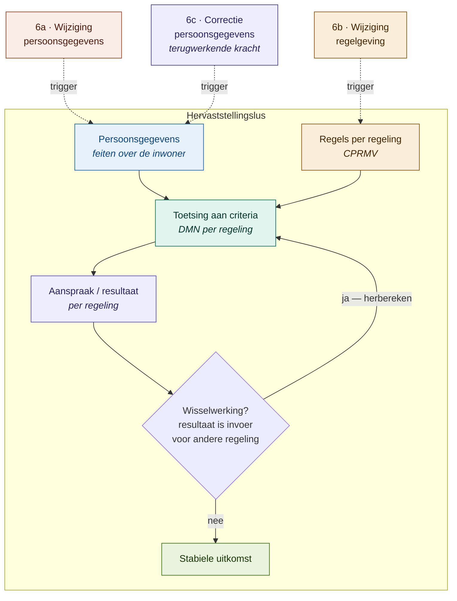

# Toetsing van inkomensondersteunende regelingen

Inwoners die in aanmerking komen voor inkomensondersteuning maken doorgaans aanspraak op meerdere regelingen tegelijk. Omdat regelingen elkaar via hun uitkomsten beïnvloeden &mdash; de uitkomst van de ene regeling is invoer voor de volgende &mdash; is de toetsing geen rechte lijn maar een **lus** die zichzelf bijwerkt tot er een stabiele uitkomst is.

Dit diagram brengt de drie ingrediënten van die lus in beeld &mdash; persoonsgegevens, regels en toetsing &mdash; en laat zien hoe drie soorten wijzigingen de lus opnieuw activeren.

## Conceptueel diagram

[➔ Interactieve versie met voorbeeldketen AOW → AIO → Bijzondere bijstand → Huurtoeslag → Heusdenpas](toetsing-inkomensondersteunende-regelingen.html)

---

## Onderdelen van de lus

### 1. Persoonsgegevens

De feiten over de inwoner waarop toetsing plaatsvindt: leeftijd, huishoudsamenstelling, inkomen, vermogen, woonsituatie. Bronnen zijn BRP, SUWI/UWV, Belastingdienst, het woningregister en de gemeentelijke administratie. Persoonsgegevens zijn de *invoer* van elke toetsing.

### 2. Regels (CPRMV)

Per regeling de geldende criteria, gemodelleerd als CPRMV en uitvoerbaar gemaakt als DMN. Iedere regeling &mdash; AOW, AIO, bijzondere bijstand, huurtoeslag, gemeentelijke regelingen &mdash; heeft een eigen regelset met eigen versies en geldigheidsperiodes.

### 3. Toetsing, resultaat en wisselwerking

De toetsing combineert persoonsgegevens met regels en levert per regeling een resultaat (aanspraak, hoogte, voorwaarden). Het kritieke punt is de **wisselwerking**: het resultaat van de ene regeling is doorgaans invoer voor de volgende. AOW bepaalt of AIO van toepassing is. AOW en AIO samen bepalen het inkomen voor de inkomenstoets van bijzondere bijstand, huurtoeslag en gemeentelijke regelingen. Eén toetsingsronde is daarmee zelden eindstation; de lus draait door tot de uitkomst zichzelf niet meer wijzigt.

### 4. Stabiele uitkomst

De toestand waarin een volgende ronde dezelfde uitkomsten oplevert. Pas op dat moment kunnen beschikkingen worden afgegeven.

---

## Drie wijzigingsstromen

Wijzigingen activeren altijd dezelfde lus, maar via verschillende ingangen.

| Stroom | Ingang | Effect |
| --- | --- | --- |
| **6a · Wijziging persoonsgegevens** | Persoonsgegevens | Alle regelingen die de gewijzigde gegevens als invoer hebben, worden opnieuw getoetst. Een inkomenswijziging raakt in beginsel elke inkomensafhankelijke regeling. |
| **6b · Wijziging regelgeving** | Regels (CPRMV) | Alleen de betreffende regeling en de regelingen die *downstream* van haar resultaat afhangen, worden opnieuw getoetst. Bovenstroomse regelingen blijven ongewijzigd. |
| **6c · Correctie persoonsgegevens** | Persoonsgegevens | Als 6a, maar met **terugwerkende kracht**. Eerdere beschikkingen worden retrospectief herbeoordeeld; nabetaling of terugvordering kan volgen. |

> Het temporele model &mdash; *valid time* versus *transaction time* &mdash; is in dit overzicht bewust niet uitgewerkt. Voor de architectuurprincipes is "elke wijziging triggert hervaststelling" voldoende; de bitemporele uitwerking hoort op een eigen pagina.
