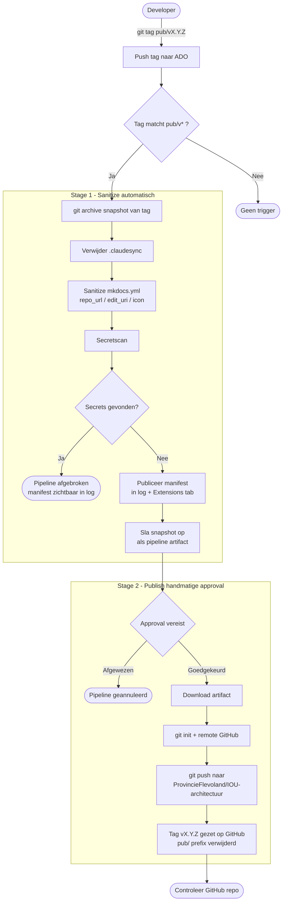

# Publishing to Public GitHub

This documentation site is maintained in Azure DevOps (ADO) as the primary source of truth. Selected releases are published to the public GitHub repository [ProvincieFlevoland/IOU-architectuur](https://github.com/ProvincieFlevoland/IOU-architectuur) using a controlled two-stage pipeline.

## How it works

Only tagged releases with the `pub/` prefix are published. The pipeline has two stages:

**Stage 1 — Sanitize (automatic)**
- Exports a clean snapshot of the tag (no git history, no internal files)
- Strips internal configuration (GitLab URLs, pipeline files, Azure config)
- Scans for secrets — aborts if anything is found
- Saves the snapshot as a pipeline artifact

**Stage 2 — Publish (requires approval)**
- Waits for manual approval in the ADO environment `GitHub-Public`
- After approval: pushes the snapshot to GitHub with the `pub/` prefix removed from the tag name

## Publishing a release

**Step 1 — Merge to `main` in ADO and verify the build is green.**

**Step 2 — Create an internal version tag (optional, for internal tracking):**
```bash
git tag v1.0.0
git push origin v1.0.0
```

**Step 3 — Create the publish tag to trigger the pipeline:**
```bash
git tag pub/v1.0.0
git push origin pub/v1.0.0
```

The pipeline triggers automatically. Stage 1 runs immediately. Stage 2 waits for approval.

**Step 4 — Approve the publish in ADO:**

ADO → Pipelines → **Publish-to-GitHub-IOU-architectuur** → open the running pipeline → approve Stage 2.

**Step 5 — Verify the result on GitHub:**

Check [github.com/ProvincieFlevoland/IOU-architectuur](https://github.com/ProvincieFlevoland/IOU-architectuur) that:

- The correct files are present
- No internal files (pipelines, Azure config) are included
- The tag is visible under **Releases**


## What gets published

| Path | Published |
|------|-----------|
| `docs/` | ✅ |
| `overrides/` | ✅ |
| `requirements.txt` | ✅ |
| `mkdocs.yml` | ✅ (internal URLs replaced) |
| `README.md` | ✅ |
| `convert_figures.py` | ✅ |
| `fix_figures.py` | ✅ |
| `fix_heading_separators.py` | ✅ |
| `rdf2graphml.xsl` | ✅ |
| `shacl_to_graphml.py` | ✅ |
| `.gitignore` | ✅ |
| `pipeline/` | ❌ ADO internal |
| `.github/` | ❌ outdated |
| `.gitlab-ci.yml` | ❌ GitLab internal |
| `azure-static-web-apps-pipeline.yml` | ❌ ADO internal |
| `staticwebapp.config.json` | ❌ Azure internal |
| `setup-azure.sh` | ❌ Azure internal |
| `docs/en/.claudesync/` | ❌ internal tooling |

## Tag convention

| Tag | Purpose |
|-----|---------|
| `v1.0.0` | Internal ADO/GitLab release only |
| `pub/v1.0.0` | Triggers publish to public GitHub |

## ADO pipeline

Pipeline file: `pipeline/publish-to-github.yml`  
Variable group: `GitHub-Publish-Secrets` (contains `GITHUB_PAT`)  
Target repository: `https://github.com/ProvincieFlevoland/IOU-architectuur`

The pipeline can also be triggered manually via ADO → Pipelines → **Publish to GitHub** → **Run pipeline** with a `releaseTag` parameter.

## PAT rotation

The GitHub Personal Access Token (`GITHUB_PAT`) in the `GitHub-Publish-Secrets` variable group expires on **27-03-2027**. See the ADO work item for rotation instructions.
